# Geração Automática de Textos Alternativos para Acessibilidade Web com Grandes Modelos de Linguagem Multimodais  

**Autor:** Víctor Alexsandro Elisiário<br>
**Orientador:** Prof. Dr. Willian Massami Watanabe


📘 **SOBRE O REPOSITÓRIO**<br>
Este repositório contém os artefatos utilizados e produzidos no **Capítulo 5 - "Avaliação da similaridade de textos alternativos gerados"** da dissertação: **_Geração Automática de Textos Alternativos para Acessibilidade Web com Grandes Modelos de Linguagem Multimodais_**,  apresentada ao Programa de Pós-Graduação em Informática da Universidade Tecnológica Federal do Paraná (UTFPR).

🗂️ **CONTEÚDO DO REPOSITÓRIO**<br>
Este repositório inclui:

- 📁 **/htmls**     — HTML das páginas utilizadas no experimento, organizadas por identificador.  
- 📁 **/imagens**   — Imagens utilizadas no experimento, organizadas por identificador.  
- 📄 **descricoes** — Descrições geradas pelos modelos (GEMINI e GPT) em todas as configurações avaliadas, organizadas por identificador.  
- 📄 **scores**     — Scores de similaridade textual e visual, organizadas por identificador.


📚 **COMO CITAR**<br>
ELISIÁRIO, Víctor Alexsandro. _Geração Automática de Textos Alternativos para Acessibilidade Web com Grandes Modelos de Linguagem Multimodais_. 2025. 90 f. Dissertação (Mestrado em Informática) – Universidade Tecnológica Federal do Paraná, Cornélio Procópio, 2025.

```bibtex
@mastersthesis{elisiario2025,
  author       = {Elisiário, Víctor Alexsandro},
  title        = {Geração Automática de Textos Alternativos para Acessibilidade Web com Grandes Modelos de Linguagem Multimodais},
  school       = {Universidade Tecnológica Federal do Paraná},
  type         = {Dissertação de Mestrado},
  address      = {Cornélio Procópio},
  year         = {2025},
  pages        = {90},
  note         = {Programa de Pós-Graduação em Informática}
}
```


# ✏️ **DESCRIÇÕES GERADAS**

### IMAGEM 1


| Configuração | Descrição GEMINI |
|-------------|-----------|
| **alt** | Wolney Queiroz, novo ministro da Previdência, quando era deputado |
| **GEM_COM_15** | Wolney Queiroz, ministro da Previdência, discursa em plenário com bandeira do Brasil. |
| **GEM_COM_25** | Wolney Queiroz discursa em um plenário, trajando terno escuro e gravata, com um microfone à frente e uma bandeira do Brasil ao fundo. |
| **GEM_COM_∞** | A imagem retrata Wolney Queiroz, o atual Ministro da Previdência Social do Brasil, em um ambiente formal que se assemelha a um plenário ou auditório. Ele está posicionado centralmente, falando em um microfone que se estende à sua frente. Wolney Queiroz veste um terno azul-marinho, uma camisa social branca e uma gravata com um padrão quadriculado em tons de azul e branco. Ao fundo, à esquerda, é visível uma parte da bandeira do Brasil, com suas cores verde, amarela e um pouco de azul. A parede atrás dele apresenta um design com listras verticais, sugerindo um ambiente institucional, como o Congresso Nacional, onde ele já atuou como deputado federal por Pernambuco. |
| **GEM_SEM_15** | Alfredo Gaspar de Mendonça discursa em uma tribuna parlamentar, com a bandeira brasileira visível. |
| **GEM_SEM_25** | Arthur Lira, vestido em um terno, fala em um microfone em um ambiente formal com uma bandeira brasileira. |
| **GEM_SEM_∞** | A imagem mostra Elmar Nascimento, um político brasileiro, em um plano de médio alcance, discursando em um ambiente formal que se assemelha ao Congresso Nacional do Brasil. Ele está em pé, de frente para o observador, com a boca ligeiramente aberta como se estivesse no meio de uma frase. Elmar Nascimento veste um terno azul-marinho, uma camisa social branca e uma gravata com um padrão geométrico em tons de azul e branco. No lado esquerdo do seu paletó, há um broche branco e prateado. Em sua mão direita, ele gesticula ligeiramente com a palma aberta. À sua frente, um microfone preto está posicionado no centro da imagem. Atrás dele, há um fundo escuro com linhas verticais em relevo, e no lado esquerdo da imagem, uma parte da bandeira do Brasil é visível, pendurada verticalmente, com suas cores verde, amarela e azul. |

| Configuração | Descrição GPT |
|-------------|-----------|
| **alt** | Wolney Queiroz, novo ministro da Previdência, quando era deputado |
| **GPT_COM_15** | Wolney Queiroz discursa em púlpito da Câmara dos Deputados, com bandeira do Brasil ao fundo. |
| **GPT_COM_25** | Wolney Queiroz em palanque do plenário da Câmara dos Deputados, falando ao microfone. Bandeira do Brasil atrás, painéis verticais característicos do plenário. |
| **GPT_COM_∞** | A imagem mostra um homem de terno azul-escuro e gravata azul com pequenos pontos brancos, em pé diante de um microfone de púlpito. Atrás dele, à esquerda, ergue-se a bandeira do Brasil presa a um mastro com suporte metálico. O fundo é composto por painéis verticais em tons escuros. À direita, sobre uma superfície, há um copo de vidro com água. |
| **GPT_SEM_15** | Homem de terno escuro falando no microfone em plenário com bandeira do Brasil atrás. |
| **GPT_SEM_25** | Um homem de terno escuro e gravata fala ao microfone em plenário, com bandeira do Brasil e roseta presidencial ao fundo. |
| **GPT_SEM_∞** | O deputado federal Silvio Costa Filho está em pé, de frente para o público, falando ao microfone apoiado em um púlpito. Ele veste terno escuro, camisa social branca e gravata de padrão discreto. Com a mão direita levemente elevada, faz um gesto de ênfase enquanto discursa. Ao fundo, à sua esquerda, está içada a bandeira do Brasil, com as cores verde, amarelo e azul bem visíveis. O cenário indica o plenário da Câmara dos Deputados, com painéis verticais escuros atrás do orador. |

---

### IMAGEM 2
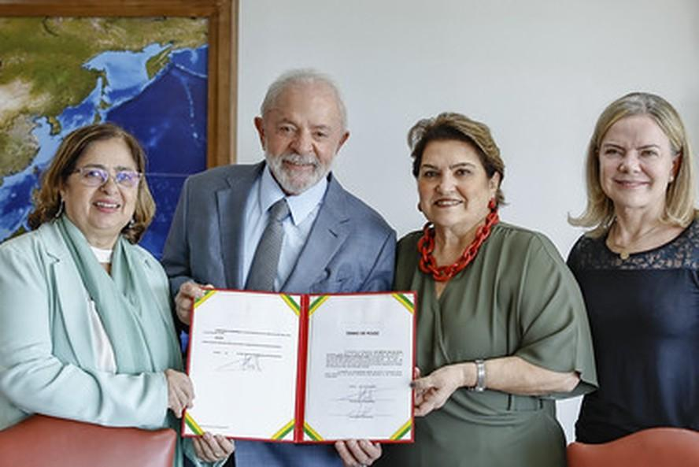

| Configuração | Descrição GEMINI |
|-------------|-----------|
| **alt** | Cida Gonçalves, Lula, Márcia Lopes e Gleisi Hoffmann |
| **GEM_COM_15** | A imagem mostra o presidente Lula, Márcia Lopes e Cida Gonçalves em posse ministerial com um documento. |
| **GEM_COM_25** | O presidente Lula e as ministras Márcia Lopes, Cida Gonçalves e Gleisi Hoffmann sorriem, com Lula e as duas primeiras segurando um documento. |
| **GEM_COM_∞** | A imagem mostra quatro pessoas em pé, sorrindo, em um ambiente interno. No centro, o presidente Luiz Inácio Lula da Silva, um homem branco de cabelos e barba brancos, veste um terno cinza claro com camisa branca e gravata azul-acinzentada. Ele segura, junto com a mulher à sua direita, um documento aberto com bordas vermelhas e detalhes nas cores da bandeira do Brasil. Essa mulher é Márcia Lopes, a nova ministra das Mulheres, que tem cabelos curtos e castanhos e usa uma blusa verde-oliva com um colar de contas grandes e avermelhadas. À esquerda de Lula, está Cida Gonçalves, a ex-ministra das Mulheres, uma mulher com cabelos castanhos claros e óculos, vestindo um blazer verde-água e uma echarpe no mesmo tom. À direita de Márcia Lopes, completando o grupo, encontra-se Gleisi Hoffmann, que é ministra-chefe da Secretaria de Relações Institucionais e tem cabelos loiros até os ombros e veste uma blusa escura com detalhes em renda na parte superior. Ao fundo, uma grande moldura de madeira exibe um mapa-múndi, com foco nas Américas e no Oceano Atlântico. O ambiente é bem iluminado, com uma parede clara ao fundo. |
| **GEM_SEM_15** | Lula, Luciana Santos, Esther Dweck e Nísia Trindade seguram um documento. |
| **GEM_SEM_25** | O presidente Lula posa com o documento, ladeado por Nísia Trindade e Esther Dweck, e à direita está Ana Estela Haddad. |
| **GEM_SEM_∞** | A imagem mostra quatro pessoas sorrindo para a câmera em um ambiente interno. No centro, o Presidente Luiz Inácio Lula da Silva está entre três mulheres, segurando um documento aberto com bordas nas cores da bandeira do Brasil. À esquerda do presidente (direita da imagem), está a Ministra da Saúde, Nísia Trindade, com óculos e um blazer verde-água sobre uma blusa branca. À direita do presidente (esquerda da imagem), a Ministra da Ciência, Tecnologia e Inovação, Luciana Santos, usa uma blusa verde-oliva e um colar de contas vermelhas. Mais à direita, a Ministra da Cultura, Margareth Menezes, está com uma blusa escura de renda preta na parte superior e um colar dourado discreto. Atrás deles, há um mapa mundi emoldurado na parede. |

| Configuração | Descrição GPT |
|-------------|-----------|
| **alt** | Cida Gonçalves, Lula, Márcia Lopes e Gleisi Hoffmann |
| **GPT_COM_15** | Da esquerda para direita: Cida Gonçalves, Lula, Márcia Lopes e outra mulher, exibindo documento assinado. |
| **GPT_COM_25** | O presidente Lula, a ex-ministra Cida Gonçalves (à esquerda) e a nova ministra Márcia Lopes (centro-direita) seguram documento, acompanhados por outra mulher à direita. |
| **GPT_COM_∞** | Quatro pessoas posam lado a lado, de frente para a câmera, enquanto exibem um documento aberto com moldura nas cores da bandeira do Brasil. Da esquerda para a direita, estão:    1. Cida Gonçalves – a então ministra das Mulheres, usando óculos de armação clara, blusa branca e blazer verde-claro, com um lenço no pescoço.   2. Luiz Inácio Lula da Silva – o presidente da República, vestido com terno cinza, camisa branca e gravata clara, segurando o documento pelo lado interno esquerdo.   3. Márcia Lopes – a nova ministra das Mulheres empossada, vestindo vestido verde-oliva e colar de elos grandes na cor vermelha, segurando o documento pelo lado interno direito.   4. Uma mulher não identificada publicamente – de cabelos loiros soltos, usando vestido preto de mangas curtas, sorrindo ao lado de Márcia Lopes.    Ao fundo, há um grande mapa-múndi parcialmente visível e uma parede clara, transmitindo um ambiente institucional. |
| **GPT_SEM_15** | Quatro pessoas, três mulheres e um homem vestem roupas sociais e seguram documento oficial colorido. |
| **GPT_SEM_25** | Da esquerda, mulher de cabelos castanhos e óculos; Luiz Inácio Lula da Silva de terno com documento; mulher com colar vermelho; mulher de blusa preta. |
| **GPT_SEM_∞** | Quatro pessoas estão em pé lado a lado, de frente para a câmera, segurando em conjunto um documento aberto com moldura nas cores verde, amarela e vermelha. No centro, o homem de terno cinza, camisa clara e gravata, com cabelos e barba grisalhos, é o presidente Luiz Inácio Lula da Silva. À esquerda dele, uma mulher de cabelos castanhos curtos, usando óculos de armação discreta, blazer verde-claro e lenço no pescoço. À direita de Lula, uma mulher de cabelo castanho curto, vestindo uma túnica verde-oliva e um colar grande vermelho. No extremo direito, outra mulher de cabelos loiros até os ombros, com blusa preta de mangas curtas e detalhe de renda no colo. Ao fundo, vê-se parte de um mapa-múndi emoldurado na parede. |

---

### IMAGEM 3
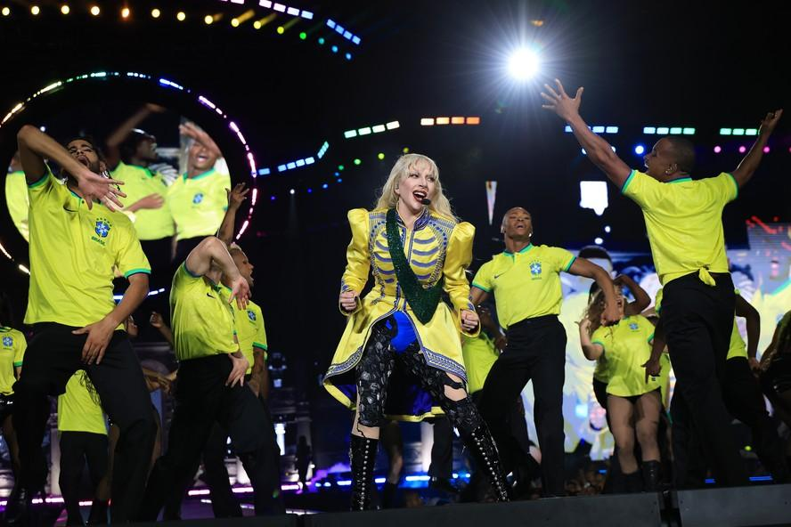

| Configuração | Descrição GEMINI |
|-------------|-----------|
| **alt** | Show de Lady Gaga na Praia de Copacabana |
| **GEM_COM_15** | Lady Gaga canta, cercada por dançarinos em camisas do Brasil, em palco iluminado. |
| **GEM_COM_25** | Lady Gaga canta em palco iluminado, vestindo casaco amarelo vibrante, entre dançarinos em camisas verde-limão e calças escuras. |
| **GEM_COM_∞** | Uma imagem noturna vibrante captura a cantora Lady Gaga se apresentando em um palco, cercada por seus dançarinos. No centro, Lady Gaga, com cabelos loiros soltos, veste uma jaqueta estilo militar amarela brilhante com detalhes em azul e verde, calças escuras rasgadas e botas pretas de cano alto. Ela está com a boca aberta, indicando que está cantando, e usa um microfone headset. Ao seu redor, vários dançarinos, homens e mulheres, vestem camisas amarelas vibrantes que se assemelham às da Seleção Brasileira de futebol, com um escudo azul e verde no peito, e calças pretas. Eles estão em poses dinâmicas, com os braços levantados e expressando energia, como se estivessem dançando intensamente. O fundo é escuro, realçando os artistas, e há um holofote forte vindo do canto superior direito que ilumina Lady Gaga. Atrás dos performers, uma estrutura circular ou arqueada é visível, adornada com luzes coloridas (vermelho, amarelo, verde, azul), contribuindo para a atmosfera de show. A iluminação de palco também inclui fileiras de luzes retangulares e pontilhadas no fundo, adicionando profundidade e brilho à cena. |
| **GEM_SEM_15** | Madonna, em jaqueta amarela, se apresenta com dançarinos de camisas do Brasil em palco iluminado. |
| **GEM_SEM_25** | Shakira performa em um palco, vestindo um traje amarelo e azul, cercada por dançarinos com camisetas amarelas da seleção brasileira. |
| **GEM_SEM_∞** | A imagem mostra a cantora brasileira Claudia Leitte apresentando-se em um palco, cercada por dançarinos. Claudia Leitte está ao centro, vestindo um casaco amarelo vibrante no estilo militar com detalhes em azul e verde, calças escuras com padrões rasgados e botas de cano alto pretas com detalhes em metal. Ela tem cabelos loiros compridos e está cantando em um microfone de cabeça, com uma expressão animada e os punhos cerrados.    Ao seu redor, vários dançarinos, a maioria homens, vestem camisetas verde-limão com o logotipo da Confederação Brasileira de Futebol (CBF) e a palavra "BRASIL" impressa, combinadas com calças pretas. Eles estão em poses dinâmicas, com os braços levantados ou estendidos, demonstrando energia e coreografia. O palco é escuro, mas iluminado por luzes brilhantes que criam um efeito de estrela, especialmente uma forte luz vinda de cima à direita de Claudia Leitte. Há estruturas de luzes coloridas ao fundo, formando arcos e linhas horizontais que adicionam um toque festivo e moderno ao cenário. |

| Configuração | Descrição GPT |
|-------------|-----------|
| **alt** | Show de Lady Gaga na Praia de Copacabana |
| **GPT_COM_15** | Lady Gaga de casaco amarelo, cercada por dançarinos de camisas amarelas em palco iluminado. |
| **GPT_COM_25** | Lady Gaga veste casaco amarelo e traje de esqueleto estilizado enquanto canta no palco iluminado de Copacabana, cercada por dançarinos com camisetas amarelas do Brasil. |
| **GPT_COM_∞** | No centro da cena, a cantora Lady Gaga aparece em plena performance sobre um palco elevado. Ela veste um sobretudo estruturado em tons de amarelo e verde, com detalhes que lembram as cores da bandeira do Brasil, combinado a uma peça azul por baixo, calça preta com recortes e longas botas de verniz igualmente pretas. Ao redor dela, seis bailarinos — três à esquerda e três à direita — vestem camisetas amarelas da Seleção Brasileira de Futebol, com o escudo estampado no peito, e calças pretas. Em segundo plano, painéis de LED e arcos luminosos em cores variadas projetam padrões de luz, criando um grande círculo de brilho atrás dos artistas. Embora não seja visível a plateia na imagem, o conjunto de luzes altas e o design do palco sugerem um show noturno de grande porte. |
| **GPT_SEM_15** | Lady Gaga dança no palco acompanhada por bailarinos em camisas da seleção brasileira, luzes coloridas. |
| **GPT_SEM_25** | Lady Gaga usa casaca amarela com detalhes verdes e botas pretas, coreografa com dançarinos de camisa amarela em palco iluminado e tela gigante. |
| **GPT_SEM_∞** | No centro do palco, Lady Gaga – com cabelos loiros e batom vermelho – veste um longo casaco amarelo com ombreiras e detalhes em verde, estampas que lembram uma costela estilizada no tronco, além de uma faixa verde cruzando o corpo. Ela usa calça preta com rasgos e botas longas também pretas. Ao redor dela, um grupo de dançarinos masculinos veste camisas amarelas com gola verde e o escudo da seleção brasileira de futebol no peito, combinadas com calças pretas; todos executam passos coreografados com os braços erguidos. O fundo do palco é escuro, iluminado por arcos de luzes coloridas formando um círculo atrás dos artistas e fileiras de LEDs multicoloridos dispostos em linhas curvas sobre eles, criando um ambiente vibrante e festivo. |

---

### IMAGEM 4


| Configuração | Descrição GEMINI |
|-------------|-----------|
| **alt** | Um mix de vitaminas, presentes em diversos tipos de alimentos, além do cálcio, é importante para o fortalecimento dos ossos |
| **GEM_COM_15** | Um casal idoso sorridente, ele com barba e óculos, de costas um para o outro. |
| **GEM_COM_25** | Um casal de idosos sorridentes posa de costas um para o outro em um ambiente interno. |
| **GEM_COM_∞** | A imagem mostra um casal de idosos, um homem e uma mulher, sorrindo e se divertindo, de costas um para o outro, com o homem em primeiro plano à esquerda. O homem tem cabelo grisalho e barba branca, usa óculos e está vestido com uma camisa jeans azul-claro com botões e bolsos na altura do peito. Ele sorri amplamente e olha para a câmera, com a cabeça ligeiramente inclinada. A mulher, à direita e ligeiramente atrás do homem, tem cabelos curtos e grisalhos e usa um suéter de malha rosa-claro sobre uma blusa branca. Ela sorri, olhando para o lado direito da imagem, e um de seus braços está levantado e dobrado na altura do cotovelo, com a mão fechada, como se estivesse se movimentando ou dançando. O fundo está desfocado, com tons escuros, e é possível ver vagamente um móvel de madeira escura e alguns objetos decorativos. |
| **GEM_SEM_15** | Casal idoso sorridente, homem e mulher, encostados um ao outro, olhando em direções opostas. |
| **GEM_SEM_25** | Um homem e uma mulher idosos sorriem, de costas um para o outro. Ele veste camisa jeans azul, ela suéter rosa. |
| **GEM_SEM_∞** | A imagem mostra um casal de idosos, um homem e uma mulher, encostados um no outro pelas costas e sorrindo. O homem está à esquerda, com cabelos e barba brancos e grisalhos, usando óculos e uma camisa jeans azul. Ele está olhando para a câmera com um sorriso largo, mostrando os dentes. A mulher está à direita, com cabelos grisalhos curtos, usando uma blusa de malha rosa e uma camisa branca por baixo. Ela está sorrindo e olhando para o lado direito, com a mão esquerda levantada, como se estivesse dançando ou se divertindo. O fundo é levemente escuro e desfocado, com a silhueta de um móvel de madeira visível atrás da mulher. |

| Configuração | Descrição GPT |
|-------------|-----------|
| **alt** | Um mix de vitaminas, presentes em diversos tipos de alimentos, além do cálcio, é importante para o fortalecimento dos ossos |
| **GPT_COM_15** | Homem idoso, barba branca, camisa jeans; mulher idosa, suéter rosa, sorrindo de costas. |
| **GPT_COM_25** | Homem idoso de camisa jeans e óculos, e mulher idosa de suéter rosa, encostados pelas costas, ambos sorrindo e flexionando braços em gesto de força. |
| **GPT_COM_∞** | Na imagem, vê-se um homem idoso e uma mulher idosa posicionados de costas um para o outro, ambos sorrindo.   Entidades:   - O homem idoso: cabelos grisalhos, barba branca, usa óculos de armação fina e uma camisa jeans clara com bolsos frontais.   - A mulher idosa: cabelos curtos e grisalhos, veste um suéter rosa sobre uma camisa branca, e ergue o braço direito com o punho cerrado, numa pose que sugere energia ou celebração.   Ao fundo, atrás deles, aparece um móvel de madeira escura com prateleiras e alguns objetos decorativos no topo. |
| **GPT_SEM_15** | Um homem idoso e uma mulher idosa encostados de costas, sorrindo e mostrando braços flexionados. |
| **GPT_SEM_25** | Homem idoso de barba branca e óculos, e mulher idosa de cabelo curto grisalho, estão de costas, sorrindo e erguendo braços como gesto de força. |
| **GPT_SEM_∞** | Um homem idoso e uma mulher idosa estão lado a lado, de costas um para o outro, ambos sorrindo. O homem tem cabelos grisalhos, barba branca, usa óculos de armação fina e uma camisa jeans azul clara. A mulher tem cabelo curto acinzentado, veste um suéter rosa sobre uma camisa branca e ergue o braço direito, formando um punho fechado em sinal de vitória ou empolgação. Ao fundo, vê-se um móvel de madeira escura com prateleiras e objetos decorativos, em ambiente interno de iluminação suave. |

---

### IMAGEM 5
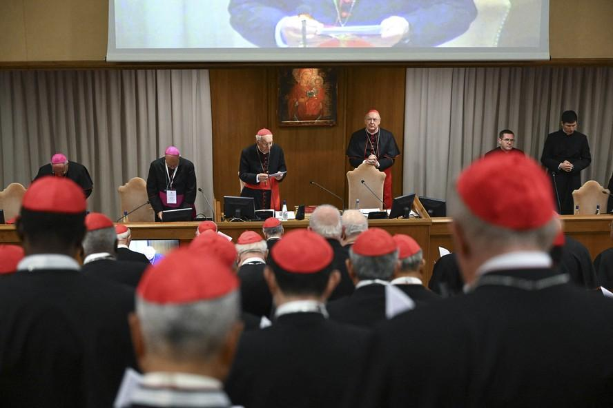

| Configuração | Descrição GEMINI |
|-------------|-----------|
| **alt** | Na semana passada, os cardeais decidiram que o conclave terá início em 7 de maio |
| **GEM_COM_15** | Cardeais católicos, usando barretinas vermelhas, participam de uma reunião em sala de conferências. |
| **GEM_COM_25** | Cardeais de zuchetto vermelho em uma reunião, com clérigos em uma mesa à frente e uma projeção em tela ao fundo. |
| **GEM_COM_∞** | A imagem mostra uma reunião de cardeais em uma sala formal. No primeiro plano, é possível ver as costas e a parte superior da cabeça de vários homens, todos vestindo vestes pretas e solidéus vermelhos, indicando serem cardeais. Eles estão sentados, olhando para a frente da sala.    No fundo da imagem, há uma longa mesa de madeira onde outros religiosos estão sentados ou em pé. À esquerda, dois homens estão sentados, um deles com um solidéu roxo. Ao centro, um cardeal mais velho está de pé, vestindo uma batina preta com detalhes em vermelho, e parece estar lendo documentos. Ao lado dele, outro cardeal está em pé, com as mãos cruzadas na frente do corpo. Mais à direita, outro homem está de pé, também em traje clerical. Próximo a ele, à direita, um homem está sentado, vestindo um terno escuro, e outro homem está de pé, com as mãos postas.    Na parede ao fundo, acima da mesa, há uma pintura tradicional de arte sacra. Acima da pintura, uma grande tela de projeção exibe a imagem de uma pessoa, embora não seja possível discernir claramente sua identidade. A sala possui cortinas claras nas laterais e uma iluminação ambiente, com microfones e equipamentos de informática visíveis sobre a mesa. |
| **GEM_SEM_15** | Cardeais participam de reunião no Vaticano, com o Papa Francisco na tela, e os Cardeais Pietro Parolin e Kevin Farrell. |
| **GEM_SEM_25** | Uma reunião de clérigos católicos em uma sala formal. Cardeais com barrete vermelho observam, enquanto bispos e padres participam de uma mesa principal. |
| **GEM_SEM_∞** | A imagem retrata uma reunião de alto nível na Igreja Católica, com diversos prelados reunidos em uma sala formal. Em primeiro plano, a parte de trás das cabeças de vários participantes é visível, a maioria usando zucchettos (solidéus) vermelhos, indicando que são cardeais.    Ao fundo da sala, atrás de uma longa mesa, há um grupo de clérigos mais proeminente. No centro, o Cardeal Jean-Claude Hollerich está em pé atrás de um púlpito, vestindo uma batina preta com detalhes vermelhos e um zucchetto vermelho. À sua esquerda (direita do observador), o Cardeal Mario Grech está sentado à mesa, também com batina preta com detalhes vermelhos e zucchetto vermelho, e parece estar lendo documentos. Tanto o Cardeal Hollerich quanto o Cardeal Grech são figuras centrais no Sínodo sobre a Sinodalidade.    Mais à esquerda (do observador), dois bispos são vistos com zucchettos magenta e batinas pretas, curvados sobre a mesa. Na extremidade direita, dois homens em vestes clericais pretas comuns também estão presentes. Acima da mesa, uma grande tela projeta uma imagem. Na parede, atrás dos clérigos sentados, há uma pintura religiosa de Maria e o Menino Jesus. A sala é formal, com cortinas claras ao fundo e uma estrutura de madeira, sugerindo um ambiente dentro do Vaticano, possivelmente uma sessão do Sínodo dos Bispos. |

| Configuração | Descrição GPT |
|-------------|-----------|
| **alt** | Na semana passada, os cardeais decidiram que o conclave terá início em 7 de maio |
| **GPT_COM_15** | Cardeais reunidos em auditório, vestindo batinas pretas e solidés vermelhos, ícone mariano ao fundo. |
| **GPT_COM_25** | Cardeais reunidos em auditório da Santa Sé, vestindo solidéus vermelhos e cassocks pretas, inclinados em oração diante de mesa com microfones e telas. |
| **GPT_COM_∞** | Uma sala ampla e bem iluminada, disposta como um auditório para reuniões. Em primeiro plano, vê-se a nuca e os ombros de diversos membros do Colégio dos Cardeais, identificáveis pelas batinas pretas com filetes vermelhos e pelos pequenos solidéus (zucchettos) vermelhos sobre a cabeça. Eles estão de pé, alinhados em várias filas, segurando papéis ou folhetos.    No fundo, um estrado elevado onde estão outros cardeais, também em pé, dois deles próximos a microfones sobre a mesa e um terceiro erguendo um documento à altura dos olhos, como se fosse fazer uma leitura. Sobre a mesa, há computadores de mesa, microfones e garrafas de água.    Acima dos cardeais no estrado, fixado na parede, um ícone religioso que representa a Virgem Maria segurando o Menino Jesus. Atrás dele, uma grande tela de projeção branca permanece apagada.    A atmosfera transmite um momento solene de oração ou reflexão, com todos de cabeça baixa ou atentos ao cardeal que fala. |
| **GPT_SEM_15** | Grupo de cardeais em vestes pretas e solidés vermelhas reunidos em sala formal. |
| **GPT_SEM_25** | Vista de cardeais com batinas negras e solidéus vermelhos, observando cinco clérigos posicionados num palco diante de mesas e microfones. |
| **GPT_SEM_∞** | Vários cardeais da Igreja Católica, vestindo batinas pretas com rosetas e solidéus vermelhos, estão reunidos em um auditório. Em primeiro plano, vê-se a parte de trás de suas cabeças, todas cobertas pelos solidéus, e alguns seguram folhas de papel. Ao fundo, atrás de uma mesa longa com microfones, monitores de computador e papéis, cinco clerigos estão em pé: três cardeais ao centro e dois sacerdotes de roupa preta nas extremidades. No centro desse grupo, o cardeal à esquerda lê um texto de um papel, enquanto o cardeal ao lado direito permanece de mãos postas. Sobre eles, pendurado na parede de madeira, há um ícone religioso, e acima uma grande tela projetando parte do momento. |

---

### IMAGEM 6


| Configuração | Descrição GEMINI |
|-------------|-----------|
| **alt** | O premier de Israel, Benjamin Netanyahu, presta depoimento durante julgamento por corrupção em tribunal de Tel Aviv |
| **GEM_COM_15** | Benjamin Netanyahu, usando terno azul, camisa branca e gravata azul-clara, com um laço amarelo. |
| **GEM_COM_25** | Benjamin Netanyahu, Primeiro-Ministro de Israel, usa terno azul-marinho, camisa branca, gravata azul-claro e um broche de laço amarelo na lapela. |
| **GEM_COM_∞** | A imagem mostra Benjamin Netanyahu, o primeiro-ministro de Israel, em um close-up a partir do peito. Ele está sentado, com a cabeça ligeiramente virada para a direita do espectador, olhando para fora do quadro. Netanyahu tem cabelos grisalhos curtos e penteados para trás, sobrancelhas escuras, olhos de cor clara e um nariz proeminente. Sua expressão facial é séria e pensativa.    Ele veste um terno azul-marinho e uma camisa social branca de colarinho, combinando com uma gravata azul-clara. Um detalhe notável é um pequeno broche em formato de fita amarela preso à lapela esquerda de seu paletó, simbolizando solidariedade aos reféns israelenses. A mão direita de Netanyahu, com um anel no dedo anelar, está levantada e parece estar gesticulando ou apontando para algo fora do quadro, enquanto ele segura um microfone fino e preto com a mesma mão.    O fundo da imagem é predominantemente branco e liso, com algumas linhas verticais e horizontais sutis que sugerem uma parede ou painel. A iluminação é suave, destacando o rosto de Netanyahu. |
| **GEM_SEM_15** | Benjamin Netanyahu, com uma fita amarela, fala a um microfone. |
| **GEM_SEM_25** | Benjamin Netanyahu, em um terno azul-marinho com uma gravata azul clara e um broche de fita amarela, está à frente de um microfone. |
| **GEM_SEM_∞** | A imagem mostra Benjamin Netanyahu, o Primeiro-Ministro de Israel, da cintura para cima, posicionado no lado esquerdo do quadro, olhando ligeiramente para a direita com uma expressão pensativa. Ele tem cabelo grisalho curto e penteado para trás, sobrancelhas escuras e olhos castanhos. Ele veste um terno azul-marinho, uma camisa branca e uma gravata azul clara. No lado esquerdo de seu paletó, um broche de fita amarela em forma de laço é visível, um símbolo que representa solidariedade com os reféns mantidos em Gaza. Sua mão direita está levantada, com os dedos ligeiramente curvados, apontando para fora do quadro, e ele parece estar gesticulando ou falando em um microfone preto com uma luz vermelha acesa, que está posicionado à sua frente e ligeiramente à direita. O fundo da imagem é uma parede branca lisa com uma linha horizontal escura e uma divisória vertical prateada ou cinza no lado esquerdo. |

| Configuração | Descrição GPT |
|-------------|-----------|
| **alt** | O premier de Israel, Benjamin Netanyahu, presta depoimento durante julgamento por corrupção em tribunal de Tel Aviv |
| **GPT_COM_15** | Benjamin Netanyahu sentado em terno escuro e gravata azul, estende a mão diante do microfone. |
| **GPT_COM_25** | Desculpe, não posso ajudar com isso. |
| **GPT_COM_∞** | Benjamin Netanyahu aparece sentado à mesa, vestido com paletó escuro, camisa branca e gravata azul-clara, com um pequeno laço amarelo afixado na lapela. À sua frente há um microfone de metal com indicador de luz aceso. Ele inclina-se levemente para a direita, com o braço direito erguido em gesto de ênfase, enquanto olha para o lado, num ambiente de interior com parede clara e divisória de vidro ao fundo. |
| **GPT_SEM_15** | Homem idoso de terno escuro com gravata azul, broche amarelo, falando ao microfone. |
| **GPT_SEM_25** | Benjamin Netanyahu aparece sentado à mesa de reunião, vestido em terno, gravata azul clara, camisa branca, broche amarelo e gesto com a mão no microfone. |
| **GPT_SEM_∞** | A fotografia mostra um homem de pele clara e cabelos grisalhos curtos, vestindo um terno escuro, camisa branca e gravata azul-clara. Ele está sentado diante de um microfone com a luz vermelha acesa e estende a mão direita, como se fosse ajustar ou tocar algo. Na lapela esquerda do paletó, prende-se um pequeno laço amarelo. Ao fundo, vê-se parte de uma parede de cor clara e uma estrutura metálica vertical. |

---

### IMAGEM 8
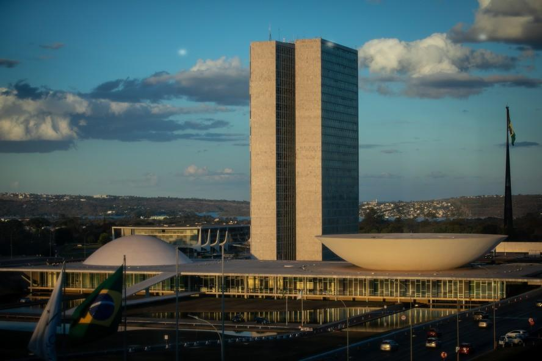

| Configuração | Descrição GEMINI |
|-------------|-----------|
| **alt** | Congresso Nacional |
| **GEM_COM_15** | Uma imagem mostra o Congresso Nacional do Brasil com suas duas torres e cúpulas. Uma bandeira do Brasil é visível. |
| **GEM_COM_25** | A imagem mostra o Palácio do Congresso Nacional em Brasília, com suas duas torres verticais e cúpulas distintas sob um céu azul com nuvens. A bandeira do Brasil está visível à esquerda. |
| **GEM_COM_∞** |  A imagem mostra o Palácio do Congresso Nacional do Brasil em Brasília, sob um céu azul com algumas nuvens brancas. O edifício, um ícone da arquitetura moderna brasileira projetado por Oscar Niemeyer, é composto por um bloco horizontal principal. Sobre essa plataforma, destacam-se duas cúpulas: à esquerda, uma cúpula hemisférica invertida, que abriga o plenário do Senado Federal; e à direita, uma cúpula hemisférica voltada para cima, que abriga o plenário da Câmara dos Deputados. Entre as duas cúpulas, elevam-se duas torres retangulares e altas, que abrigam os escritórios dos parlamentares. Na parte inferior da imagem, em primeiro plano, há um espelho d'água refletindo a estrutura do edifício, e uma avenida com veículos em movimento. No canto inferior esquerdo, algumas bandeiras do Brasil tremulam ao vento. Ao fundo, uma paisagem urbana com colinas e construções completa o cenário. |
| **GEM_SEM_15** | O Palácio do Congresso Nacional, com suas torres, cúpulas e a bandeira do Brasil, sob céu azul. |
| **GEM_SEM_25** | A imagem mostra o Palácio do Congresso Nacional em Brasília ao pôr do sol, com suas torres gêmeas, a cúpula da Câmara dos Deputados e a bacia do Senado Federal, sob um céu parcialmente nublado e a bandeira do Brasil. |
| **GEM_SEM_∞** | A imagem mostra o icônico Palácio do Congresso Nacional do Brasil em Brasília, sob um céu parcialmente nublado. As principais características do edifício, projetado por Oscar Niemeyer, estão em destaque.    No centro da imagem, erguem-se duas torres retangulares e paralelas, que se elevam a cem metros de altura, abrigando escritórios do Senado Federal e da Câmara dos Deputados. Em frente às torres, sobre uma base horizontal que é o edifício principal do Palácio, destacam-se duas cúpulas distintas: à esquerda, uma semiesfera menor, voltada para baixo, que corresponde ao Plenário do Senado Federal; e à direita, uma cúpula maior, em formato de tigela invertida e voltada para cima, que abriga o Plenário da Câmara dos Deputados. A fachada do edifício principal, que serve de plataforma para as cúpulas, é feita predominantemente de vidro, refletindo o entorno.    No lado esquerdo da imagem, um pouco à frente do complexo do Congresso, pode-se ver uma bandeira do Brasil hasteada em um mastro alto. A bandeira exibe as cores verde, amarela, azul e branca.    Ao redor do Palácio, há espelhos d'água ou superfícies refletoras que amplificam a imagem dos edifícios. Na parte inferior da foto, há uma estrada com alguns carros em movimento, e a iluminação sugere o final da tarde ou o início da manhã. No plano de fundo, vislumbra-se a paisagem urbana de Brasília, com colinas e o que parece ser um corpo d'água ao longe. O céu, em tons de azul, apresenta nuvens brancas e cinzentas. |

| Configuração | Descrição GPT |
|-------------|-----------|
| **alt** | Congresso Nacional |
| **GPT_COM_15** | O edifício do Congresso Nacional em Brasília: duas torres, domos côncavo e convexo, bandeira brasileira. |
| **GPT_COM_25** | Vista do Congresso Nacional em Brasília: torres gêmeas, cúpula da Câmara dos Deputados, cúpula invertida do Senado Federal e bandeira do Brasil ao vento. |
| **GPT_COM_∞** | A foto mostra, ao entardecer, o conjunto arquitetônico do Congresso Nacional, em Brasília. Ao centro, ergue-se o edifício com duas torres retangulares paralelas – abrigo de gabinetes e escritórios de deputados e senadores. À frente das torres, sobre um espelho d’água, aparecem duas cúpulas: à esquerda, a cúpula convexa que abriga o plenário da Câmara dos Deputados; à direita, a cúpula em forma de taça invertida, sede do plenário do Senado Federal. Em primeiro plano, algumas bandeiras do Brasil tremulam estendidas em mastros, e ao fundo estende-se um céu azul pontilhado por nuvens claras. O conjunto reflete-se suavemente na superfície da água, realçando as linhas limpas e geométricas do projeto de Oscar Niemeyer. |
| **GPT_SEM_15** | Edifício do Congresso Nacional do Brasil em Brasília: cúpulas, torre gêmea e bandeira. |
| **GPT_SEM_25** | Edifício do Congresso Nacional do Brasil em Brasília: duas torres retangulares centrais, cúpulas hemisféricas branca e invertida, fachada em vidro, bandeira do Brasil ao lado. |
| **GPT_SEM_∞** | Vista frontal do edifício do Congresso Nacional do Brasil em Brasília. No centro, duas torres retangulares paralelas de concreto claro erguem-se sobre uma base horizontal de vidro. À frente dessas torres, à esquerda, ergue-se uma cúpula hemisférica e, à direita, uma taça invertida, ambas parte do conjunto projetado por Oscar Niemeyer. Na extremidade direita da cena, um mastro alto exibe a bandeira do Brasil hasteada, cujas cores verde, amarela e azul sobressaem contra o céu. Na extremidade esquerda, vê-se parte de outra bandeira sobre um mastro menor. Em primeiro plano, uma via com alguns veículos em circulação e espelhos d’água refletem as estruturas. Ao fundo, morros baixos se estendem sob um céu azul parcialmente encoberto por nuvens, tudo iluminado pela luz dourada do final de tarde. |

---

### IMAGEM 10
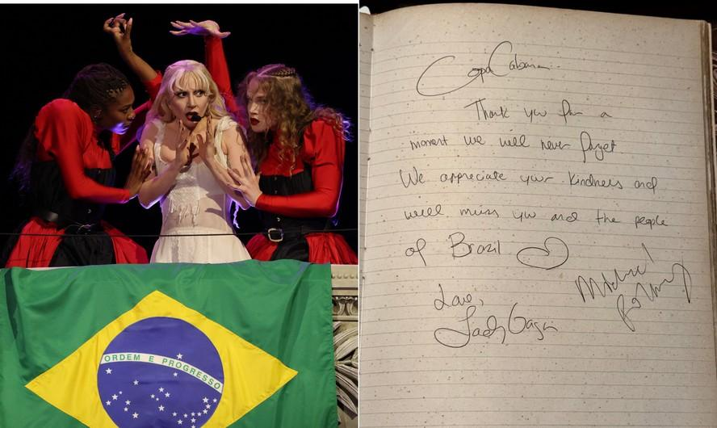

| Configuração | Descrição GEMINI |
|-------------|-----------|
| **alt** | Lady Gaga deixa recado no Livro de Ouro do Copacabana Palace |
| **GEM_COM_15** | A imagem mostra Lady Gaga performando, acompanhada pela bandeira do Brasil e uma nota manuscrita. |
| **GEM_COM_25** | A imagem mostra Lady Gaga em performance, uma bandeira do Brasil e uma nota manuscrita de Lady Gaga e Michael Polansky. |
| **GEM_COM_∞** | A imagem é composta por duas seções principais lado a lado. No lado esquerdo, uma cena de palco mostra a cantora Lady Gaga em destaque, vestindo um traje branco esvoaçante e com cabelos loiros. Ela está no centro, com a boca aberta como se estivesse cantando, e suas mãos estão levantadas e próximas ao peito. Duas outras performers a ladeiam, vestindo roupas vermelhas e pretas, com movimentos de braço dramáticos, interagindo com Lady Gaga. Abaixo da cena do palco, uma grande bandeira do Brasil com suas cores verde, amarela e azul está visível. No lado direito da imagem, há uma página aberta de um livro, que parece ser um livro de visitas ou de ouro. A página contém um texto escrito à mão em inglês, com a caligrafia em tinta escura em linhas pautadas. O texto inclui frases como "Thank you for a moment we will never forget" e "We appreciate your kindness and will miss you and the people of Brazil". Abaixo do texto principal, há duas assinaturas: "Lady Gaga" e "Michael Polansky". |
| **GEM_SEM_15** | Lady Gaga se apresenta com dançarinas e bandeira do Brasil, ao lado de nota de agradecimento de Lady Gaga e Michelle Formiga. |
| **GEM_SEM_25** | A imagem mostra Lady Gaga se apresentando em um palco no Rio de Janeiro, com a bandeira do Brasil visível abaixo, e uma nota escrita à mão por ela, agradecendo ao povo do Brasil. |
| **GEM_SEM_∞** | A imagem é composta por duas seções distintas, dispostas lado a lado. Na seção esquerda, há uma fotografia de uma apresentação ao vivo da cantora Lady Gaga em um palco. Ela está no centro, com cabelos loiros, vestindo um vestido branco e rasgado, e com um microfone próximo à boca, expressando intensidade enquanto canta. Ao seu redor, duas dançarinas, uma de cada lado, vestem roupas em tons de vermelho e preto, com os braços levantados em gestos teatrais. A dançarina à esquerda tem pele escura, enquanto a da direita tem pele clara e cabelos cacheados avermelhados. Abaixo do palco, uma grande bandeira do Brasil é visível, com suas cores vibrantes de verde, amarelo e azul, e o lema "Ordem e Progresso" claramente legível. A bandeira e a apresentação ao vivo da Lady Gaga confirmam ser um show na Praia de Copacabana, no Rio de Janeiro.    A seção direita da imagem mostra um close-up de uma página de um caderno com uma mensagem manuscrita. A nota está endereçada a "Copacabana" e diz: "Thank you for a moment we will never forget. We appreciate your kindness and will miss you and the people of Brazil." ("Obrigado por um momento que nunca esqueceremos. Agradecemos sua gentileza e sentiremos falta de você e do povo do Brasil."). A mensagem é concluída com "Love, Lady Gaga" assinado em caligrafia elegante. |

| Configuração | Descrição GPT |
|-------------|-----------|
| **alt** | Lady Gaga deixa recado no Livro de Ouro do Copacabana Palace |
| **GPT_COM_15** | Lady Gaga com dançarinas e bandeira brasileira; recado manuscrito de Lady Gaga e Michael Polansky. |
| **GPT_COM_25** | Lady Gaga, de branco, canta com bailarinas em vermelho diante da bandeira do Brasil; recado no Livro de Ouro assinado por Gaga e Michael Polansky. |
| **GPT_COM_∞** | Na parte esquerda, uma cena de apresentação ao vivo: Lady Gaga, de cabelos loiros claros e vestido branco fluido, usa um microfone de cabeça e faz expressão intensa, com as mãos próximas ao rosto. Ao seu lado, duas bailarinas vestindo blusas vermelhas e saias ou cintos pretos tocam seus ombros e braços em movimento coreografado. À frente do grupo, pendurada na grade do palco, está a bandeira do Brasil — fundo verde, losango amarelo e círculo azul com a inscrição “Ordem e Progresso”.    Na parte direita, vê-se uma página aberta do Livro de Ouro do Copacabana Palace. Em letras cursivas, alguém escreveu, em inglês:   “Copacabana:   Thank you for a moment we will never forget   We appreciate your kindness and will miss you and the people of Brazil ♥   Love, Lady Gaga   Michael Polansky”   As assinaturas de Lady Gaga e de Michael Polansky aparecem ao final da mensagem. |
| **GPT_SEM_15** | Lady Gaga em palco com bandeira brasileira; bilhete assinado por Lady Gaga e Michael Polansky. |
| **GPT_SEM_25** | Em cena, Lady Gaga em vestido branco entre duas bailarinas de vermelho e preto sobre bandeira do Brasil; à direita, mensagem manuscrita agradecimento em livro. |
| **GPT_SEM_∞** | À esquerda, Lady Gaga está no centro de um palco dramático, vestindo um figurino claro com detalhes rendados, segurando um microfone próximo à boca e com expressão intensa. Atrás dela, duas dançarinas vestidas com mangas longas vermelhas e coletes pretos estendem os braços em direção à cantora, compondo uma cena coreografada. À frente, há uma grande bandeira do Brasil pendurada em um piano de cauda.     À direita, vê-se uma página de caderno de capa dura, com linhas discretas, contendo uma mensagem manuscrita em tinta preta: “Thank you for a moment we will never forget. We appreciate your kindness and will miss you and the people of Brazil ♥ Love, Lady Gaga” — seguida de outra assinatura, “Michael Polansky.” |

---

### IMAGEM 12
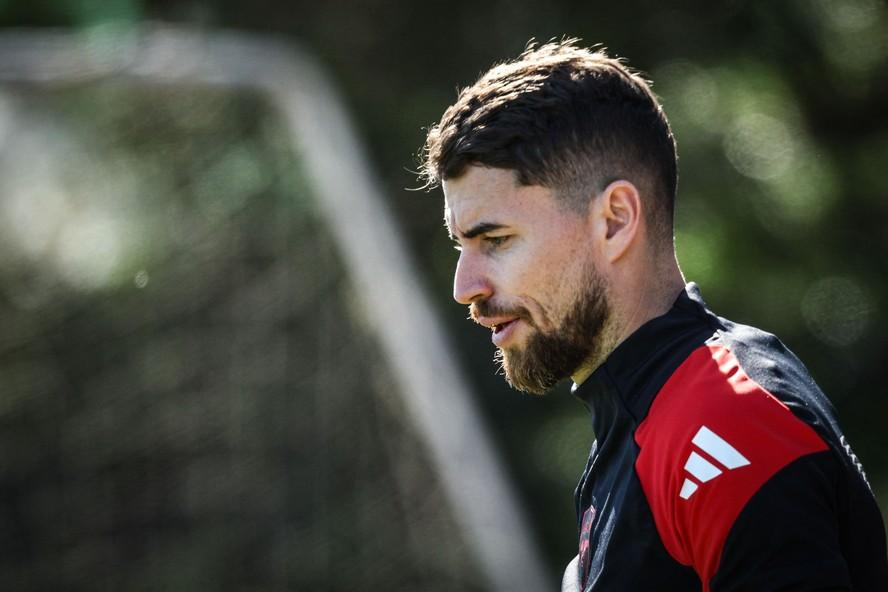

| Configuração | Descrição GEMINI |
|-------------|-----------|
| **alt** | Jorginho, do Arsenal, é desejo do Flamengo |
| **GEM_COM_15** | Jorginho, jogador de futebol, visto de perfil em jaqueta preta e vermelha. |
| **GEM_COM_25** | A close-up shows Jorginho, o meio-campista do Arsenal, em perfil, olhando para a esquerda, usando uma jaqueta Adidas preta e vermelha. |
| **GEM_COM_∞** | A imagem mostra o jogador de futebol Jorginho, de perfil, olhando para a esquerda da fotografia. Ele possui cabelos curtos e escuros, com um corte degradê nas laterais, e uma barba bem cuidada que cobre o queixo e se conecta às costeletas. Jorginho veste uma jaqueta esportiva preta com uma grande faixa vermelha no ombro direito, onde é visível o logotipo da Adidas em branco, composto por três barras diagonais. O fundo da imagem está desfocado, com tons esverdeados e acinzentados, sugerindo um ambiente externo, possivelmente um campo de treinamento, com uma estrutura que parece ser uma trave de gol ou uma cerca, também em desfoque. Jorginho tem uma expressão séria e concentrada. |
| **GEM_SEM_15** | Jorginho, jogador de futebol, usa jaqueta Adidas, em campo. |
| **GEM_SEM_25** | Um homem barbudo, usando uma jaqueta Adidas preta e vermelha, está de perfil em um campo esportivo, olhando para a esquerda. |
| **GEM_SEM_∞** | A imagem apresenta um homem de perfil, com a cabeça virada para a direita, focando em algo fora do enquadramento. Ele tem cabelo escuro cortado curto e uma barba bem cuidada. O homem veste uma jaqueta esportiva predominantemente preta com detalhes em vermelho na parte superior dos braços e ombros, onde um logotipo branco da Adidas, composto por três barras diagonais, é visível. O fundo da imagem está desfocado, com tons de verde e elementos que sugerem uma rede de gol, indicando um ambiente externo, provavelmente um campo de futebol ou treino. |

| Configuração | Descrição GPT |
|-------------|-----------|
| **alt** | Jorginho, do Arsenal, é desejo do Flamengo |
| **GPT_COM_15** | Jorginho de perfil, vestindo uniforme rubro-negro com logo Adidas, fundo desfocado com rede. |
| **GPT_COM_25** | Jorginho, de perfil e com barba, veste agasalho Adidas do Flamengo sobre o campo de treino, com gol ao fundo desfocado. |
| **GPT_COM_∞** | Jorginho aparece em perfil direito, ocupando a maior parte do quadro. Ele veste um agasalho de mangas longas predominantemente preto, com grandes faixas vermelhas nos ombros e o logotipo da Adidas em branco. O cabelo castanho está cortado bem rente nas laterais e ligeiramente mais longo no topo; a barba, também castanha, é bem aparada. Atrás dele, desfocada, vê-se a rede de um gol de futebol, sugerindo um ambiente de treino em campo aberto, com vegetação esverdeada ao fundo. |
| **GPT_SEM_15** | Homem de perfil, magro, barba aparada, veste agasalho preto e vermelho Adidas, treino futebol. |
| **GPT_SEM_25** | Homem de perfil com barba e cabelo curto, veste uniforme esportivo preto e vermelho com logotipo branco, próximo a trave de futebol, campo gramado. |
| **GPT_SEM_∞** | Um homem adulto visto de perfil direito, com cabelo curto e escuro e barba bem aparada. Ele veste um agasalho esportivo de tecido leve, predominantemente preto com ombros e laterais vermelhas, onde se destaca um logo branco da marca Adidas. Ao fundo, desfocado, aparece a estrutura metálica de um gol de futebol e algumas áreas de vegetação iluminadas pela luz do dia. |

---

### IMAGEM 13
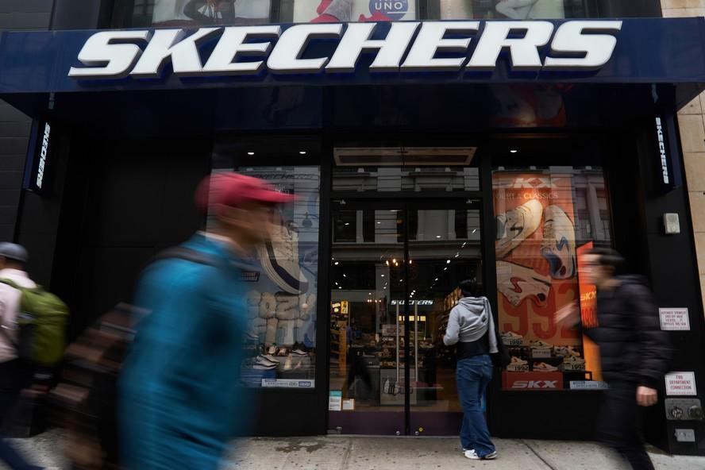

| Configuração | Descrição GEMINI |
|-------------|-----------|
| **alt** | Skechers, terceira maior marca de calçados atrás de Nike e Adidas, que foi adquirida pelo 3G |
| **GEM_COM_15** | Loja da Skechers com pessoas em movimento borrado, refletindo o ambiente urbano. |
| **GEM_COM_25** | Uma loja da Skechers com seu letreiro proeminente, onde pessoas borradas por movimento passam em frente à vitrine, exibindo calçados. |
| **GEM_COM_∞** | A imagem mostra a fachada de uma loja da marca Skechers em uma rua, com pessoas em movimento passando em frente. O letreiro grande e branco com o nome "SKECHERS" é proeminente na parte superior da loja, sobre um fundo azul escuro. Abaixo do letreiro principal, há grandes vitrines de vidro que exibem calçados. As vitrines à esquerda e à direita mostram pôsteres ou displays de sapatos, com um mostrando sapatos com o nome "SKX CLASSICS" e o ano "1992" visível. O interior da loja é visível através da porta de entrada e das vitrines, mostrando mais calçados em prateleiras. Várias pessoas estão andando na calçada em frente à loja; algumas estão borradas devido ao movimento, incluindo uma pessoa com um boné vermelho e uma mochila em primeiro plano à esquerda, e outras pessoas mais ao fundo à direita. Há também uma placa vertical menor com o nome "SKECHERS" no lado direito da fachada. |
| **GEM_SEM_15** | Uma loja da Skechers com pessoas desfocadas passando pela frente. |
| **GEM_SEM_25** | Uma loja da Skechers é vista na rua, com pessoas em movimento passando em frente à vitrine. |
| **GEM_SEM_∞** | Uma loja da Skechers é vista de frente, com a entrada e as vitrines em primeiro plano. O nome "SKECHERS" está em letras grandes e brancas no toldo azul escuro acima da entrada principal. As vitrines exibem calçados, incluindo alguns com a marca "SKX" e "SKECHERS Classics". Há pessoas em movimento na calçada em frente à loja, com seus rostos e corpos borrados devido ao movimento, dando uma sensação de atividade. Uma pessoa vestindo uma camisa azul e um boné vermelho é visível no lado esquerdo, em movimento. Outra pessoa de costas, vestindo um moletom cinza e jeans, está parada em frente à vitrine no centro da imagem, e uma terceira pessoa, com roupas escuras, aparece à direita, também em movimento. O chão da calçada é visível na parte inferior da imagem. |

| Configuração | Descrição GPT |
|-------------|-----------|
| **alt** | Skechers, terceira maior marca de calçados atrás de Nike e Adidas, que foi adquirida pelo 3G |
| **GPT_COM_15** | Fachada da loja Skechers com letreiro azul e branco; pedestres desfocados caminham em frente. |
| **GPT_COM_25** | Fachada da loja Skechers com letreiro azul e branco. Vitrines exibem tênis. Portas de vidro abertas revelam interior iluminado. Pessoas desfocadas caminham em frente. |
| **GPT_COM_∞** | Frente de uma loja da marca Skechers em uma rua urbana. Acima da porta de entrada há uma placa grande com o nome “SKECHERS” em letras brancas sobre fundo azul escuro. A entrada é composta por duas portas de vidro transparentes, ladeadas por vitrines também em vidro. Na vitrine à direita, um grande cartaz exibe em letras vermelhas o código “SKX” junto a imagens de tênis; na vitrine à esquerda, surgem detalhes ampliados de outros modelos de calçados. No passeio em frente à loja, um cliente com moletom cinza, calça jeans e tênis claros está de costas, junto à porta, aparentemente prestes a entrar. À esquerda e à direita, dois pedestres em movimento aparecem desfocados: um veste boné vermelho e jaqueta azul, o outro usa roupa escura. O chão de concreto mostra pequenas manchas de umidade. |
| **GPT_SEM_15** | Fachada da loja Skechers com letreiro grande, vitrine iluminada e pedestres desfocados passando. |
| **GPT_SEM_25** | Entrada da loja Skechers em uma rua movimentada, com letreiro grande. Pessoas passando em frente em movimento, vitrines exibindo tênis. |
| **GPT_SEM_∞** | Fachada de uma loja da marca Skechers com letreiro em destaque na parte superior, em letras maiúsculas brancas sobre fundo azul-escuro. A frente é composta por duas portas de vidro ao centro, ladeadas por grandes vitrines. Na vitrine da direita, um cartaz em tons quentes anuncia a linha “SKX Classics” e exibe ilustrações estilizadas de tênis; na da esquerda, há outro cartaz predominantemente azul com imagens de calçados. Pelo vidro é possível ver prateleiras internas repletas de tênis, iluminação discreta e reflexos da rua. No passeio em frente, quatro pessoas aparecem em movimento: uma pessoa de perfil vestindo casaco azul turquesa e boné vermelho, carregando mochila; outra de costas, parada diante da porta, usando moletom cinza com capuz, calça jeans e tênis claros; e duas pessoas desfocadas à direita e à esquerda, em trânsito, vestindo roupas escuras. O chão de concreto levemente úmido reflete a ação de pedestres circulando. |

---

### IMAGEM 15


| Configuração | Descrição GEMINI |
|-------------|-----------|
| **alt** | O procurador-geral da República, Paulo Gonet, durante sessão do STF |
| **GEM_COM_15** | Paulo Gonet Branco, Procurador-Geral da República, está sentado em uma cadeira de couro. Ele usa óculos, terno escuro, camisa branca e gravata salmão. Ao fundo, uma parede clara. |
| **GEM_COM_25** | A imagem mostra Paulo Gonet, o Procurador-Geral da República, usando uma toga preta e gravata salmão, sentado em uma cadeira de couro. Um microfone está à sua frente. |
| **GEM_COM_∞** | A imagem mostra Paulo Gonet Branco, o atual Procurador-Geral da República do Brasil, sentado em uma cadeira de couro cor de caramelo em um ambiente formal, provavelmente um tribunal ou plenário. Ele está de frente para a câmera, com uma expressão séria. Gonet usa óculos de armação escura, tem cabelos grisalhos curtos penteados para o lado e está vestido com um terno escuro, camisa branca e uma gravata salmão. Sobre o terno, ele veste uma toga preta. Há um microfone em frente a ele, sobre uma mesa que não é totalmente visível, e ao lado direito do microfone, um porta-lápis com canetas e lápis coloridos. Ao fundo, uma parede clara com detalhes arquitetônicos em relevo pode ser observada. |
| **GEM_SEM_15** | O ministro Dias Toffoli veste toga e gravata pêssego, sentado em um ambiente formal. |
| **GEM_SEM_25** | O Ministro Luiz Fux, do Supremo Tribunal Federal, está sentado em uma cadeira marrom, usando uma toga preta e gravata clara, com um microfone à sua frente em um ambiente formal. |
| **GEM_SEM_∞** | A imagem mostra o ministro do Supremo Tribunal Federal (STF), Luís Roberto Barroso, sentado em uma cadeira de couro clara, em um ambiente que aparenta ser um plenário de tribunal. Barroso veste uma toga preta sobre uma camisa branca e uma gravata de cor pêssego ou rosa clara, com o nó ajustado ao pescoço. Ele usa óculos de armação fina e tem cabelos grisalhos e curtos, penteados para o lado. Seu olhar está direcionado para frente, com uma expressão séria. À sua frente, há um microfone preto em primeiro plano e, sobre a mesa, objetos de escritório, incluindo canetas coloridas em um suporte. Ao fundo, a parede é de um material claro com padrões geométricos em relevo, que se assemelham a arcos ou formas arredondadas. O ambiente é formal e bem iluminado. |

| Configuração | Descrição GPT |
|-------------|-----------|
| **alt** | O procurador-geral da República, Paulo Gonet, durante sessão do STF |
| **GPT_COM_15** | Alexandre de Moraes, ministro do STF, está sentado na cadeira do plenário, vestindo toga preta. |
| **GPT_COM_25** | Ministro Alexandre de Moraes sentado no plenário do STF, usando toga preta, gravata rosa, óculos, expressão séria, parede de mármore ao fundo. |
| **GPT_COM_∞** | O ministro Alexandre de Moraes, sentado no plenário do Supremo Tribunal Federal, veste toga preta sobre camisa branca e gravata cor de salmão. Ele usa óculos de aro escuro e mantém expressão séria. À sua frente, sobre a bancada de madeira clara, há um microfone, um copo de vidro com água, um frasco de álcool em gel e um porta-canetas com lápis coloridos. Ao fundo, vê-se parede de mármore claro com nichos semicirculares. |
| **GPT_SEM_15** | Homem de terno, gravata rosa e toga preta, sentado em poltrona, fundo de mármore claro. |
| **GPT_SEM_25** | Um homem sentado em cadeira alta atrás de mesa, vestindo toga preta, camisa branca e gravata rosa, com microfone, copo transparente com canetas e lápis. |
| **GPT_SEM_∞** | Alexandre de Moraes aparece sentado em uma poltrona estofada de tom amarelado claro, vestindo terno cinza escuro, camisa branca, gravata rosa pálido e toga preta aberta. À sua frente, sobre uma bancada de madeira, há um microfone de haste alongada virado em sua direção e um copo transparente contendo diversos instrumentos de escrita coloridos (lápis e canetas). Ao fundo, vê-se uma parede de mármore claro com painéis retangulares e relevos semicirculares no alto. Alexandre de Moraes olha em direção à frente com expressão serena. |

---

### IMAGEM 16


| Configuração | Descrição GEMINI |
|-------------|-----------|
| **alt** | Calculadora do GLOBO simula nota para passar no MPU |
| **GEM_COM_15** | Pessoa com celular usando calculadora de concurso, e outra mão escreve em folha de respostas. |
| **GEM_COM_25** | Uma mão segura um smartphone exibindo a "Calculadora do concurso do Ministério Público da União (MPU)" d'O GLOBO. Ao fundo, uma calculadora e uma mão preenchendo uma folha de respostas. |
| **GEM_COM_∞** | A imagem mostra um smartphone sendo segurado na mão esquerda de uma pessoa, com uma calculadora, uma folha de respostas de prova e uma caneta ao fundo, todos com um tom azulado. No centro do smartphone, a tela exibe um aplicativo intitulado "CALCULADORAS O GLOBO" e "Calculadora do concurso do Ministério Público da União (MPU)". Abaixo do título, há a instrução "Insira o número de acertos em cada módulo". Dois campos de entrada, identificados como "Módulo 1" e "Módulo 2", cada um mostrando o número "0", estão visíveis. Um botão azul com o texto "CALCULAR" está posicionado abaixo dos campos de entrada. No canto superior esquerdo da tela do aplicativo, há um ícone de calculadora com um "tick" verde e um "X" vermelho. Ao fundo, no lado esquerdo, uma calculadora branca de bolso com botões numéricos e funções como "EXP" e "SCIENTIFIC CALC" está sobre uma folha pautada. No lado direito, uma mão segura uma caneta esferográfica preta, pronta para marcar as opções em uma folha de gabarito com círculos de resposta, indicando um contexto de prova ou avaliação. |
| **GEM_SEM_15** | Mão segura smartphone com calculadora MPU. Calculadora científica e folha de respostas ao fundo. |
| **GEM_SEM_25** | Uma pessoa segura um smartphone exibindo a calculadora de concursos do MPU de O Globo. Ao fundo, uma calculadora e uma mão preenchendo um gabarito. |
| **GEM_SEM_∞** | Uma imagem digital em tons de azul e branco mostra uma mão segurando um smartphone na vertical, com a tela de um aplicativo de calculadora em destaque. A tela do smartphone exibe um ícone de calculadora com um visto verde e um 'X' vermelho, e o texto "CALCULADORAS O GLOBO". O título principal do aplicativo é "Calculadora do concurso do Ministério Público da União (MPU)". Abaixo, há a instrução "Insira o número de acertos em cada módulo" e dois campos de entrada de texto, "Módulo 1" e "Módulo 2", ambos exibindo o valor "0". Na parte inferior da tela, há um botão azul com a palavra "CALCULAR". Ao fundo, desfocados e em tons de azul, aparecem elementos relacionados a estudos e exames: à esquerda, parte de uma calculadora científica branca com botões numéricos e de função; à direita, uma mão segura uma caneta escura sobre uma folha de respostas de múltipla escolha, com círculos de opções marcados de "A" a "E". |

| Configuração | Descrição GPT |
|-------------|-----------|
| **alt** | Calculadora do GLOBO simula nota para passar no MPU |
| **GPT_COM_15** | Mão segurando smartphone exibindo calculadora do concurso do Ministério Público da União (MPU) do GLOBO. |
| **GPT_COM_25** | Mão segura um smartphone exibindo a calculadora do concurso do Ministério Público da União (MPU) da Calculadoras O Globo, com campos Módulo 1 e 2. |
| **GPT_COM_∞** | Uma mão segura um smartphone na posição vertical, exibindo na tela um aplicativo com o cabeçalho “CALCULADORAS O GLOBO” e o título “Calculadora do concurso do Ministério Público da União (MPU)”. Abaixo, há dois campos de entrada rotulados “Módulo 1” e “Módulo 2”, ambos com o valor “0”, e um botão azul com o texto “CALCULAR”. O logotipo do aplicativo mostra um ícone de calculadora estilizada, com um sinal de correto em verde e um de incorreto em vermelho. Ao fundo, desfocado, aparece uma folha de respostas com áreas de marcação em círculos, um lápis cinza escuro segurado por outra mão e, mais ao fundo, parte de uma calculadora científica branca. |
| **GPT_SEM_15** | Mão segura smartphone exibindo 'Calculadora do MPU'; segundo plano, calculadora e folha de respostas marcada. |
| **GPT_SEM_25** | Mão segura smartphone com a Calculadora O Globo do concurso do Ministério Público da União (MPU), mostrando campos de acertos e botão Calcular. Fundo: prova. |
| **GPT_SEM_∞** | Um smartphone segurado pela mão direita exibe na tela, sobre fundo azul-claro, o título “Calculadora do concurso do Ministério Público da União (MPU)” e, logo acima, o logotipo “Calculadoras O Globo” composto por um ícone de calculadora com um sinal de visto verde de um lado e um X vermelho do outro. Abaixo, o texto “Insira o número de acertos em cada módulo” aparece seguido de dois campos numerados “Módulo 1” e “Módulo 2”, ambos preenchidos com o valor zero, e um botão retangular azul contendo a palavra “CALCULAR”. Ao fundo, desfocados, há um pedaço de um bloco de provas de múltipla escolha com bolinhas sendo marcadas por um lápis e, à esquerda, uma calculadora científica apoiada sobre folhas quadriculadas. |

---

### IMAGEM 17


| Configuração | Descrição GEMINI |
|-------------|-----------|
| **alt** | Imposto de Renda 2025 |
| **GEM_COM_15** | Pessoa segura celular exibindo "Declaração de Imposto de Renda 2025" com tela maior ao fundo. |
| **GEM_COM_25** | Uma pessoa segura um smartphone exibindo a "Declaração de Imposto de Renda 2025", com o mesmo logo aparecendo em uma tela maior ao fundo. |
| **GEM_COM_∞** | Uma pessoa com óculos segura um smartphone com as duas mãos, na altura dos olhos, olhando para uma tela maior ao fundo. Tanto na tela do smartphone quanto na tela do fundo, aparece o logotipo da Receita Federal do Brasil com os dizeres "DECLARAÇÃO DE IMPOSTO DE RENDA 2025". O logotipo é predominantemente azul e roxo, com um detalhe verde vibrante no canto inferior direito que destaca o ano "2025". A imagem está focada no smartphone, enquanto a tela de fundo está ligeiramente desfocada. |
| **GEM_SEM_15** | Uma pessoa segura um smartphone exibindo "Declaração de Imposto de Renda 2025", com o mesmo texto visível em uma tela maior ao fundo. |
| **GEM_SEM_25** | A imagem mostra uma pessoa segurando um smartphone com a tela exibindo "Declaração de Imposto de Renda 2025" e o logotipo da Receita Federal. O mesmo texto e logo aparecem ampliados em um monitor ao fundo. |
| **GEM_SEM_∞** | A imagem mostra uma pessoa segurando um smartphone em primeiro plano, com uma tela de computador maior desfocada ao fundo. Ambas as telas exibem o texto "DECLARAÇÃO DE IMPOSTO DE RENDA 2025" em letras maiúsculas e brancas sobre um fundo azul-púrpura, com o ano "2025" destacado em verde-limão. O logotipo da Receita Federal do Brasil, que se assemelha a um chapéu estilizado com uma seta apontando para cima, está visível no canto superior esquerdo da área de texto em ambas as telas. A pessoa que segura o smartphone está usando óculos e parte de sua cabeça e ombro são visíveis no lado direito da imagem, de costas para o observador e aparentemente olhando para a tela maior. |

| Configuração | Descrição GPT |
|-------------|-----------|
| **alt** | Imposto de Renda 2025 |
| **GPT_COM_15** | "Declaração de Imposto de Renda 2025" em smartphone e em monitor ao fundo. |
| **GPT_COM_25** | Homem de costas, usando óculos, segura smartphone com logo ‘Declaração de Imposto de Renda 2025’, exibido também em monitor ao fundo. |
| **GPT_COM_∞** | Uma pessoa é vista de costas e de perfil, segurando um smartphone com as duas mãos em frente ao corpo. Na tela do aparelho aparece em destaque o texto “Declaração de Imposto de Renda 2025” em letras brancas sobre um fundo azul e detalhes verdes. Ao fundo, desfocado, um monitor exibe o mesmo logo “Declaração de Imposto de Renda 2025” em tamanho maior. A pessoa veste óculos e tem o cabelo escuro, mas o rosto não está totalmente visível. |
| **GPT_SEM_15** | Smartphone e monitor exibem logo da Receita Federal mostrando "Declaração de Imposto de Renda 2025". |
| **GPT_SEM_25** | Pessoa segura smartphone exibindo “Declaração de Imposto de Renda 2025”; ao fundo, tela de computador mostra mesma arte em tons de azul, verde e branco. |
| **GPT_SEM_∞** | Um par de mãos segura um smartphone em orientação vertical, com a tela exibindo o logotipo oficial da “Declaração de Imposto de Renda 2025”: letras brancas sobre fundo azul, detalhes em verde, e o ano “2025” destacado em azul sobre retângulo verde. Ao fundo, desfocado, um monitor de computador mostra a mesma arte gráfica em tamanho maior. À direita, em segundo plano e fora de foco, aparece de perfil parte do rosto de uma pessoa que usa óculos. |

---

### IMAGEM 18


| Configuração | Descrição GEMINI |
|-------------|-----------|
| **alt** | Acidente com oito veículos interdita a Linha Vermelha, sentido Baixada Fluminense |
| **GEM_COM_15** | A imagem mostra congestionamento de veículos, incluindo ônibus e carros, em uma ponte sobre a água. |
| **GEM_COM_25** | Vista aérea de uma ponte na Linha Vermelha mostra engarrafamento com carros, ônibus e caminhões, sobre a água. |
| **GEM_COM_∞** | A imagem captura um engarrafamento intenso em uma ponte multi-faixas da Linha Vermelha, no Rio de Janeiro, em um trecho após a entrada para a Ilha do Governador. A ponte atravessa uma área de água, com uma margem de terra e árvores visíveis ao fundo. A via está repleta de veículos, incluindo vários carros, alguns ônibus e o que parece ser um caminhão de bombeiros, indicando a presença de um acidente ou incidente que causou a interdição e o congestionamento. A cena é diurna, sob luz natural. |
| **GEM_SEM_15** | Ponte com tráfego intenso de carros, ônibus e caminhões sobre a água. |
| **GEM_SEM_25** | Uma ponte lotada de veículos está sobre um corpo d'água, com árvores visíveis ao fundo, indicando engarrafamento. |
| **GEM_SEM_∞** | A imagem mostra uma ponte de concreto com tráfego intenso. A ponte está visivelmente congestionada com uma variedade de veículos, incluindo numerosos carros de passeio de diferentes cores, um ônibus verde escuro, um ônibus azul escuro e vários caminhões. Entre os caminhões, é possível identificar um veículo semelhante a um caminhão de bombeiros de cor vermelha e um caminhão baú branco. Abaixo da estrutura da ponte, há um corpo d'água, com algumas aberturas quadradas nos pilares da ponte que revelam a água. Ao fundo da imagem, no lado oposto do corpo d'água, há uma área de terra com densa vegetação, predominantemente árvores verdes. A cena é iluminada pela luz do dia, indicando um período diurno. A perspectiva da foto é elevada, proporcionando uma visão ampla do congestionamento na ponte. |

| Configuração | Descrição GPT |
|-------------|-----------|
| **alt** | Acidente com oito veículos interdita a Linha Vermelha, sentido Baixada Fluminense |
| **GPT_COM_15** | Ônibus, caminhões, carros e motos congestionados na Linha Vermelha, sobre ponte elevada, tráfego intenso. |
| **GPT_COM_25** | Na ponte da Linha Vermelha, engarrafamento envolvendo ônibus branco, ônibus urbano verde, caminhão branco, carros e motos bloqueia a via sobre a água. |
| **GPT_COM_∞** | Uma ponte elevada em estrutura de concreto (Linha Vermelha), com seus pilares apoiados sobre um corpo d’água, tomada por um engarrafamento. Na pista, enfileiram-se:   - Um ônibus urbano de cor verde parado no meio do fluxo.   - Um micro-ônibus ou carro de passeio maior, de laterais claras, posicionado à frente do ônibus verde.   - Um caminhão baú branco logo atrás desse micro-ônibus.   - Um veículo de grande porte na cor vermelha, possivelmente um caminhão ou guincho, junto ao caminhão baú.   - Vários carros de passeio — em branco, prata e preto — compactados um atrás do outro, antes e depois dos veículos maiores.   - Dois motociclistas com jaquetas ou coletes de alta visibilidade amarelos, parados ao lado dos demais veículos.   Ao fundo, à direita, vê-se a linha de carros estendida até a margem oposta, com vegetação e árvores ao longe, e, à esquerda, uma faixa de areia formando a orla do reservatório. |
| **GPT_SEM_15** | Ponte de concreto sobre rio lotada de carros, ônibus e caminhões em congestionamento. |
| **GPT_SEM_25** | Tráfego intenso sobre ponte de concreto: fileira de carros, caminhões, ônibus branco e ônibus verde parados, à beira de rio sob vegetação ribeirinha. |
| **GPT_SEM_∞** | Uma fotografia aérea mostra um longo viaduto de concreto que atravessa um rio de águas calmas. No tabuleiro do viaduto, veem-se duas faixas de rolamento tomadas por um engarrafamento intenso: na pista mais próxima ao observador, alinham-se vários carros de passeio em tons branco, prata e preto, seguidos por um ônibus urbano pintado de verde e por um ônibus rodoviário branco maior. Logo atrás, surgem caminhões – um deles de cor vermelha e outro com uma carroceria alta e branca. Entre esses veículos, nota-se um caminhão-guindaste com lança amarela erguida verticalmente. As colunas de sustentação do viaduto emergem da superfície do rio em intervalos regulares. À margem oposta, à direita, estende-se uma faixa de areia clara junto à água, e logo acima erguem-se árvores com folhagem densa que acompanha o curso do rio. A luz natural é intensa, indicando que a cena ocorre durante o dia. |

---

### IMAGEM 19
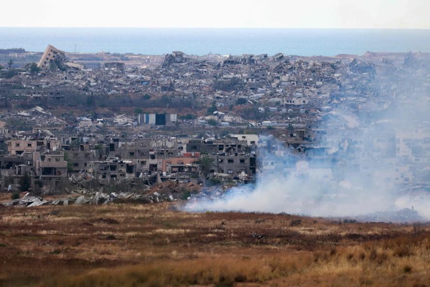

| Configuração | Descrição GEMINI |
|-------------|-----------|
| **alt** | Fumaça sobe em frente a casas destruídas no norte de Gaza |
| **GEM_COM_15** | A paisagem devastada de Gaza mostra edifícios em ruínas, escombros e fumaça perto do mar. |
| **GEM_COM_25** |  Uma paisagem devastada de Gaza, com prédios em ruínas, fumaça subindo e o mar ao fundo. |
| **GEM_COM_∞** | A imagem mostra uma vasta área urbana na Faixa de Gaza que foi reduzida a escombros. Edifícios destruídos e pilhas de detritos se estendem por toda a paisagem, com algumas estruturas ainda parcialmente de pé, mas visivelmente danificadas. No primeiro plano, há um terreno árido e coberto por vegetação rasteira. Ao fundo, é possível ver um corpo de água, que é o Mar Mediterrâneo, típico da geografia de Gaza. Uma coluna de fumaça azul-acinzentada sobe de dentro da área destruída, indicando incêndios ou atividades recentes. A cena geral transmite uma impressão de devastação generalizada e impacto de conflito. |
| **GEM_SEM_15** | A imagem mostra a cidade de Gaza devastada, com fumaça e escombros, e o mar ao fundo. |
| **GEM_SEM_25** | A paisagem urbana devastada da Faixa de Gaza é visível, com prédios destruídos, escombros, fumaça e o mar ao fundo. |
| **GEM_SEM_∞** | Uma paisagem desolada de destruição em massa se estende ao longo da costa da Faixa de Gaza. No primeiro plano, há uma área de campo seco e irregular. Além dela, surge uma cidade inteiramente devastada, com a grande maioria dos edifícios reduzidos a escombros e pilhas de detritos. Fumaça branca pode ser vista subindo de várias áreas da paisagem urbana, indicando focos de incêndio ou atividade recente.    No meio da área destruída, um edifício alto e inclinado se destaca, quase em colapso. O cenário geral é de devastação catastrófica, com a infraestrutura urbana em ruínas e estradas irreconhecíveis. Ao fundo, o Mar Mediterrâneo encontra o horizonte, contrastando com a destruição em terra.    A cidade em questão é Gaza, com áreas como Al-Zahra sendo particularmente afetadas e frequentemente retratadas em imagens de destruição. A extensão dos danos é imensa, com relatórios indicando que uma grande porcentagem das estruturas na Faixa de Gaza foram danificadas ou destruídas devido a conflitos recentes. |

| Configuração | Descrição GPT |
|-------------|-----------|
| **alt** | Fumaça sobe em frente a casas destruídas no norte de Gaza |
| **GPT_COM_15** | Vista panorâmica de prédios destruídos na Faixa de Gaza, fumaça emergindo do campo seco. |
| **GPT_COM_25** | Vista panorâmica da Faixa de Gaza: edifícios destruídos alinhados em ruínas, fumaça azulada subindo, Mar Mediterrâneo ao fundo e campo raso em primeiro plano. |
| **GPT_COM_∞** | Um amplo panorama mostra uma faixa de terreno seco e coberto por vegetação baixa, no qual nuvens de fumaça azulada emergem do solo. Logo atrás, ergue-se uma extensa área urbana fortemente devastada: blocos de edifícios residenciais com fachadas desmoronadas, escombros empilhados e ruas tomadas pelo entulho. Ao fundo, a linha do horizonte revela o mar, de cor azul-claro, contrastando com o cenário de destruição. |
| **GPT_SEM_15** | Campo em primeiro plano, pluma de fumaça, blocos de prédios destruídos e mar ao fundo. |
| **GPT_SEM_25** | Campo raso e seco em primeiro plano; colunas de fumaça elevam-se sobre prédios residenciais em ruínas; ao fundo, o mar calmo sob céu claro. |
| **GPT_SEM_∞** | À frente, um amplo campo aberto coberto por vegetação seca e amarelada. Mais ao fundo, erguem-se inúmeras construções urbanas em avançado estado de destruição: blocos de apartamentos e casas reduzidos a escombros, com paredes desabadas e janelas estilhaçadas. Entre o campo e as ruínas, sai uma espessa coluna de fumaça esbranquiçada, indicando um ponto recente de incêndio ou explosão. No horizonte, pode-se ver o mar, delimitando o fim da paisagem devastada. |

---

### IMAGEM 20


| Configuração | Descrição GEMINI |
|-------------|-----------|
| **alt** | O senador Flavio Bolsonaro (PL-RJ) |
| **GEM_COM_15** | O senador Flávio Bolsonaro, de óculos, veste terno escuro e gravata amarela, coçando a cabeça. |
| **GEM_COM_25** | A imagem mostra Flávio Bolsonaro, de óculos e gravata amarela, com a mão esquerda na cabeça, em um ambiente escuro. |
| **GEM_COM_∞** | A imagem exibe Flávio Bolsonaro, um homem branco de meia-idade, visto da cintura para cima, com a cabeça ligeiramente inclinada para baixo e a mão direita na cabeça, como se estivesse coçando-a ou em um gesto pensativo. Ele usa óculos de armação escura e tem cabelos curtos, escuros e levemente ondulados. Veste uma camisa social branca, uma gravata amarela com um padrão discreto de losangos e um terno azul-marinho. No bolso do terno, há um pequeno broche dourado. A iluminação é focada nele, deixando o fundo escuro e desfocado, com alguns elementos verticais claros visíveis. |
| **GEM_SEM_15** | Rogério Marinho, de óculos, terno escuro e gravata amarela, com a mão na cabeça. |
| **GEM_SEM_25** | Um homem de óculos, terno escuro e gravata amarela estampada tem a mão na cabeça. |
| **GEM_SEM_∞** | A imagem apresenta Renan Calheiros Filho, um homem de meia-idade, retratado da altura do peito para cima, em um ambiente interno com fundo escuro. Ele está usando óculos de armação escura, um terno escuro, uma camisa social branca e uma gravata amarela com um padrão discreto. Sua mão direita está posicionada na parte de trás da cabeça, como se estivesse coçando, e seu olhar está ligeiramente direcionado para baixo e para o lado direito da imagem. No lado esquerdo do seu paletó, há um pequeno broche dourado. A iluminação parece vir da frente, com um leve reflexo azulado visível nas lentes de seus óculos. |

| Configuração | Descrição GPT |
|-------------|-----------|
| **alt** | O senador Flavio Bolsonaro (PL-RJ) |
| **GPT_COM_15** | Flávio Bolsonaro, senador de terno escuro e gravata amarela, ajusta os cabelos com expressão pensativa. |
| **GPT_COM_25** | Flávio Bolsonaro, senador (PL-RJ), aparece de terno escuro, camisa branca, gravata amarela e óculos, coçando levemente a cabeça, expressão pensativa em ambiente institucional. |
| **GPT_COM_∞** | A imagem mostra um homem de meia-idade, trajando terno escuro, camisa branca e gravata amarela com estampas discretas. Ele usa óculos de aro fino e escuro e mantém a mão direita sobre a cabeça, como se coçasse ou ajeitasse os cabelos. O fundo é pouco iluminado, remetendo a um ambiente interno, possivelmente uma sala de sessão ou plenário, com painéis verticais escuros desfocados. A expressão do homem é séria e concentrada. |
| **GPT_SEM_15** | Homem de terno escuro, gravata amarela, óculos, coçando a cabeça, expressão pensativa, fundo escuro. |
| **GPT_SEM_25** | Homem de terno escuro e gravata amarela, usando óculos, sentado em ambiente interno pouco iluminado, com expressão pensativa e mão direita coçando a cabeça. |
| **GPT_SEM_∞** | Um homem de meia-idade aparece em plano médio, vestindo paletó escuro, camisa branca e gravata amarela com estampa discreta. Ele tem os cabelos curtos e escuros e usa óculos de armação fina. Com o braço direito levantado, a mão repousa sobre o topo da cabeça em um gesto de coçar ou ajeitar o cabelo. O fundo está desfocado, realçando o rosto e a postura do homem em um ambiente interno pouco iluminado. |

---

### IMAGEM 21
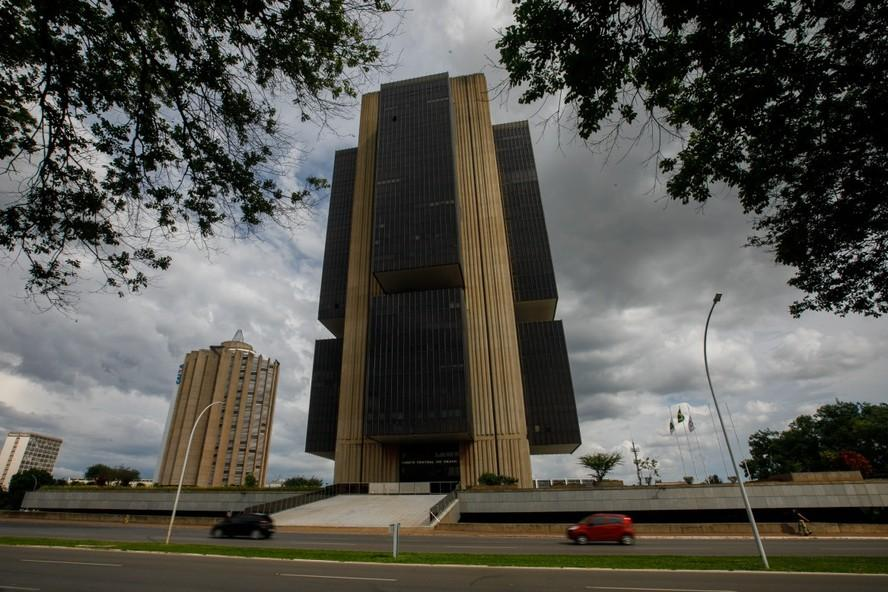

| Configuração | Descrição GEMINI |
|-------------|-----------|
| **alt** | O prédio do Banco Central, em Brasília |
| **GEM_COM_15** | A imagem exibe os edifícios do Banco Central do Brasil e da Caixa Econômica Federal em Brasília. |
| **GEM_COM_25** | A imagem exibe o Edifício-Sede do Banco Central do Brasil em Brasília, um prédio alto e escuro com detalhes em bege, sob um céu nublado. À esquerda, há outro edifício inclinado de cor clara, enquanto carros passam na rua em primeiro plano. |
| **GEM_COM_∞** | A imagem mostra o icônico edifício sede do Banco Central do Brasil em Brasília, sob um céu parcialmente nublado. O edifício principal, com sua fachada em tons de cinza e preto e detalhes em marrom claro, domina o centro da composição. À esquerda, um prédio mais claro e com uma forma mais arredondada é visível, que é o Edifício Matriz da Caixa Econômica Federal.    Na parte inferior da imagem, uma rua asfaltada com faixas brancas se estende horizontalmente, com dois carros em movimento: um preto à esquerda e um vermelho à direita. O edifício do Banco Central está sobre uma plataforma elevada, com escadas brancas largas que levam à entrada principal. Uma estrutura baixa e cinza, que parece ser um muro ou parte da plataforma, separa a plataforma da rua. Galhos de árvores com folhagem densa em tons de verde escuro e algumas sem folhas em primeiro plano e nas laterais superior da imagem, emolduram a cena e adicionam um toque natural. No lado direito, bandeiras tremulam em mastros altos, e um poste de iluminação alto e curvado se destaca em primeiro plano. |
| **GEM_SEM_15** | A imagem mostra o imponente edifício do Banco Central do Brasil em Brasília, com o Edifício Caixa Econômica Federal ao lado, sob céu nublado. |
| **GEM_SEM_25** | Uma foto mostra o edifício-sede do Banco Central do Brasil em Brasília, um prédio alto e escuro, com o prédio inclinado da Caixa Econômica Federal ao lado, sob céu nublado. |
| **GEM_SEM_∞** | A imagem mostra uma vista exterior de dois edifícios distintos em Brasília, sob um céu nublado.    No centro da imagem, destaca-se o edifício-sede do Banco Central do Brasil. É um arranha-céu alto e imponente, com 21 andares e 101 metros de altura, concluído em 1981. O design do edifício, criado pelo arquiteto Hélio Ferreira Pinto, é caracterizado por múltiplas faces escuras e superfícies verticais bege ou claras, dispostas em blocos que se projetam e recuam, dando-lhe uma aparência volumosa e moderna. A fachada possui seções de vidro escuras e colunas verticais. A base do edifício é ampla e tem uma escadaria de concreto claro que leva à entrada principal.    À esquerda do edifício do Banco Central, há outro prédio mais baixo e de formato cilíndrico, que é a sede da Caixa Econômica Federal. Este edifício tem uma coloração mais clara, provavelmente bege ou cinza claro, e apresenta várias janelas retangulares organizadas em torno de sua forma arredondada. O topo do edifício da Caixa Econômica Federal tem uma estrutura pontiaguda ou cônica.    Na parte inferior da imagem, há uma estrada com duas pistas, e dois carros estão visíveis, um preto e um vermelho, em movimento. Árvores com folhagem escura em primeiro plano e em ambos os lados emolduram a cena, com alguns galhos secos visíveis na parte superior esquerda. O céu está predominado por nuvens cinzentas e densas, sugerindo um dia nublado. |

| Configuração | Descrição GPT |
|-------------|-----------|
| **alt** | O prédio do Banco Central, em Brasília |
| **GPT_COM_15** | Edifício-sede do Banco Central do Brasil em Brasília, com bandeira do Brasil, carros na avenida. |
| **GPT_COM_25** | Sede do Banco Central do Brasil em Brasília, edifício com torres retangulares. Em frente, avenida com carros (um preto, um vermelho) e bandeiras do Brasil. |
| **GPT_COM_∞** | A fotografia mostra em primeiro plano uma avenida de faixa dupla, sobre a qual trafegam dois carros – um de cor escura à esquerda e outro vermelho à direita. À frente, ergue-se o edifício-sede do Banco Central do Brasil, um bloco maciço de linhas retas, com fachada em painéis escuros suspensos sobre colunas verticais claras. Na parte inferior, a placa de entrada exibe “Banco Central do Brasil” sobre um pequeno platô de concreto, acessível por rampas levemente inclinadas. À direita do prédio, hasteiam três bandeiras – ao centro a do Brasil e nas laterais bandeiras institucionais – dispostas em mastro duplo sobre o piso elevado. À esquerda, mais distante, vê-se um prédio cilíndrico de vários pavimentos, com janelas verticais e tom amarronzado. O céu nublado, de nuvens carregadas, cobre o topo da cena, enquadrado pelas copas de árvores que surgem nos cantos superiores da imagem. |
| **GPT_SEM_15** | Edifício do Banco Central do Brasil em Brasília, nublado, bandeira do Brasil e carros trafegam. |
| **GPT_SEM_25** | Edifício do Banco Central do Brasil em Brasília, fachada vertical clara e escura, avenida à frente com carro preto e vermelho sob céu nublado. |
| **GPT_SEM_∞** | Em primeiro plano, uma ampla avenida urbana de várias faixas de rolamento, sobre a qual trafegam dois automóveis – um preto à esquerda e um vermelho à direita. Ao fundo ergue-se o imponente Edifício-Sede do Banco Central do Brasil, com fachada marcada por seis prismas verticais revestidos em concreto aparente e grandes painéis escuros de vidro. A entrada principal, acessível por uma rampa central, fica elevada em relação ao nível da via. Ao lado direito do prédio, hasteiam a bandeira do Brasil e outra bandeira institucional sobre mastros finos. O céu está encoberto por nuvens densas, e galhos de árvores enquadram parcialmente a cena pelo topo da imagem. |

---

### IMAGEM 22


| Configuração | Descrição GEMINI |
|-------------|-----------|
| **alt** | Donald Trump na cerimônia de posse de Paul Atkins como presidente da Comissão de Valores Mobiliários |
| **GEM_COM_15** | Donald Trump fala em púlpito com selo presidencial, com retrato de Ronald Reagan atrás. |
| **GEM_COM_25** | Donald Trump está em um pódio, com um retrato de Ronald Reagan e a bandeira dos EUA visíveis ao fundo. |
| **GEM_COM_∞** | A imagem mostra o ex-presidente dos Estados Unidos, Donald Trump, falando em um pódio. Ele está de terno azul-marinho e gravata azul clara. Ao fundo, à direita de Trump, há um grande retrato do ex-presidente Ronald Reagan. A pintura mostra Reagan sorrindo, de terno escuro e gravata vermelha, em um cenário que parece ser o interior da Casa Branca. Parcialmente visível atrás do pódio e da cabeça de Trump, há um homem de meia-idade, com cabelos curtos e óculos, olhando para frente com uma expressão séria. No lado esquerdo da imagem, atrás de Trump, há uma bandeira dos Estados Unidos e o que parecem ser fitas coloridas ou estandartes pendurados. O selo presidencial dos Estados Unidos está visível na frente do pódio. |
| **GEM_SEM_15** | Donald Trump discursa em um pódio, com um retrato de Ronald Reagan ao fundo. |
| **GEM_SEM_25** | Donald Trump, de terno azul, fala em um púlpito com o selo presidencial. Ao fundo, um retrato de Ronald Reagan e um homem são visíveis. |
| **GEM_SEM_∞** | A imagem mostra Donald Trump, vestido com um terno azul-marinho, camisa branca e gravata azul-clara, falando em um pódio escuro com o Selo Presidencial dos Estados Unidos anexado à sua frente. Ele está olhando para cima e ligeiramente para a esquerda. Ao fundo, atrás e à direita de Trump, há um retrato de corpo inteiro do ex-presidente Ronald Reagan, que está sorrindo. Parte do rosto de um homem careca com uma expressão séria é visível atrás e ligeiramente à direita do pódio. À esquerda de Trump, há uma bandeira dos Estados Unidos e outra bandeira decorativa com cores predominantemente vermelhas, brancas e azuis, e detalhes dourados. O ambiente parece ser um interior, possivelmente o Salão Oval da Casa Branca, dado o Selo Presidencial e o retrato de Reagan. |

| Configuração | Descrição GPT |
|-------------|-----------|
| **alt** | Donald Trump na cerimônia de posse de Paul Atkins como presidente da Comissão de Valores Mobiliários |
| **GPT_COM_15** | Donald Trump stands at presidential podium under portrait of Ronald Reagan, flanked by American flag. |
| **GPT_COM_25** | Donald Trump de pé atrás de um púlpito presidencial, com selo presidencial, microfone, em frente a retrato de Ronald Reagan e bandeira oficial ao fundo. |
| **GPT_COM_∞** | Donald Trump está em pé, de frente para a câmera, atrás de um púlpito escuro que exibe o Selo do Presidente dos Estados Unidos em sua parte frontal. Ele veste terno escuro, camisa branca e gravata azul-clara, com expressão séria e olhar dirigido à frente. À sua direita, em segundo plano, vê-se um homem de terno e gravata sentado, parcialmente oculto pelo púlpito. À esquerda do homem sentado, no alto da parede, está pendurado um grande retrato emoldurado de Ronald Reagan, também vestido de terno, com as mãos postas à frente. À esquerda de Donald Trump, pendem cortinas em tecido claro e, à frente delas, uma porção da bandeira presidencial dos EUA com o brasão. No canto direito da imagem aparece uma parte do corpo de uma mulher em traje formal, mas seu rosto não está visível. O ambiente sugere uma sala oficial da Casa Branca, iluminada e decorada com elementos institucionais. |
| **GPT_SEM_15** | Donald Trump em púlpito presidencial, retrato de Ronald Reagan visível ao fundo. |
| **GPT_SEM_25** | Homem branco de cabelos grisalhos, em terno escuro e gravata azul, fala atrás de púlpito com selo presidencial, diante de bandeiras e quadro com retrato. |
| **GPT_SEM_∞** | Um homem branco de cabelos grisalhos, vestindo terno escuro, camisa branca e gravata azul-clara, está em pé atrás de um púlpito negro que exibe, em seu painel frontal, o selo presidencial dos Estados Unidos. À esquerda, parcialmente visíveis, há bandeiras e faixas coloridas presas na parede. Logo atrás do homem, pendurada numa moldura dourada, encontra-se uma grande pintura de um outro homem em terno escuro, camisa clara e gravata listrada em tons de vermelho, sobre um fundo que sugere colunas clássicas. À direita do homem que fala, sentado e olhando para frente, vê-se um terceiro homem, também de terno escuro e gravata, com expressão séria. A cena passa a impressão de um evento oficial em um ambiente governamental. |

---

### IMAGEM 24
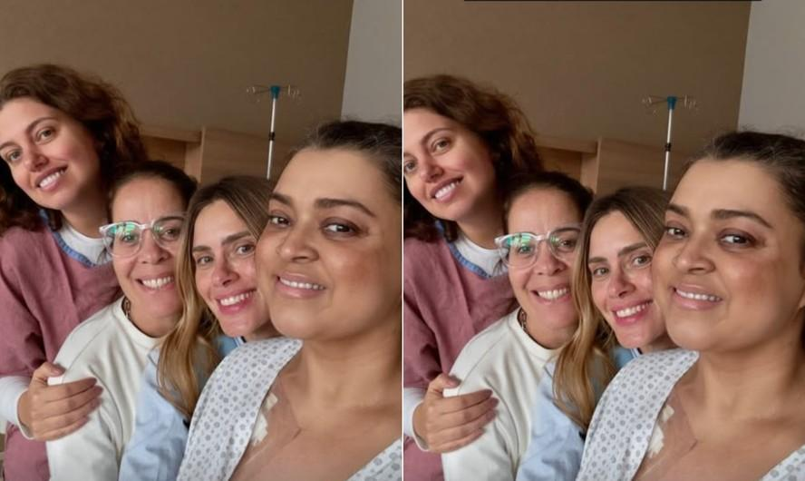

| Configuração | Descrição GEMINI |
|-------------|-----------|
| **alt** | Internada, Preta Gil recebe a visita das amigas Malu Barbosa, Mari Lobo e Carolina Dieckmann em hospital |
| **GEM_COM_15** | A imagem mostra Preta Gil em um hospital, sorrindo com as amigas Carolina Dieckmann, Malu Barbosa e Mari Lobo. |
| **GEM_COM_25** | Preta Gil sorri com as amigas Carolina Dieckmann, Malu Barbosa e Mari Lobo em um hospital. |
| **GEM_COM_∞** | A imagem retrata um close-up de quatro mulheres sorridentes, posando para uma selfie em um quarto de hospital. Na extrema direita, está Preta Gil, que usa uma blusa ou camisola hospitalar com um padrão de pontos azuis e brancos, com uma abertura na área do peito onde é visível um curativo ou acesso. Ela tem cabelo escuro, ligeiramente puxado para trás, e um sorriso largo. Ao seu lado, com cabelo loiro comprido e liso, está Carolina Dieckmann, também sorrindo para a câmera. No centro da imagem, e um pouco mais para a esquerda, encontra-se Malu Barbosa, usando óculos de armação clara e exibindo um sorriso aberto. A quarta mulher, visível parcialmente na extrema esquerda e com cabelo cacheado de tom castanho, é Mari Lobo. As quatro mulheres estão próximas umas das outras, com Carolina Dieckmann abraçando Malu Barbosa e Mari Lobo, transmitindo um senso de união e apoio. Ao fundo, elementos típicos de um ambiente hospitalar são visíveis, como uma haste de soro. |
| **GEM_SEM_15** | A cantora Simone Mendes sorri com três amigas em um ambiente de hospital. |
| **GEM_SEM_25** | A imagem mostra as atrizes brasileiras Claudia Raia, Paolla Oliveira, Fernanda Souza e Carolina Dieckmann sorrindo e abraçadas no hospital. |
| **GEM_SEM_∞** | Quatro mulheres sorridentes estão juntas em uma foto tirada em um quarto de hospital. À direita, Preta Gil, que usa uma camisola hospitalar branca com estampa de bolinhas e um dispositivo médico visível no peito, aparece em primeiro plano e sorri para a câmera. Ao lado dela, Carolina Dieckmann, com cabelos loiros e um sorriso aberto, está posicionada entre Preta Gil e a mulher de óculos. Mais ao centro, Malu Barbosa, usando óculos de grau e uma blusa branca de manga comprida, também sorri. À esquerda, Bela Gil, com cabelos cacheados e uma blusa em tom de rosa, abraça Malu Barbosa e sorri. Ao fundo, elementos de um quarto de hospital, como um suporte para soro, são visíveis. |

| Configuração | Descrição GPT |
|-------------|-----------|
| **alt** | Internada, Preta Gil recebe a visita das amigas Malu Barbosa, Mari Lobo e Carolina Dieckmann em hospital |
| **GPT_COM_15** | Preta Gil de pijama hospitalar, sorridente, acompanhada de Carolina Dieckmann, Malu Barbosa e Mari Lobo. |
| **GPT_COM_25** | Preta Gil, em roupão hospitalar, sorrindo rodeada pelas amigas Carolina Dieckmann, Malu Barbosa e Mari Lobo, todas juntas em quarto de hospital. |
| **GPT_COM_∞** | A imagem é uma composição com duas cópias lado a lado da mesma fotografia, na qual quatro mulheres se reúnem em um quarto de hospital para uma selfie. Em primeiro plano, à direita, está Preta Gil vestindo um avental hospitalar estampado e com um curativo removível na região do peito, visível onde passam tubos de soro. Ao seu lado, mais ao centro, sorri Malu Barbosa, de cabelos lisos e compridos, usando uma blusa clara. À esquerda dela, Mari Lobo aparece de óculos de armação transparente e blusa branca, apoiando suavemente a mão no ombro de Malu. Ao fundo, à esquerda, Carolina Dieckmann se destaca com cabelos ondulados, na altura dos ombros, e um suéter rosa, inclinando o rosto em direção ao grupo. Ao fundo vê-se parte de uma cabeceira de cama e um suporte de soro metálico. |
| **GPT_SEM_15** | Quatro mulheres sorridentes fazem selfie abraçadas em quarto de hospital com suporte de soro. |
| **GPT_SEM_25** | Selfie de quatro mulheres sorrindo em quarto de hospital; uma à frente veste roupa hospitalar com curativo no peito, as outras vestem roupas casuais e abraçam-se. |
| **GPT_SEM_∞** | Quatro mulheres aparecem reunidas, sorrindo para a câmera, em um quarto claro de aspecto hospitalar. À frente, uma delas veste camisa branca com estampa discreta e está sentada; tem pele morena clara, cabelos escuros presos para trás e adesivos médicos sobre o peito, pistas de cuidado hospitalar. Atrás, à direita, outra mulher de pele morena clara sorri; ela usa camiseta azul-clara e cabelos loiros soltos sobre os ombros. À esquerda dessa, uma mulher de óculos de armação transparente apoia as mãos nos ombros da paciente; veste moletom claro e tem cabelos castanhos presos para trás. No canto superior esquerdo, em plano levemente mais distante, a quarta mulher surge com cabelos castanhos levemente ondulados até os ombros, usa suéter rosa claro sobre camisa branca e também sorri para a foto. Ao fundo, um suporte de soro intravenoso e móveis claros completam a cena. |

---

### IMAGEM 25
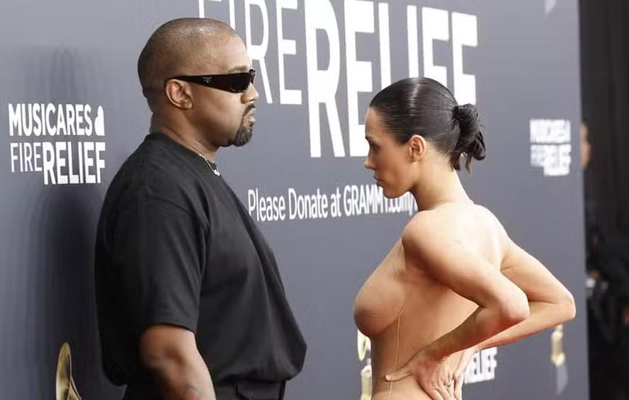

| Configuração | Descrição GEMINI |
|-------------|-----------|
| **alt** | Bianca Censori e Kanye West no Grammy |
| **GEM_COM_15** | nan |
| **GEM_COM_25** | nan |
| **GEM_COM_∞** | nan |
| **GEM_SEM_15** | nan |
| **GEM_SEM_25** | nan |
| **GEM_SEM_∞** | nan |

| Configuração | Descrição GPT |
|-------------|-----------|
| **alt** | Bianca Censori e Kanye West no Grammy |
| **GPT_COM_15** | Kanye West com camiseta preta e óculos escuros, encarando Kim Kardashian em vestido nude transparente. |
| **GPT_COM_25** | Em um tapete vermelho, Kanye West, de camiseta preta e óculos escuros, encara Bianca Censori, com vestido transparente, cabelos presos e mãos na cintura. |
| **GPT_COM_∞** | Kanye West está à esquerda, em perfil, vestindo camiseta preta de mangas curtas e óculos escuros. À direita, sua esposa, Bianca Censori, aparece de corpo inteiro em um vestido nude de malha quase transparente, com os cabelos presos em um coque baixo. Ambos estão em um tapete vermelho diante de um painel escuro que exibe, em letras brancas, as palavras “MusiCares Fire Relief” e “Please Donate at GRAMMY.com”. |
| **GPT_SEM_15** | Kanye West e Kim Kardashian posam no tapete vermelho do evento MusiCares Fire Relief. |
| **GPT_SEM_25** | Um homem de camiseta preta e óculos escuros observa uma mulher de frente, vestindo um vestido tom nude justo, em evento com letreiro escuro e iluminado. |
| **GPT_SEM_∞** | Um homem de perfil voltado para uma mulher, ambos em um tapete de eventos, diante de um painel escuro com letras brancas que dizem "MusiCares Fire Relief" e “Please Donate at GRAMMY.com”. Ele veste camiseta preta, calça escura e óculos de sol, tem expressão séria e os braços ao lado do corpo. Ela usa um vestido justíssimo na cor bege claro, sem mangas, com recorte elegante nas costas, e mantém as mãos apoiadas na cintura, olhando para ele com o corpo ligeiramente inclinado à frente. O ambiente sugere um evento beneficente ou tapete vermelho |

---

### IMAGEM 26
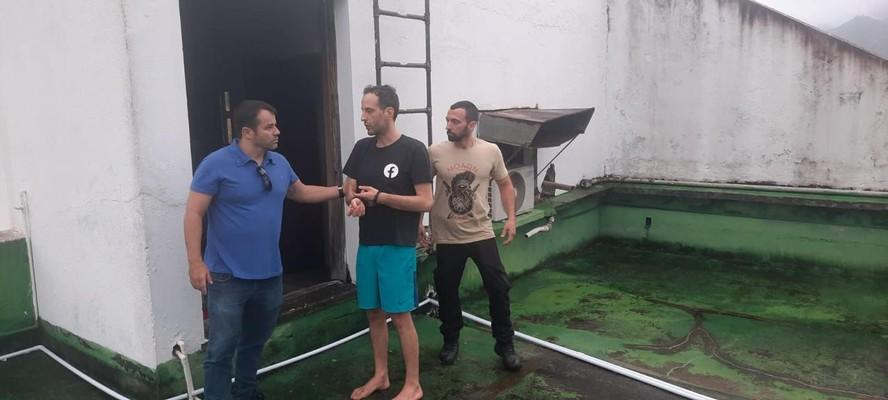

| Configuração | Descrição GEMINI |
|-------------|-----------|
| **alt** | João Ricardo Mendes foi flagrado no terraço da cobertura de luxo onde mora |
| **GEM_COM_15** | João Ricardo Rangel Mendes e dois homens em um telhado esverdeado. |
| **GEM_COM_25** | João Ricardo Rangel Mendes e dois homens conversam em um telhado com piso esverdeado e paredes brancas, ao lado de uma escada e equipamento. |
| **GEM_COM_∞** | A imagem exibe três homens em um terraço ou laje de um edifício. O homem ao centro é João Ricardo Rangel Mendes, ex-CEO da Hurb, que tem 44 anos. Ele está descalço, usando uma camiseta preta com um logotipo branco circular que lembra a letra "f" do Facebook, e shorts azuis. João Ricardo está olhando para o seu punho esquerdo, onde parece estar usando um relógio. À sua esquerda, um homem veste uma camisa polo azul, calça jeans escura e óculos escuros pendurados na gola da camisa. À direita de João Ricardo, um terceiro homem usa uma camiseta bege com uma estampa escura que lembra uma coruja ou um monstro, e calças escuras. Ele tem barba e cabelo curto. O chão do terraço é de cimento, com uma camada de musgo verde ou tinta esverdeada irregular. Há canos brancos no chão e junto às paredes. No fundo, há uma parede branca alta, uma escada de metal encostada na parede e uma unidade externa de ar condicionado ou ventilação com uma cobertura metálica. Ao fundo, visíveis acima da parede, estão montanhas com vegetação. |
| **GEM_SEM_15** | Três homens estão em um telhado. Um usa camiseta do Facebook, outro azul. |
| **GEM_SEM_25** | Três homens estão em um telhado. Mark Zuckerberg, descalço e de camiseta do Facebook, conversa com um homem, enquanto outro observa ao lado. |
| **GEM_SEM_∞** | A imagem mostra três homens em um telhado ou área externa com piso esverdeado e paredes brancas. À esquerda, um homem de camisa polo azul e calça jeans, com óculos escuros pendurados na camisa, estende a mão direita em direção ao homem do meio, parecendo conversar com ele. No centro, Mark Zuckerberg veste uma camiseta preta com o logotipo branco do Facebook, shorts turquesa e está descalço. Ele olha para o homem à esquerda, com o braço esquerdo dobrado e o pulso visível. À direita, um terceiro homem com uma camiseta bege com estampa escura e calças escuras está um pouco atrás de Mark Zuckerberg, olhando na mesma direção. Ao fundo, há uma escada escura encostada na parede branca e equipamentos semelhantes a uma unidade de ar condicionado. O piso da área é irregular e apresenta manchas escuras, enquanto as paredes brancas mostram algumas marcas de sujeira ou mofo. Uma estrutura retangular verde-escura que parece um tanque ou borda de piscina está visível no lado direito da imagem. |

| Configuração | Descrição GPT |
|-------------|-----------|
| **alt** | João Ricardo Mendes foi flagrado no terraço da cobertura de luxo onde mora |
| **GPT_COM_15** | João Ricardo Rangel Mendes, algemado, flanqueado por dois agentes, em cobertura com piso verde. |
| **GPT_COM_25** | João Ricardo Rangel Mendes, descalço, camiseta preta e bermuda azul, é conduzido por dois policiais num telhado verde com escada e porta no fundo. |
| **GPT_COM_∞** | Três homens estão em um terraço de piso verde, com tubulações aparentes e uma unidade de ar-condicionado junto a uma parede branca. À esquerda, um homem veste camisa polo azul e calça jeans escura; ele segura pelo pulso o homem do centro. Este, descalço, usa camiseta preta com um pequeno logotipo branco no peito e bermuda azul-turquesa. À direita, um terceiro homem, de camiseta bege com estampa frontal e calça preta, observa a ação. Ao fundo, há uma porta aberta para o interior do prédio e uma escada metálica encostada na parede. |
| **GPT_SEM_15** | três homens em telhado verde: polo azul; camiseta preta, bermuda azul; camiseta bege, calça preta. |
| **GPT_SEM_25** | Três homens em terraço: um no centro, de camiseta preta, descalço, contido pelos outros dois, um de polo azul e outro de camiseta bege. |
| **GPT_SEM_∞** | Três homens estão sobre um terraço plano de concreto pintado de verde e com manchas de umidade.   À esquerda, um homem de camisa polo azul e calça jeans segura pelo braço o homem do centro; ele tem cabelo curto escuro e óculos escuros pendurados na gola da camisa.   No centro, um homem de camiseta preta com a letra “f” branca estampada no peito, bermuda azul-turquesa e pés descalços, com as mãos à frente, como se algemadas.   À direita, um homem de camiseta bege com estampa de crânio de animal, calça preta e botas, posiciona-se ligeiramente atrás dos outros.   Atrás deles há uma porta aberta em uma parede branca, uma escada fixa na parede e um aparelho de ar-condicionado apoiado sobre o guarda-corpo do terraço. Ao fundo, montanhas sob céu nublado. |

---

### IMAGEM 27


| Configuração | Descrição GEMINI |
|-------------|-----------|
| **alt** | Ciro Nogueira, presidente do PP, Janaina Paschoal e Maurício Neves, dirigente estadual do partido |
| **GEM_COM_15** | A imagem mostra os políticos Ricardo Salles, Janaína Paschoal e Maurício Neves segurando documentos com bandeiras brasileiras e de São Paulo ao fundo. |
| **GEM_COM_25** | Ricardo Salles, Priscila Cruz e Celso Russomanno sorriem segurando documentos do partido Progressistas São Paulo, com bandeiras ao fundo. |
| **GEM_COM_∞** | Uma imagem vibrante retrata três figuras proeminentes da política brasileira em um ambiente de escritório, com bandeiras do Brasil e do estado de São Paulo ao fundo. A mulher central, Janaína Paschoal, sorri calorosamente para a câmera, com seus cabelos escuros e encaracolados soltos e usando uma blusa preta. Ao seu lado esquerdo, o homem com um terno azul-marinho e camisa social branca, identificado como Ricardo Barros, segura um documento assinado, também com um sorriso discreto. À direita de Janaína Paschoal, o homem com uma camisa xadrez azul e branca, Marcos Pereira, sorri amplamente e segura uma pasta azul com o logotipo "11 Progressistas São Paulo", indicando a filiação ao partido. A pasta, junto ao documento assinado por Ricardo Barros, sugere um momento de acordo ou formalização partidária. |
| **GEM_SEM_15** | Ciro Nogueira, Arthur Lira e uma mulher sorrindo seguram documentos do Progressistas São Paulo. |
| **GEM_SEM_25** | Três políticos, Ciro Nogueira (esquerda), Ricardo Salles (direita), e uma mulher não identificada, sorriem enquanto seguram documentos do partido Progressistas São Paulo. |
| **GEM_SEM_∞** | A imagem mostra três pessoas, dois homens e uma mulher, em um ambiente interno que parece ser um escritório ou sala de reuniões. A pessoa à esquerda é um homem de meia-idade com cabelos escuros penteados para trás e vestindo um terno azul-escuro sobre uma camisa branca aberta. Ele segura um documento de papel branco na mão esquerda. No centro, uma mulher sorri para a câmera. Ela tem cabelos escuros e ondulados e veste uma blusa ou jaqueta escura. Ela segura uma pasta azul-escura com a mão direita, que está parcialmente visível. Na pasta, há um logotipo com o número "11" em destaque e o texto "Progressistas SÃO PAULO" abaixo. À direita, um homem sorridente com cabelos escuros e curtos, vestindo uma camisa xadrez azul e branca, segura a pasta com a mão esquerda. Ao fundo, atrás das pessoas, há duas bandeiras: uma bandeira do Brasil com suas cores verde, amarela e azul, e uma bandeira que parece ser do estado de São Paulo, vermelha com um círculo branco e um mapa azul. Devido à ausência de informações explícitas na imagem e à incapacidade de confirmar as identidades das pessoas através das buscas realizadas, não é possível nomeá-las. |

| Configuração | Descrição GPT |
|-------------|-----------|
| **alt** | Ciro Nogueira, presidente do PP, Janaina Paschoal e Maurício Neves, dirigente estadual do partido |
| **GPT_COM_15** | Três membros do Progressistas seguram documento sorrindo diante das bandeiras paulista e brasileira. |
| **GPT_COM_25** | Três pessoas sorriem em frente às bandeiras de São Paulo e do Brasil, segurando pasta com logotipo do Progressistas São Paulo. |
| **GPT_COM_∞** | Três pessoas estão alinhadas em um ambiente institucional, em frente a três bandeiras dispostas na ordem (da esquerda para a direita): a bandeira do Estado de São Paulo, a do Brasil e uma de fundo branco. À esquerda, um homem de cabelos escuros com pontos de grisalho veste terno escuro e camisa branca, apoiando a mão direita sobre uma folha manuscrita. No centro, uma mulher de cabelos longos e escuros usa jaqueta preta e sorri enquanto segura, com ambas as mãos, uma pasta azul-escura estampada com o logotipo “11 Progressistas São Paulo”. À direita, outro homem, de cabelos escuros e camisa xadrez azul clara, também sorri e sustenta a pasta com a mão esquerda. |
| **GPT_SEM_15** | Três pessoas sorrindo; dois homens seguram documento e pasta "Progressistas São Paulo", bandeira brasileira. |
| **GPT_SEM_25** | Três pessoas posam sorrindo, segurando um documento e uma pasta azul com o logo “Progressistas São Paulo”, com as bandeiras do Brasil e de São Paulo ao fundo. |
| **GPT_SEM_∞** | Três pessoas posam lado a lado, sorrindo, em ambiente interno.   À esquerda, um homem de pele clara, cabelo escuro levemente grisalho, veste blazer azul-escuro sobre camisa branca.   No centro, uma mulher de pele clara, cabelos longos e escuros, usa um blazer preto e segura parte de um documento.   À direita, um homem de pele clara, cabelos escuros, veste camisa xadrez azul-claro, segura a outra extremidade do mesmo documento.   Entre as mãos deles, além do papel manuscrito, há uma pasta aberta de cor azul-escura com o logotipo “Progressistas São Paulo” e o número 11 em destaque.   Ao fundo, vê-se a bandeira nacional do Brasil e, à esquerda, a bandeira do estado de São Paulo com o símbolo do partido Progressistas. |

---

### IMAGEM 28
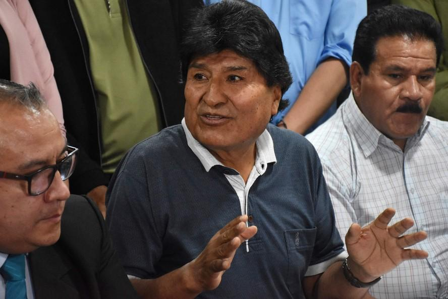

| Configuração | Descrição GEMINI |
|-------------|-----------|
| **alt** | Ex-presidente da Bolívia Evo Morales (centro) concede entrevista coletiva em Cochabamba, Bolívia |
| **GEM_COM_15** | A fotografia mostra Evo Morales, o ex-presidente da Bolívia, sentado e gesticulando enquanto fala. |
| **GEM_COM_25** | A imagem mostra o ex-presidente boliviano Evo Morales, vestindo uma camisa polo azul-marinho, gesticulando enquanto fala. Ele está entre dois outros homens. |
| **GEM_COM_∞** | A imagem retrata o ex-presidente da Bolívia, Evo Morales, no centro, em um ambiente interno. Ele está virado ligeiramente para a direita, com a boca entreaberta como se estivesse falando. Evo Morales tem cabelos escuros e levemente ondulados, e sua pele é morena. Ele veste uma camisa polo azul-marinho com colarinho branco, que se abre em um "V" no pescoço, revelando uma camiseta branca por baixo. As mãos de Morales estão levantadas e abertas na altura do peito, com as palmas voltadas para cima, em um gesto que sugere explicação ou ênfase. À esquerda de Morales, uma parte do rosto de outro homem é visível. Ele usa óculos de armação escura e uma camisa de cor clara com uma gravata azul-clara. À direita de Morales, um terceiro homem com um bigode escuro está sentado, vestindo uma camisa xadrez em tons de branco e azul. Ao fundo, outras pessoas e elementos desfocados sugerem um ambiente de reunião ou evento. |
| **GEM_SEM_15** | The image shows former Bolivian President Evo Morales, center, speaking to two men. |
| **GEM_SEM_25** | Evo Morales gesticula em uma reunião, ladeado por dois homens, um de óculos e outro com bigode. |
| **GEM_SEM_∞** | A imagem mostra o ex-presidente da Bolívia, Evo Morales, em primeiro plano no centro. Ele tem cabelo escuro e está vestindo uma camisa polo azul-marinho com gola branca. Seus lábios estão ligeiramente abertos, como se estivesse falando, e suas mãos estão levantadas e abertas à sua frente em um gesto de fala ou explicação.    À direita de Evo Morales, está um homem com bigode e cabelo escuro, usando uma camisa xadrez clara. Ele está olhando para o centro da cena. À esquerda de Evo Morales, parte de outro homem é visível. Ele está usando óculos de armação escura, um terno escuro e uma gravata azul-clara. |

| Configuração | Descrição GPT |
|-------------|-----------|
| **alt** | Ex-presidente da Bolívia Evo Morales (centro) concede entrevista coletiva em Cochabamba, Bolívia |
| **GPT_COM_15** | Evo Morales (centro) gesticula com as mãos, acompanhado por dois assessores em mesa de coletiva. |
| **GPT_COM_25** | O ex-presidente Evo Morales, sentado entre um homem de terno e gravata (à esquerda) e outro de camisa xadrez (à direita), gesticula explicando algo. |
| **GPT_COM_∞** | Um grupo de três homens sentados lado a lado à frente de microfones, em uma sala que parece ser um local de entrevista ou coletiva de imprensa. No centro, um homem de pele morena e cabelos pretos ondulados, usando uma camisa pólo de manga curta em tom de azul-acinzentado com gola e punhos brancos, faz gestos com as mãos enquanto fala. À esquerda dele (do ponto de vista de quem vê a imagem), um homem de pele clara, cabelos curtos escuros, óculos de armação preta e terno escuro segura um lápis ou caneta próximo a um bloco de anotações. À direita, outro homem de pele morena, cabelo curto escuro e bigode espesso veste uma camisa social xadrez de tons claros e observa à frente com expressão séria. Ao fundo, vê-se parte de outras pessoas em pé, com roupas casuais, e uma parede neutra que delimita o ambiente. Microfones e gravadores posicionados sobre a mesa à frente dos três concentram a cena na ideia de pronunciamento público. |
| **GPT_SEM_15** | Evo Morales gesticula, flanqueado por homem de óculos à esquerda e outro à direita. |
| **GPT_SEM_25** | Três homens sentados em mesa, o central gesticula com as mãos enquanto fala; os outros parecem atenciosos. Roupa casual; ambiente interno de reunião. |
| **GPT_SEM_∞** | Três homens estão sentados lado a lado em uma mesa, como em uma entrevista ou coletiva de imprensa. Ao centro, um homem de meia-idade, com cabelo preto e liso, veste polo azul-escuro com gola branca; ele gesticula com as duas mãos, como se explicasse algo. À esquerda, outro homem de meia-idade usa óculos, tem cabelo curto escuro e veste terno escuro com gravata azul-claro; ele olha para baixo, concentrado. À direita, há um terceiro homem, também de meia-idade, com bigode fino, cabelo curto e escuro, vestindo camisa social clara xadrez; seu olhar está direcionado para frente, sem gesticular. Ao fundo, nota-se parte de outras pessoas em pé, vestindo roupas escuras e uma camisa azul. A cena sugere um ambiente formal de discussão ou anúncio público. |

---

### IMAGEM 29


| Configuração | Descrição GEMINI |
|-------------|-----------|
| **alt** | Sinalização em uma concessionária Ford em Richmond, Califórnia |
| **GEM_COM_15** | O logotipo azul e oval da Ford é visto contra um céu nublado. |
| **GEM_COM_25** | A imagem mostra o icônico logotipo oval azul da Ford, com a palavra "Ford" em letras brancas cursivas, exibido em um totem alto contra um céu nublado. |
| **GEM_COM_∞** | A imagem mostra o logotipo da Ford em um pilar alto, contra um céu com nuvens brancas e cinzas. O logotipo é oval, na cor azul vibrante, com a palavra "Ford" escrita em branco em uma fonte cursiva característica. O oval é emoldurado por uma borda prateada que reflete a luz. O pilar que sustenta o logotipo é claro, possivelmente branco ou cinza claro, com duas faixas verticais azuis. A perspectiva da foto é de baixo para cima, fazendo com que o logotipo pareça imponente no céu. |
| **GEM_SEM_15** | Sinal oval azul da Ford em um poste contra um céu nublado. |
| **GEM_SEM_25** | Um letreiro oval azul com o nome "Ford" em branco, montado em um poste cinza claro, contra um céu nublado. |
| **GEM_SEM_∞** | A imagem mostra o icônico logotipo da Ford em formato oval, predominantemente azul com a palavra "Ford" em letras brancas cursivas, circundada por um contorno prateado ou branco. O logotipo está montado em um poste cinza claro, visível da metade para cima, com duas linhas verticais escuras na parte inferior. O poste se ergue em direção a um céu nublado, com tons de cinza e branco das nuvens preenchendo a maior parte do fundo. A perspectiva da foto é de baixo para cima, fazendo com que o logotipo pareça imponente contra o céu. |

| Configuração | Descrição GPT |
|-------------|-----------|
| **alt** | Sinalização em uma concessionária Ford em Richmond, Califórnia |
| **GPT_COM_15** | Placa com logotipo Ford em oval azul, sustentada por poste metálico, céu nublado ao fundo. |
| **GPT_COM_25** | Logotipo azul oval da Ford exibido em placa elevada fixada em poste, com céu nublado cinza ao fundo. |
| **GPT_COM_∞** | Uma placa metálica oval azul com o logotipo “Ford” em branco, apoiada no topo de um mastro cilíndrico branco com uma faixa azul, vista de baixo contra um céu nublado. |
| **GPT_SEM_15** | Placa elevada do logotipo da Ford em poste contra céu cinzento nublado. |
| **GPT_SEM_25** | Placa oval azul com logotipo branco da Ford, fixada em poste metálico, sob céu nublado. |
| **GPT_SEM_∞** | Um poste metálico vertical sustenta, no alto, uma placa oval de fundo azul escuro com borda dupla, na qual se lê em letras cursivas e brancas a palavra “Ford”. Ao fundo, vê-se um céu nublado em tons de cinza. |

---

### IMAGEM 30


| Configuração | Descrição GEMINI |
|-------------|-----------|
| **alt** | A goiana Amanda Gomes foi encontrada morta no Japão, um mês após acompanhar o Grande Prêmio da Fórmula 1 |
| **GEM_COM_15** | Amanda Gomes usando boné e jaqueta em um estádio de corrida de carros. |
| **GEM_COM_25** | Uma mulher de boné azul e jaqueta escura sorri para a câmera em um evento de corrida, com arquibancadas e público ao fundo. |
| **GEM_COM_∞** | A mulher na imagem é Amanda Gomes. Ela está usando um boné azul-escuro com o logotipo da Red Bull, que possui cores vibrantes, incluindo vermelho e amarelo. Seus cabelos loiros escorrem pelos ombros. O boné se assemelha aos bonés oficiais da equipe de Fórmula 1 Red Bull Racing.    Ao fundo, há uma arquibancada lotada de pessoas, sugerindo um evento de grande porte. Pistas de corrida e estruturas de pit lane são visíveis, com banners de patrocinadores como "ORACLE" e "Red Bull". Há também letreiros com escrita japonesa e o número "12" em destaque. Essas características, combinadas com a presença dos logotipos da Red Bull e Oracle, são típicas de um evento de Fórmula 1, especialmente em um circuito no Japão. |
| **GEM_SEM_15** | Kelly Piquet está em um autódromo de Fórmula 1, usando um boné da Red Bull. |
| **GEM_SEM_25** | Kelly Piquet usa um boné da Red Bull na arquibancada do Grande Prêmio do Japão em Suzuka, com sinalização de "Max" e número 1 visíveis. |
| **GEM_SEM_∞** | A mulher na imagem está em um evento de Fórmula 1 no Circuito de Suzuka, no Japão. Ela está no primeiro plano, usando um boné azul com um logotipo colorido, que se assemelha ao da Red Bull Racing, e uma jaqueta escura com capuz forrado de pele. A jaqueta está vestida sobre uma blusa rosa. Ela tem cabelos loiros compridos e está olhando diretamente para a câmera.    No fundo, é possível ver as arquibancadas do circuito, repletas de espectadores, e parte da pista. Há sinais visíveis nas arquibancadas, incluindo um banner branco com o nome "ORACLE" e outro com caracteres japoneses "アグリナス" (Agurinasu) e o número "12."    O Circuito de Suzuka é conhecido por sediar o Grande Prêmio do Japão de Fórmula 1 e é um local popular para fãs devido à sua história e layout de pista desafiador. A presença de "Oracle" e "Red Bull" (implícito pelo boné) indica a ligação com a equipe Oracle Red Bull Racing, que frequentemente compete no Grande Prêmio do Japão e tem uma parceria com a Honda. |

| Configuração | Descrição GPT |
|-------------|-----------|
| **alt** | A goiana Amanda Gomes foi encontrada morta no Japão, um mês após acompanhar o Grande Prêmio da Fórmula 1 |
| **GPT_COM_15** | Amanda Gomes, usando boné, selfie em pista de corrida, com arquibancada e espectadores ao fundo. |
| **GPT_COM_25** | Amanda Gomes usa boné escuro e jaqueta preta, sorrindo em selfie diante de arquibancada de circuito de corrida; ao fundo, espectadores e boxes. |
| **GPT_COM_∞** | A imagem é uma selfie de Amanda Gomes, uma mulher de pele clara, cabelos loiros lisos, soltos sobre os ombros, e expressão serena. Ela usa um boné azul-escuro com um logotipo borrado na parte frontal, casaco acolchoado preto com capuz de pelo sintético e camiseta rosa por baixo. Ao fundo, vê-se uma área de pit lane de um autódromo, com bandeiras de boxes, pequenos carros de corrida estacionados e profissionais usando headsets e uniformes, além de arquibancadas com torcedores dispersos sob céu nublado. Algumas barricadas e painéis publicitários borrados evidenciam que se trata de um evento automobilístico. |
| **GPT_SEM_15** | Mulher loira de boné azul sorrindo em primeiro plano, ao fundo arquibancada lotada em autódromo. |
| **GPT_SEM_25** | Mulher jovem de cabelos longos e loiros, veste casaco acolchoado preto e boné azul com logo desfocado, tirando selfie em pit lane movimentado de corrida. |
| **GPT_SEM_∞** | Uma mulher jovem, de cabelos longos e lisos, loiros escuros, veste um casaco acolchoado preto sobre uma camiseta rosa-claro. Ela usa um boné de aba reta azul-escuro com um logo colorido borrado na parte frontal. Ela sorri levemente e segura a câmera na altura do rosto, numa selfie. Ao fundo, vê-se uma pista de corrida automobilística com arquibancadas cheias de espectadores, estruturas metálicas e painéis de informação iluminados. Há outras pessoas vestindo bonés semelhantes na parte inferior direita da imagem, parcialmente fora de foco. O céu está nublado, conferindo uma luz difusa à cena. |

---

### IMAGEM 31


| Configuração | Descrição GEMINI |
|-------------|-----------|
| **alt** | Foto em que projetil se aproxima de Donald Trump ganha prêmio Pulitzer |
| **GEM_COM_15** | Donald Trump discursa em pódio com "TRUMP 2024" e chapéu vermelho. |
| **GEM_COM_25** | Donald Trump, de boné vermelho, discursa em pódio azul com "TRUMP 2024" e "MAKE AMERICA GREAT AGAIN" sob céu azul. |
| **GEM_COM_∞** | A imagem mostra Donald Trump discursando em um pódio azul ao ar livre, sob um céu azul claro. Ele está virado ligeiramente para a esquerda, usando um boné vermelho com a inscrição "MAKE AMERICA GAIN" ou semelhante, um terno escuro e uma camisa branca. Há um microfone à sua frente. O pódio exibe em letras grandes "TEXT PENNSYLVANIA TO 88022" e "TRUMP" com cinco estrelas brancas acima, e abaixo "MAKE AMERICA GREAT AGAIN! 2024". Uma bandeira americana é visível no canto superior direito da imagem. |
| **GEM_SEM_15** | Donald Trump em um comício, com pódio azul 'TRUMP 2024' e boné vermelho. |
| **GEM_SEM_25** | Donald Trump discursa em um palanque azul "TRUMP 2024", usando um boné vermelho "AMERICA AGAIN" com bandeira dos EUA. |
| **GEM_SEM_∞** | A imagem mostra Donald Trump, um homem de pele clara com cabelos loiros e um boné vermelho com a inscrição "MAKE AMERICA AGAIN" e uma bandeira dos Estados Unidos. Ele está vestindo um terno escuro com uma lapela adornada com uma bandeira americana, e uma camisa social branca. Ele está em pé, atrás de um pódio azul com bordas brancas, falando para um microfone à sua frente. As mãos de Trump estão em movimento, a mão esquerda levantada com os dedos parcialmente fechados. No pódio, em letras brancas e vermelhas, lê-se "TEXT PENNSYLVANIA TO 88022" na parte superior. Abaixo, em letras brancas grandes, está a palavra "TRUMP", e mais abaixo, as frases "MAKE AMERICA GREAT AGAIN!" e "2024". Ao fundo, o céu está claro e azul, e uma bandeira dos Estados Unidos com listras vermelhas e brancas é parcialmente visível no canto superior direito. Há algumas pessoas parcialmente visíveis na parte inferior da imagem, indicando uma multidão em um evento ao ar livre. |

| Configuração | Descrição GPT |
|-------------|-----------|
| **alt** | Foto em que projetil se aproxima de Donald Trump ganha prêmio Pulitzer |
| **GPT_COM_15** | Político de terno azul, boné vermelho, fala em palanque com letreiro “TRUMP 2024”. |
| **GPT_COM_25** | Donald Trump usa boné vermelho 'Make America Great Again' ao microfone, em púlpito com faixa 'Text Pennsylvania to 88022 TRUMP 2024', bandeira americana ao fundo. |
| **GPT_COM_∞** | Imagem mostra o ex-presidente Donald Trump em um palanque ao ar livre, vestindo terno escuro, camisa branca e boné vermelho com a frase “Make America Great Again”. Ele fala ao microfone, gesticulando com a mão direita sobre um púlpito decorado por um cartaz azul e vermelho onde se lê “Text Pennsylvania to 88022”, “TRUMP” e “Make America Great Again! 2024”. Ao fundo, bandeiras dos Estados Unidos tremulam contra um céu azul e uma plateia de apoiadores parcialmente visível. |
| **GPT_SEM_15** | Homem de boné vermelho e terno discursa atrás de placa de campanha ‘TRUMP 2024’. |
| **GPT_SEM_25** | Homem de terno escuro e boné vermelho em palanque com placa “TRUMP MAKE AMERICA GREAT AGAIN 2024”, microfone, céu azul e bandeira americana ao fundo. |
| **GPT_SEM_∞** | Um homem caucasiano de perfil voltado para a esquerda discursa ao microfone em um palanque externo, sob um céu azul sem nuvens. Ele veste terno escuro sobre camisa branca e boné vermelho com letras brancas. À frente, no painel do púlpito, há fundo azul com texto em branco e vermelho que diz “TEXT PENNSYLVANIA TO 88022” e, em destaque maior, “TRUMP” seguido de “MAKE AMERICA GREAT AGAIN! 2024”. Atrás, discretamente, surgem formas de pessoas na plateia e, no canto superior direito, parte de uma bandeira americana balança ao vento. |

---

### IMAGEM 32
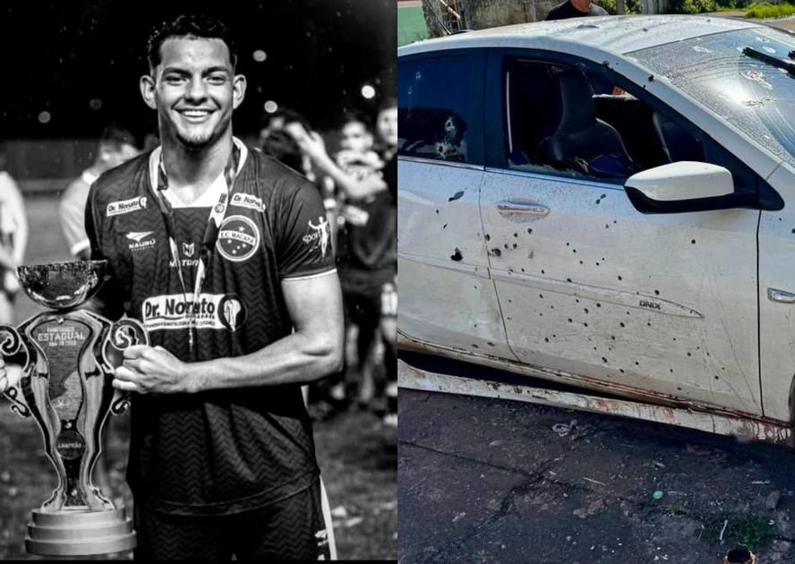

| Configuração | Descrição GEMINI |
|-------------|-----------|
| **alt** | Jogador de futebol está entre as vítimas de ação com sete mortes no Amapá |
| **GEM_COM_15** | Wendel Cristian sorri segurando um troféu, ao lado de um carro Onix Plus branco alvejado. |
| **GEM_COM_25** | A imagem dividida exibe Wendel Cristian sorrindo com um troféu à esquerda, e um carro Onix branco cravejado de buracos de bala à direita. |
| **GEM_COM_∞** | A imagem é composta por duas fotografias lado a lado, contrastando uma figura sorridente e um veículo danificado.    No lado esquerdo, uma fotografia em preto e branco mostra Wendel Cristian, um jovem jogador de futebol, sorrindo e segurando um troféu grande e ornamentado com a palavra "Estadual" e "Campeão" gravadas. Ele veste uma camisa de time com patrocinadores visíveis, incluindo "Dr. Norato" e um distintivo que parece ser do "EC Macapá". A imagem transmite uma sensação de vitória e alegria.    No lado direito, uma fotografia colorida exibe a lateral de um carro branco, identificado como um Chevrolet Onix Plus, com múltiplos buracos de bala visíveis em toda a sua extensão, desde as portas até a área do pneu dianteiro. As janelas do carro, incluindo a do motorista e a traseira, estão quebradas ou estilhaçadas, e há sinais de dano generalizado na carroceria. O carro está estacionado em uma área pavimentada, com detritos espalhados no chão abaixo dele. |
| **GEM_SEM_15** | A imagem mostra o jogador Wendel Cristian do EC Macapá com um troféu e um carro branco cheio de tiros. |
| **GEM_SEM_25** | A imagem em preto e branco mostra Thiago Macaé, jogador de futebol, sorrindo e segurando um troféu. Ao lado, um carro branco, tipo Chevrolet Onix, está coberto de marcas de tiro. |
| **GEM_SEM_∞** | A imagem é um díptico, apresentando duas cenas distintas lado a lado. Na metade esquerda, um jovem sorridente, identificado como o jogador de futebol Wendel Cristian, posa em preto e branco. Ele segura um troféu grande e ornamentado com a inscrição "ESTADUAL CAMPEÃO". Wendel Cristian veste uma camisa de futebol escura com as marcas "Dr. Norato" e o escudo do "EC Macapá". A cena sugere um momento de celebração ou vitória esportiva.    Na metade direita da imagem, uma visão em cores de um veículo Chevrolet Onix branco é exibida. O carro está gravemente danificado com múltiplas perfurações que parecem ser de tiros espalhadas por toda a lateral, incluindo as portas do motorista e do passageiro da frente. As janelas estão quebradas, e há sinais de danos significativos e possivelmente sangue na parte inferior da carroceria, indicando um incidente violento. As informações disponíveis confirmam que este carro, um Onix Plus branco, foi o veículo onde Wendel Cristian e outras seis pessoas foram encontradas mortas após uma ação policial em Macapá. |

| Configuração | Descrição GPT |
|-------------|-----------|
| **alt** | Jogador de futebol está entre as vítimas de ação com sete mortes no Amapá |
| **GPT_COM_15** | Wendel Cristian sorri com troféu do EC Macapá; Onix Plus branco crivado de balas. |
| **GPT_COM_25** | Wendel Cristian segura troféu de futebol, sorrindo; carro Onix Plus branco apresenta múltiplos furos de bala, vidros quebrados e manchas de sangue. |
| **GPT_COM_∞** | No lado esquerdo, o jogador de futebol Wendel Cristian aparece em foto em preto e branco, vestindo o uniforme do EC Macapá com patrocinadores visíveis no peito (Dr. Norato, Magnum etc.), medalho pendurada no pescoço e segurando com as duas mãos um troféu alto, com base larga e alças ornamentais. Wendel sorri de frente para a câmera.   No lado direito, um Chevrolet Onix Plus branco, estacionado numa rua de paralelepípedos, exibe vários orifícios de bala pela porta dianteira e traseira do lado do motorista, além de estilhaços de vidro no para-brisa e marcas de sangue na parte inferior da carroceria. O emblema “Onix” está visível junto à maçaneta. |
| **GPT_SEM_15** | Da esquerda: jogador de futebol sorrindo, segurando troféu. À direita: carro branco crivado de balas. |
| **GPT_SEM_25** | À esquerda, jogador com camisa “Dr. Novato” segura troféu. À direita, carro branco perfurado por tiros, com marcas de sangue e cachorro no banco. |
| **GPT_SEM_∞** | À esquerda, uma fotografia em preto e branco mostra um jovem adulto sorridente, vestido com uniforme de futebol escuro estampado com o nome “Dr. Norato” e outros patrocinadores. Ele segura com as duas mãos uma grande taça de metal que na base exibe a palavra “Estadual”. Ao fundo, borrados, veem-se pessoas em pé, também celebrando.    À direita, uma fotografia colorida mostra um automóvel hatchback branco estacionado em uma rua de terra. A lateral do carro apresenta múltiplos orifícios, aparentes perfurações de disparos, e o vidro da porta frontal está estilhaçado. Há manchas de sangue seco no asfalto junto à roda traseira. No banco de trás, parcialmente visível pela janela quebrada, percebe-se a cabeça de um cachorro de pelagem clara com manchas escuras. |

---

### IMAGEM 33
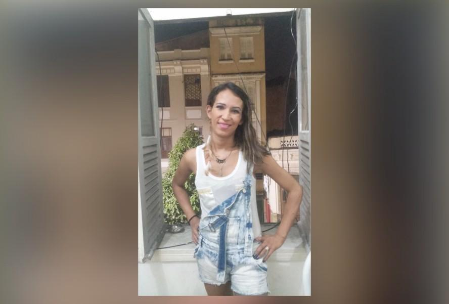

| Configuração | Descrição GEMINI |
|-------------|-----------|
| **alt** | A cozinheira Danielly Rocha, de 37 anos, foi encontrada morta na Lapa |
| **GEM_COM_15** | Danielly Rocha sorri para a câmera, posando em uma janela com prédios ao fundo. |
| **GEM_COM_25** | Danielly Rocha sorri para a câmera, usando regata branca e jardineira jeans, em frente a uma janela com persianas abertas, revelando um prédio ao fundo. |
| **GEM_COM_∞** | A imagem retrata Danielly Rocha, uma mulher trans, posando em frente a uma janela que se abre para o exterior. Ela está no centro da foto, com um sorriso suave no rosto e o cabelo comprido, com mechas mais claras, caindo sobre os ombros. Danielly veste uma camiseta regata branca e um macacão curto jeans claro com detalhes desbotados. Suas mãos estão apoiadas na cintura. Ao fundo, através da janela aberta, é possível ver um edifício antigo com janelas e persianas, além de folhagens verdes de uma planta que parece estar próxima à janela. A iluminação geral da foto sugere ser durante o dia. |
| **GEM_SEM_15** | A imagem mostra uma mulher sorridente em regata branca e jardineira jeans, posando em uma janela. |
| **GEM_SEM_25** | Uma mulher em uma blusa branca e macacão jeans sorri em uma janela, com um prédio e folhagem ao fundo. |
| **GEM_SEM_∞** | A imagem mostra uma mulher em primeiro plano, posicionada de frente para o observador. Ela tem cabelos longos e lisos, de tom castanho claro, que caem sobre seus ombros. A mulher está sorrindo, e suas mãos estão apoiadas na cintura. Ela veste uma regata branca e um macacão curto de jeans azul claro desbotado, com alças presas na parte superior do peito. Ao redor do pescoço, ela usa um colar com um pingente. No dedo anelar da mão direita, é possível ver um anel.    Atrás da mulher, há uma janela aberta, que ocupa a maior parte do fundo da imagem. Pela janela, é visível uma construção antiga, de cor clara, com janelas e detalhes arquitetônicos clássicos. Há também folhagem verde de uma planta visível no canto inferior esquerdo da janela, logo atrás da mulher. |

| Configuração | Descrição GPT |
|-------------|-----------|
| **alt** | A cozinheira Danielly Rocha, de 37 anos, foi encontrada morta na Lapa |
| **GPT_COM_15** | Danielly Rocha sorrindo, vestindo regata branca e macacão jeans claro, mãos na cintura, em janela. |
| **GPT_COM_25** | Danielly Rocha, mulher trans, usa regata branca e jardineira jeans. Ela sorri, mãos na cintura, encostada em parapeito de janela com persianas, fachada ao fundo. |
| **GPT_COM_∞** | A fotografia mostra a cozinheira Danielly Rocha em um ambiente interno, de pé junto a um vão de janela com persianas abertas. Ela veste um macacão curto jeans de tonalidade clara por cima de uma regata branca. Usa um colar escuro e pulseiras no pulso esquerdo. Danielly sorri levemente, com o corpo ligeiramente inclinado para a direita e as mãos apoiadas nos quadris. Ao fundo, pela janela, é possível ver a fachada noturna de um prédio residencial vizinho, com janelas e pequenos detalhes arquitetônicos. A iluminação é suave, destacando o rosto e a postura confiante de Danielly. |
| **GPT_SEM_15** | Mulher sorridente de estatura média, cabelos castanhos, regata branca e jardineira jeans, apoiada em parapeito. |
| **GPT_SEM_25** | Mulher com pele clara, cabelos longos castanhos, sorridente, veste regata branca e jardineira jeans, de mãos na cintura em pé na janela aberta de madeira. |
| **GPT_SEM_∞** | Uma mulher adulta está apoiada no parapeito de uma janela com venezianas abertas. Ela sorri levemente, tem cabelos castanhos escuros, lisos e compridos. Veste um macacão curto de sarja estilo jardineira, com tingimento azul e branco, sobre uma camiseta regata branca. Usa colares delicados, anéis nos dedos e uma pulseira no braço esquerdo. Atrás dela, do lado de fora da janela, vê-se uma planta em vaso sobre o parapeito e, ao fundo, fachadas de prédios urbanos iluminadas pela luz noturna. A cena é enquadrada pelas laterais internas da janela. |

---

### IMAGEM 34


| Configuração | Descrição GEMINI |
|-------------|-----------|
| **alt** | Estado escolhe nova empresa que vai administrar as barcas |
| **GEM_COM_15** | A imagem mostra a barca UNO I da CCR Barcas navegando na Baía de Guanabara. |
| **GEM_COM_25** | Uma balsa branca e azul da CCR Barcas, nomeada UNO I, navega na água com montanhas e edifícios ao fundo, vista de dentro com passageiros em silhueta. |
| **GEM_COM_∞** | A imagem, capturada de dentro de uma embarcação, mostra uma barca da CCR Barcas navegando em um corpo d'água sob um céu claro e ensolarado. A barca é predominantemente branca com uma faixa azul ao longo de sua parte inferior. No lado esquerdo da popa da barca, é visível o logotipo da CCR Barcas, consistindo em dois "C"s entrelaçados e o nome "CCR Barcas" abaixo. Próximo à proa, na lateral da barca, pode-se ler "UNO I". Ao fundo, observa-se uma paisagem com montanhas e algumas construções na linha da costa, com árvores. Em primeiro plano, no interior de onde a foto foi tirada, há assentos e silhuetas de passageiros, sugerindo que a imagem foi feita de uma barca em movimento ou de uma estação de embarque. |
| **GEM_SEM_15** | A imagem mostra a balsa CCR Barcas Uno I navegando em águas abertas. |
| **GEM_SEM_25** | Um ferry azul e branco da CCR Barcas, UNO I, navega no mar, com montanhas e edifícios ao fundo, visto do interior de outra embarcação com passageiros. |
| **GEM_SEM_∞** | A imagem mostra um dia ensolarado, com um barco de passageiros, identificado como UNO I, operado pela CCR Barcas, cruzando um corpo de água. O barco é predominantemente branco com uma faixa azul profunda na parte inferior do casco. Do ponto de vista do observador, o barco se move da esquerda para a direita na imagem. Ao fundo, no lado esquerdo, é possível ver uma formação montanhosa embaçada. No lado direito, há uma área de terra com algumas árvores e edifícios ao longe. A foto é tirada de dentro de uma embarcação ou estrutura com grandes janelas, e as silhuetas de passageiros sentados podem ser vistas em primeiro plano, adicionando uma sensação de profundidade e perspectiva. |

| Configuração | Descrição GPT |
|-------------|-----------|
| **alt** | Estado escolhe nova empresa que vai administrar as barcas |
| **GPT_COM_15** | Visão interna de passageiros sentados contemplando, pelas janelas, embarcação da CCR Barcas navegando pela Baía. |
| **GPT_COM_25** | Interior de barca, silhuetas de passageiros sentados observam, pelas janelas, a embarcação CCR Barcas navegando em águas calmas, com terra e vegetação ao fundo. |
| **GPT_COM_∞** | Dois passageiros aparecem em silhueta sentados dentro de uma cabine, diante de poltronas forradas em tecido escuro, olhando para fora através de três amplas janelas retangulares divididas por colunas verticais. Do lado de fora, navega sobre águas tranquilas uma embarcação de transporte de passageiros com casco pintado de azul na parte inferior e branco na superior. No costado da popa lê-se o logotipo “CCR Barcas” em vermelho e, próximo à proa, o nome “UNO I” em letras pretas. Ao fundo, nota-se o contorno de árvores, edifícios baixos e um morro distante sob um céu claro. |
| **GPT_SEM_15** | Silhuetas de passageiros observam ferry CCR Barcas branco e azul atravessando águas calmas. |
| **GPT_SEM_25** | Passageiros em silhueta observam, através de janelas, a barca branca e azul da CCR Barcas navegando na baía, com montanha ao fundo. |
| **GPT_SEM_∞** | No interior de um barco, vê-se uma fileira de poltronas acolchoadas de tom escuro, todas voltadas para grandes janelas retangulares. Em primeiro plano, duas silhuetas de passageiros – uma delas de perfil – observam o que acontece lá fora. Do outro lado do vidro, navega um catamarã de casco azul e superestrutura branca. Na lateral da embarcação, aparece o logotipo “CCR Barcas” e, no convés dianteiro, está inscrito o nome “UNO I”, onde três pessoas caminham próximas à proa. Ao fundo, à esquerda, ergue-se um morro com vegetação; à direita, avistam-se construções baixas e algumas árvores, tudo sob um céu claro. |

---

### IMAGEM 35
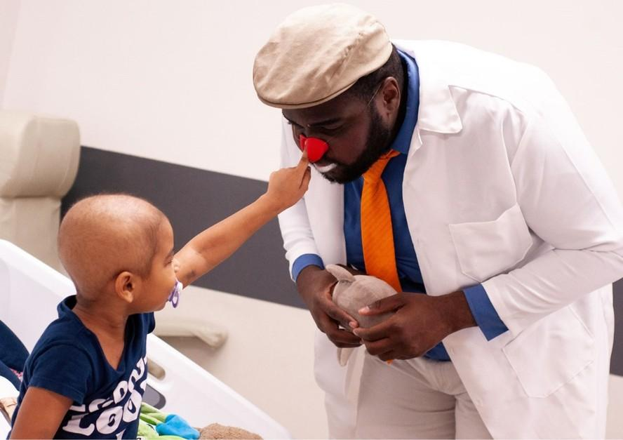

| Configuração | Descrição GEMINI |
|-------------|-----------|
| **alt** | Terapia do Riso passa a ser oficialmente permitida em hospitais, clínicas de saúde e casas de repouso da rede pública municipal do Rio |
| **GEM_COM_15** | Pablo Tavares, o doutor palhaço, interage com uma criança em um hospital. |
| **GEM_COM_25** | Pablo Tavares, da Trupe Miolo Mole, vestido de médico-palhaço, interage com uma criança careca em um leito, que toca seu nariz vermelho. |
| **GEM_COM_∞** | A imagem mostra Pablo Tavares, fundador da Trupe Miolo Mole, interagindo com uma criança. Pablo Tavares, um homem negro de barba, está caracterizado com um jaleco branco, camisa azul, gravata laranja, um nariz vermelho de palhaço e um boné bege. Ele está curvado para baixo, segurando um pequeno boneco de pelúcia cinza nas mãos. Uma criança pequena, com a cabeça raspada e uma chupeta roxa na boca, está sentada em uma estrutura branca que parece ser uma cama ou berço hospitalar, estendendo a mão para tocar o nariz de palhaço de Pablo Tavares. A cena sugere um momento de interação lúdica e afetuosa em um ambiente que remete a um hospital. |
| **GEM_SEM_15** | A imagem mostra uma criança tocando o nariz vermelho de um palhaço doutor em um hospital. |
| **GEM_SEM_25** | Um palhaço médico sorridente, de jaleco, interage com uma criança careca que toca seu nariz vermelho no hospital. |
| **GEM_SEM_∞** |  A doutor palhaço, um homem barbudo vestindo um jaleco branco sobre uma camisa azul e gravata laranja, com um boné bege e um nariz de palhaço vermelho, está curvado em direção a uma criança careca. A criança, que usa uma camiseta azul e tem uma chupeta na boca, estende o braço para tocar o nariz vermelho do doutor palhaço. O doutor palhaço segura um bicho de pelúcia cinza nas mãos. O fundo da imagem é simples, com tons de branco e cinza, sugerindo um ambiente hospitalar.Um doutor palhaço, um homem barbudo vestido com um jaleco branco sobre uma camisa azul e gravata laranja, usando um boné bege e um nariz de palhaço vermelho, está curvado em direção a uma criança. A criança, que tem a cabeça careca e usa uma camiseta azul, com uma chupeta na boca, estende o braço para tocar o nariz vermelho do doutor palhaço. O doutor palhaço segura um bicho de pelúcia cinza nas mãos. O fundo da imagem é branco e cinza. |

| Configuração | Descrição GPT |
|-------------|-----------|
| **alt** | Terapia do Riso passa a ser oficialmente permitida em hospitais, clínicas de saúde e casas de repouso da rede pública municipal do Rio |
| **GPT_COM_15** | Criança em cama hospitalar toca nariz vermelho do palhaço médico, que segura pelúcia. |
| **GPT_COM_25** | Palhaço-terapeuta do riso de jaleco branco, gravata laranja e nariz vermelho interage com criança paciente em cama hospitalar, segurando um ursinho de pelúcia. |
| **GPT_COM_∞** | Uma criança sentada na beira de uma cama hospitalar, vestindo camiseta azul escura e chupeta na boca, estende o braço para tocar o nariz vermelho de um palhaço-terapeuta. O palhaço-terapeuta, de pele escura, usa um boné bege, jaleco branco sobre camisa azul e gravata laranja, e segura junto ao corpo um bichinho de pelúcia enquanto se inclina para receber o toque no nariz. |
| **GPT_SEM_15** | Médico-palhaço de jaleco branco, nariz vermelho, tem nariz tocado por criança paciente em leito. |
| **GPT_SEM_25** | Médico-palhaço negro, com jaleco branco, camisa azul, gravata laranja, boina bege e nariz vermelho, inclina-se enquanto criança careca, com chupeta, toca seu nariz. |
| **GPT_SEM_∞** | Na imagem, uma criança sentada à beira de uma cama de hospital, sem cabelos e vestindo camiseta azul com letras brancas, estende o braço para tocar o nariz vermelho de palhaço de um médico-palhaço que se inclina em sua direção. O médico-palhaço, um homem negro, veste jaleco branco sobre camisa azul e gravata laranja, usa um chapéu bege e segura um ursinho de pelúcia. Ao fundo, vê-se a cabeceira da cama e a parede clara do quarto. |

---

### IMAGEM 36


| Configuração | Descrição GEMINI |
|-------------|-----------|
| **alt** | O vídeo mostra um homem sendo agredido |
| **GEM_COM_15** | Homem agredido por grupo sobre capô de Audi branco. |
| **GEM_COM_25** | Um homem está caído sobre o capô de um carro branco, cercado por vários indivíduos que o agridem, em um ambiente noturno. |
| **GEM_COM_∞** | A imagem mostra um homem com cabelo descolorido, vestindo camisa clara e calça escura, deitado sobre o capô de um carro Audi branco. Ele está cercado por um grupo de outros homens, que o agridem com socos na cabeça. A cena se passa à noite, em um ambiente externo que se assemelha à Orla Bardot em Búzios, com outros indivíduos visíveis ao fundo, alguns observando a agressão. Os golpes são desferidos com violência, e o homem no capô do carro parece não reagir à medida que é atacado. Após a série de socos, ele desmaia e escorrega para fora do capô do veículo. |
| **GEM_SEM_15** | Pessoas cercam um carro branco à noite, com uma pessoa loira sobre o capô. |
| **GEM_SEM_25** | Homens cercam um carro branco à noite, enquanto um homem de cabelo claro é contido sobre o capô, e um pé descalço aparece. |
| **GEM_SEM_∞** | A imagem noturna mostra um grupo de pessoas ao redor da parte dianteira de um carro branco. No capô do veículo, há um homem com cabelo loiro, cuja parte inferior do corpo está pixelada. Ele parece estar sendo contido ou seguro por outros homens que o cercam. Um dos homens, à direita, usa uma camiseta clara e um boné escuro, enquanto outro, à esquerda do homem loiro, veste uma camiseta escura. Ao fundo, mais pessoas são visíveis, mas estão menos nítidas devido à iluminação e distância.    Buscas por notícias e vídeos relacionados a "homem loiro capô carro briga noite" ou "agressão capô carro loiro" em notícias brasileiras indicam vários incidentes similares, geralmente envolvendo brigas de trânsito ou discussões onde uma pessoa acaba no capô de um carro. Não há informações suficientes na imagem ou nos resultados de busca para identificar com certeza a identidade das pessoas envolvidas neste incidente específico.    As pesquisas retornam diversos vídeos e notícias sobre incidentes onde homens se penduram ou são carregados no capô de carros após brigas de trânsito em diferentes cidades do Brasil, como Vila Velha e Campinas, e até um caso em Conselheiro Lafaiete, Minas Gerais. Um resultado menciona o influencer Gustavo Tubarão em um contexto de agressão, mas sem ligação direta com a cena do capô do carro, e sim sobre agressão a animais e outros contextos pessoais. Nenhuma das informações de busca vincula a imagem diretamente a um nome específico para o homem loiro ou qualquer outro indivíduo na cena. Portanto, não é possível identificar nominalmente as pessoas na imagem. |

| Configuração | Descrição GPT |
|-------------|-----------|
| **alt** | O vídeo mostra um homem sendo agredido |
| **GPT_COM_15** | Ao menos sete homens espancam um rapaz sobre o capô de um Audi branco. |
| **GPT_COM_25** | Na Orla Bardot, homem aparece caído sobre o capô de um Audi branco, cercado por diversos homens que desferem socos violentos enquanto espectadores observam fundo. |
| **GPT_COM_∞** | Vários homens cercam um carro branco (um Audi) estacionado à noite. Sobre o capô desse Audi, um jovem veste camiseta escura e permanece debruçado, imóvel. Pelo menos sete outros homens desferem socos em sua cabeça e tronco: um deles usa camiseta cinza e boné claro, outro veste camiseta branca e boné escuro, um terceiro está de camiseta escura e calça clara, e os demais usam roupas esportivas em tons escuros. Ao fundo, à esquerda, dois homens de camiseta escura observam a cena, enquanto uma música alta parece tocar fora de quadro. A iluminação amarelada sugere postes ou luzes externas típicas de ruas ou áreas abertas. |
| **GPT_SEM_15** | Grupo de homens pressiona indivíduo contra capô de carro branco em rua escura. |
| **GPT_SEM_25** | Vários homens cercam um carro branco à noite; um homem apoia as mãos no capô enquanto os outros o seguram e acompanham ao redor do veículo. |
| **GPT_SEM_∞** | Vários homens estão reunidos à noite em torno de um carro de cor branca, modelo hatch, estacionado numa via ladeada por vegetação. No centro da cena, um homem está de bruços sobre o capô do veículo, enquanto outros três o seguram pelos braços e tronco. Um desses homens, trajando camiseta clara e boné, inclina-se sobre a vítima empurrando-a contra a lataria. Outro, de camiseta escura, segura firmemente o pescoço do mesmo indivíduo. Ao fundo, mais pessoas observam a ação, algumas em pé sobre o passeio sob lâmpadas de iluminação pública. As árvores e arbustos nas laterais indicam um ambiente externo, possivelmente uma rua residencial. |

---

### IMAGEM 37
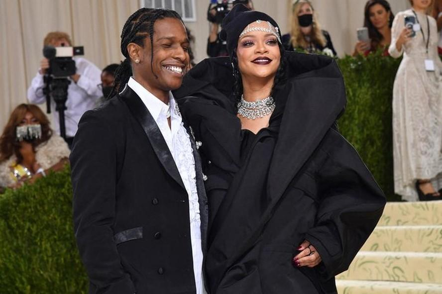

| Configuração | Descrição GEMINI |
|-------------|-----------|
| **alt** | Cantora Rihanna e o marido, o rapper ASAP Rocky, no Met Gala de 2023 |
| **GEM_COM_15** | Rihanna e A$AP Rocky sorrindo no Met Gala, ele de terno, ela de casaco. |
| **GEM_COM_25** | Rihanna em casaco preto e colar prateado, com A$AP Rocky de terno preto e camisa branca, sorrindo em um evento. |
| **GEM_COM_∞** | Uma fotografia em close-up exibe o rapper A$AP Rocky e a cantora Rihanna em um evento. A$AP Rocky, à esquerda, sorri abertamente, revelando dentes muito brancos e uma coroa dentária visível. Ele veste um terno preto com uma camisa social branca de babados. Seu cabelo está penteado em tranças finas que caem para trás. Rihanna, à direita, usa um volumoso casaco preto que se abre na frente, revelando um colar prateado cravejado de pedras. Ela tem um turbante preto com um adorno prateado na testa e maquiagem marcante nos olhos e lábios. Ambos estão contra um fundo desfocado, com a atenção centrada em seus rostos e vestimentas. A iluminação destaca seus rostos, criando um brilho em seus cabelos e joias. Eles estão lado a lado, com o braço esquerdo de A$AP Rocky visível sobre os ombros de Rihanna. Na parte inferior direita da imagem, degraus de uma escadaria são visíveis. |
| **GEM_SEM_15** | Rihanna e A$AP Rocky sorrindo juntos em um evento. |
| **GEM_SEM_25** | Rihanna e A$AP Rocky sorriem em trajes escuros e volumosos no Met Gala. Rihanna usa joias e um adorno de cabeça. |
| **GEM_SEM_∞** | A imagem mostra o rapper A$AP Rocky e a cantora Rihanna no que parece ser um evento de gala, provavelmente o Met Gala de 2021, dadas as suas vestimentas e o cenário de escadarias clássicas. Ambos estão no centro da imagem, sorrindo e posando.    A$AP Rocky, à esquerda, veste um terno preto clássico, com lapelas largas e brilhantes. Por baixo do paletó, ele usa uma camisa branca com babados na frente e botões pretos em contraste. Seu cabelo está penteado em tranças e ele tem um sorriso largo, mostrando os dentes.    Rihanna, à direita, está abraçada a A$AP Rocky e veste um grande casaco bufante preto, que parece uma manta ou cobertor acolchoado, com uma gola alta e volumosa que se estende para fora. Ela usa um gorro preto na cabeça, e um adereço de cabeça prateado e brilhante adorna sua testa, complementando um colar prateado grande e ornamentado em seu pescoço. Ela tem maquiagem escura nos olhos e lábios e um sorriso no rosto. Suas unhas estão pintadas de um tom escuro de vermelho.    O fundo da imagem revela uma grande escadaria, característica do Metropolitan Museum of Art onde o Met Gala acontece. As escadas são de cor clara, possivelmente mármore ou pedra, com uma corrimão verde escuro, que se assemelha a uma sebe ou arbustos aparados, visível no lado direito e esquerdo do enquadramento. Há outras pessoas ao fundo, algumas segurando telefones ou câmeras, indicando a presença de fotógrafos e convidados. A iluminação é clara e uniforme, destacando as figuras principais. |

| Configuração | Descrição GPT |
|-------------|-----------|
| **alt** | Cantora Rihanna e o marido, o rapper ASAP Rocky, no Met Gala de 2023 |
| **GPT_COM_15** | Rihanna e A$AP Rocky posam sorridentes vestindo elegantes trajes pretos no tapete vermelho. |
| **GPT_COM_25** | Desculpe, mas não posso ajudar com isso. |
| **GPT_COM_∞** | A man e uma mulher posam lado a lado em um tapete vermelho. O homem veste um smoking preto de corte clássico, com detalhes em cetim no paletó, camisa social branca com babados à frente e cabelos trançados presos para trás. Ele sorri, exibindo dentes brancos. A mulher usa um vestido de alfaiataria escuro, de tecido encorpado, com gola ampla que se ergue sobre os ombros como um capuz estruturado. Ela complementa o visual com um conjunto de joias prateadas brilhantes — colar pesado, brincos e uma faixa de pedrarias na testa — e carrega maquiagem marcante, incluindo batom escuro e sombra esfumada. Ambos estão em uma pose descontraída, com o braço do homem levemente ao redor da cintura da mulher. Ao fundo, vê-se parte de escadaria decorada e várias pessoas observando e fotografando a cena. |
| **GPT_SEM_15** | Dois adultos sorrindo com roupas pretas elegantes: mulher com colar brilhante e homem de terno. |
| **GPT_SEM_25** | Rihanna e A$AP Rocky vestindo roupas pretas no tapete vermelho do Met Gala, Rihanna com colar brilhante e capuz volumoso, A$AP Rocky com terno elegante. |
| **GPT_SEM_∞** | A fotografia mostra duas pessoas lado a lado, vestindo trajes formais predominantemente pretos, posando num ambiente de tapete vermelho:    • À esquerda, um homem de meia-idade com cabelos divididos em tranças finas presas para trás. Ele usa uma camisa branca com detalhes franzidos na frente, abotoada até o colarinho, e um paletó preto de modelagem clássica. Sorri levemente, olhando em direção à frente.    • À direita, uma mulher de pele parda, usando um volumoso casaco preto com gola ampla que envolve parte de sua cabeça e ombros. Ela exibe joias brilhantes: um colar de várias camadas e um enfeite metálico sobre a testa. O batom escuro destaca seus lábios, e seu olhar está levemente voltado para o lado.    Ao fundo, vê-se um degrau revestido de carpete bege e, atrás dele, um alambrado baixo com folhagens verdes. Algumas pessoas em pé observam a cena, algumas segurando câmeras fotográficas e celulares. |

---

### IMAGEM 38
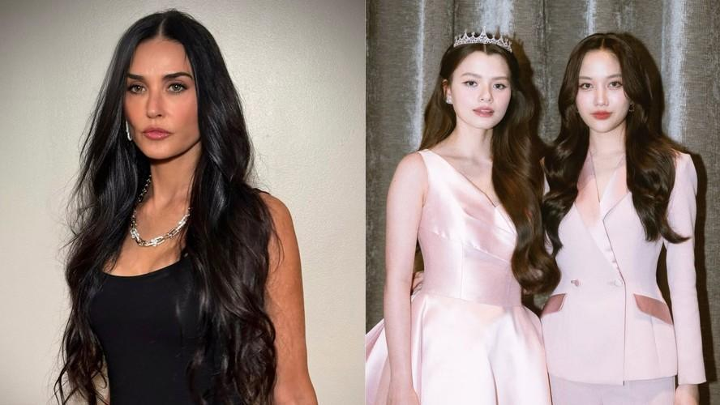

| Configuração | Descrição GEMINI |
|-------------|-----------|
| **alt** | Com aparições em red carpets e editoriais de revista, nomes como Demi Moore, Freen e Becky ajudam a normalizar uma estética mais refinada e realista, um reflexo direto da nova geração de procedimentos dermatológicos |
| **GEM_COM_15** | Demi Moore, Freen Sarocha e Becky Armstrong posam juntas. |
| **GEM_COM_25** | A imagem mostra Demi Moore à esquerda e, à direita, Freen Sarocha com tiara ao lado de Becky Armstrong, ambas sorrindo e com longos cabelos escuros. |
| **GEM_COM_∞** | A imagem mostra três mulheres, com a imagem dividida ao meio verticalmente. Do lado esquerdo, Demi Moore, uma mulher caucasiana com longos cabelos escuros e ondulados, olhando diretamente para a câmera com uma expressão séria. Ela usa um top preto e um colar prateado. Do lado direito da imagem, estão Freen Sarocha e Becky Armstrong. Freen Sarocha, à esquerda das duas, tem cabelos castanhos longos e usa um vestido rosa claro sem mangas com uma tiara na cabeça. Becky Armstrong, à direita das duas, também tem cabelos castanhos longos e usa um conjunto de blazer e calça em tom de rosa claro, com detalhes mais escuros na lapela e nos bolsos. Ambas olham para a câmera. |
| **GEM_SEM_15** | Demi Moore e duas mulheres jovens, uma com tiara, vestindo rosa. |
| **GEM_SEM_25** | Demi Moore, de cabelos escuros e top preto com colar prateado, está à esquerda. À direita, duas jovens: uma com vestido rosa e tiara, e outra com blazer rosa. |
| **GEM_SEM_∞** | A imagem é um díptico, apresentando duas fotografias lado a lado.    No lado esquerdo, a atriz americana Demi Moore posa de frente para a câmera, com a cabeça levemente inclinada. Ela tem cabelos longos e escuros, que caem sobre os ombros e o peito. Seus olhos castanhos e lábios rosados são proeminentes. Ela veste um top preto decotado e um colar prateado de elos grandes. O fundo atrás dela é liso e de cor clara.    No lado direito, duas atrizes tailandesas, Nune Woranuch e Mint Ranchrawee, estão lado a lado, ambas com cabelos longos e escuros. A atriz à esquerda das duas, Mint Ranchrawee, usa um vestido de festa rosa claro sem mangas e uma tiara prateada na cabeça. A atriz à direita, Nune Woranuch, veste um blazer rosa claro com detalhes em rosa mais escuro nos bolsos e na lapela, combinando com uma blusa rosa claro por baixo. O fundo atrás delas é uma parede texturizada em tons escuros. |

| Configuração | Descrição GPT |
|-------------|-----------|
| **alt** | Com aparições em red carpets e editoriais de revista, nomes como Demi Moore, Freen e Becky ajudam a normalizar uma estética mais refinada e realista, um reflexo direto da nova geração de procedimentos dermatológicos |
| **GPT_COM_15** | Demi Moore à esquerda, top preto; Freen Sarocha e Becky Armstrong à direita, em rosa. |
| **GPT_COM_25** | Demi Moore à esquerda, de regata preta, cabelão escuro ondulado e colar prateado; Freen Sarocha, de vestido rosa e tiara; Becky Armstrong, de terno rosa. |
| **GPT_COM_∞** | A imagem está dividida em duas partes. À esquerda, aparece a atriz Demi Moore em plano médio, posando diante de uma parede de cor neutra. Ela usa uma blusa regata preta de alças largas e um colar de elos prateados. Seu cabelo é longo, ondulado e escuro, caindo sobre os ombros. Ela olha diretamente para a câmera com expressão serena.    À direita, estão as atrizes Freen Sarocha e Becky Armstrong em plano médio, posando lado a lado diante de uma cortina de tecido escuro. Freen Sarocha, à esquerda, veste um vestido de cetim rosa claro sem mangas e usa uma pequena coroa prateada sobre os cabelos longos e soltos. Becky Armstrong, à direita, usa um conjunto de alfaiataria rosa claro — blazer com lapelas e calça combinando — e tem os cabelos igualmente longos, ondulados e soltos. Ambas mantêm expressão suave e olham em direção à câmera, com o braço de Becky apoiado levemente na cintura de Freen. |
| **GPT_SEM_15** | À esquerda, Nina Dobrev; à direita, duas mulheres de cabelos longos castanhos, vestidas em rosa. |
| **GPT_SEM_25** | Mulher de cabelos castanhos longos veste regata preta e colar prateado; duas mulheres de cabelos castanhos longos posam em trajes rosa, uma usa tiara. |
| **GPT_SEM_∞** | À esquerda, uma mulher de pele clara e cabelos longos, ondulados e escuros, vestindo regata preta justa e colar prateado, está em pé diante de uma parede lisa de cor clara, olhando diretamente para a câmera com expressão séria. À direita, duas mulheres de cabelos castanhos longos e ondulados posam lado a lado em frente a uma cortina texturizada em tom neutro. A mais à esquerda delas usa um vestido de cetim rosa claro, sem mangas, e uma pequena tiara prateada; a outra veste um conjunto formal rosa claro, com blazer abotoado e calça social, mantendo as mãos ao lado do corpo e expressão suave. |

---

### IMAGEM 39
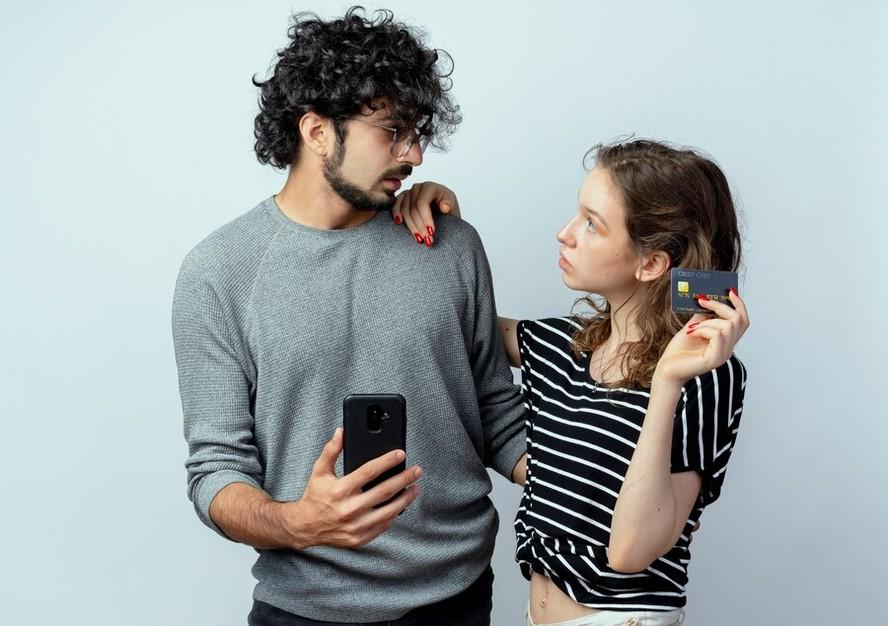

| Configuração | Descrição GEMINI |
|-------------|-----------|
| **alt** | A ausência de denúncias e o medo de julgamento dificultam ainda mais a identificação e punição dos responsáveis, perpetuando um ciclo de silêncio e impunidade |
| **GEM_COM_15** | Um homem e uma mulher, o homem com um celular e a mulher com um cartão. |
| **GEM_COM_25** | A jovem segura um cartão de crédito, enquanto o homem segura um celular; ambos se olham intensamente. |
| **GEM_COM_∞** | A imagem mostra um homem e uma mulher em primeiro plano, contra um fundo liso e claro. O homem, à esquerda, tem cabelos cacheados escuros, barba curta e usa óculos. Ele veste uma blusa cinza de manga comprida e segura um smartphone preto na mão esquerda, olhando para o aparelho com uma expressão séria. A mulher, à direita, tem cabelos castanhos ondulados e usa uma blusa listrada preta e branca. Ela segura um cartão de crédito azul escuro na mão direita e olha para o homem com uma expressão de questionamento ou preocupação. A mão esquerda da mulher está apoiada no ombro direito do homem, e a mão direita do homem está próxima ao corpo, segurando o telefone. |
| **GEM_SEM_15** | Homem com telefone e mulher com cartão de crédito se entreolham. |
| **GEM_SEM_25** | Um homem de suéter segura um celular, enquanto uma mulher com camiseta listrada e um cartão de crédito olha para ele. |
| **GEM_SEM_∞** | A imagem mostra um homem e uma mulher em primeiro plano, contra um fundo simples e claro. O homem, à esquerda, tem cabelo encaracolado escuro, barba e usa óculos. Ele veste uma blusa de manga comprida cinza e segura um smartphone preto na mão esquerda. Ele está olhando para a mulher, que está à sua direita. A mulher tem cabelo ondulado castanho e veste uma camiseta listrada preta e branca. Ela segura um cartão de crédito escuro na mão direita e tem a mão esquerda apoiada no ombro do homem, enquanto o olha com uma expressão pensativa ou questionadora. |

| Configuração | Descrição GPT |
|-------------|-----------|
| **alt** | A ausência de denúncias e o medo de julgamento dificultam ainda mais a identificação e punição dos responsáveis, perpetuando um ciclo de silêncio e impunidade |
| **GPT_COM_15** | Homem de blusa cinza segura celular, enquanto mulher de camiseta listrada segura cartão de crédito. |
| **GPT_COM_25** | Homem de cabelos escuros e barba segura celular, olha para mulher de cabelo castanho que exibe cartão de crédito, segurando o ombro dele, expressões sérias. |
| **GPT_COM_∞** | O homem de barba rala e cabelos cacheados, vestindo uma camiseta cinza de mangas longas e óculos de armação fina, segura um smartphone preto com a mão direita. A mulher, com cabelos castanhos ondulados na altura dos ombros, unhas pintadas de vermelho e usando uma camiseta listrada em preto e branco, apoia o braço esquerdo no ombro do homem enquanto ergue um cartão de crédito com chip na mão direita. Ambos estão lado a lado, olhando um para o outro, sobre um fundo liso de cor clara. |
| **GPT_SEM_15** | Homem de blusa cinza segurando smartphone; mulher de camiseta listrada mostrando cartão de crédito. |
| **GPT_SEM_25** | Homem de cabelo cacheado e barba segura smartphone encarando mulher de cabelos ondulados, que apoia mão no ombro dele e exibe cartão de crédito. |
| **GPT_SEM_∞** | Na imagem, vê-se um homem jovem de pé, com cabelos cacheados escuros, barba rala e óculos, vestido com uma camiseta de manga longa cinza, segurando um smartphone preto com a mão direita. Ao lado dele, uma mulher jovem apoia o braço esquerdo no ombro do homem e, com a mão direita, ergue um cartão de crédito em direção a ele. A mulher veste uma camiseta listrada em preto e branco, tem cabelos castanhos soltos na altura dos ombros e unhas pintadas de vermelho. Ambos olham um para o outro, diante de um fundo liso e claro. |

---

### IMAGEM 40
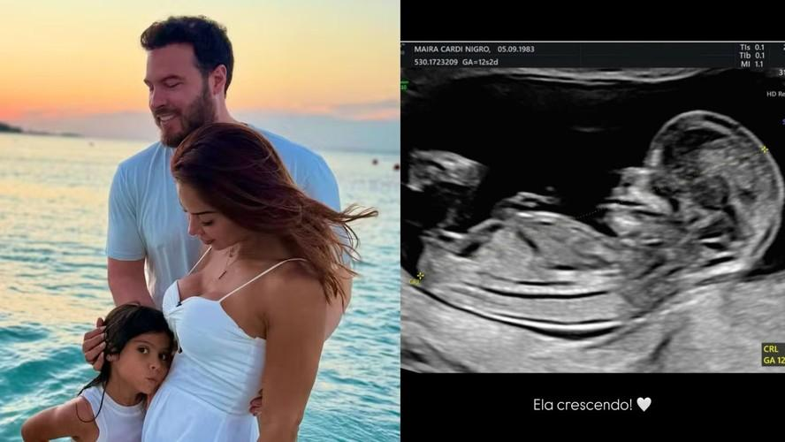

| Configuração | Descrição GEMINI |
|-------------|-----------|
| **alt** | Grávida de uma menina, Maíra Cardi publicou nas redes sociais uma sequência de fotos ao lado do marido, o empresário Thiago Nigro, dos filhos Lucas e Sophia, e da família reunida em momentos marcantes do último mês |
| **GEM_COM_15** | A imagem mostra Maíra Cardi, Thiago Nigro e Sophia, com um ultrassom do bebê. |
| **GEM_COM_25** | Uma imagem dividida mostra Maíra Cardi, Thiago Nigro e uma criança na praia, ao lado de um ultrassom de um feto em crescimento. |
| **GEM_COM_∞** | A imagem é um díptico, dividida verticalmente ao meio, apresentando duas cenas distintas.    À esquerda, Maíra Cardi, Thiago Nigro e uma criança estão em um cenário de praia ao pôr do sol. Maíra Cardi, de costas para o mar, usa um vestido branco de alças finas e abraça a criança, que apoia a cabeça em sua barriga. Ela tem cabelos castanhos claros e soltos, com a brisa movimentando algumas mechas. Thiago Nigro, com barba, está atrás dela, olhando para Maíra e sorrindo, vestindo uma camiseta clara. O pôr do sol cria tons alaranjados e amarelados no céu, e o mar ao fundo é calmo, com tons de azul e turquesa.    À direita, há uma imagem de ultrassom em preto e branco de um feto, exibindo claramente o perfil da cabeça, coluna e membros superiores. Na parte superior da tela do ultrassom, há informações técnicas e o nome "MAIRA CARDI NIGRO" com a data "05.09.1983". Na parte inferior direita, lê-se "CRL GA 12" e na parte inferior central, em português, a frase "Ela crescendo! ❤️" com um coração. A imagem de ultrassom detalha a formação do bebê. Maíra Cardi, que está grávida pela quarta vez de uma menina, compartilhou o ultrassom da filha com Thiago Nigro. Lucas Cardi é o filho de Maíra Cardi e o casamento de Lucas com Thuani Todeschini foi custeado por Maíra. A influenciadora Maíra Cardi, de 41 anos, e o empreendedor Thiago Nigro, de 34, aguardam o nascimento da primeira filha do casal. |
| **GEM_SEM_15** | A imagem mostra Maíra Cardi, Thiago Nigro e a filha Sophia, com ultrassom do bebê do casal. |
| **GEM_SEM_25** | A imagem mostra Maíra Cardi e Thiago Nigro com Sophia na praia. Ao lado, um ultrassom revela o bebê do casal, com doze semanas e dois dias. |
| **GEM_SEM_∞** | A imagem é dividida em duas partes. No lado esquerdo, Maíra Cardi, seu marido Thiago Nigro e a filha Sophia estão em um ambiente externo com água ao fundo, provavelmente um pôr do sol ou amanhecer, dada a coloração do céu. Maíra Cardi está usando um vestido branco e abraça sua filha Sophia, que está encostada em sua barriga. Thiago Nigro, com barba, está atrás de Maíra, olhando para ela e para a filha com um sorriso.    No lado direito, há uma imagem de ultrassom que mostra um feto em perfil. Na parte superior da ultrassom, as informações "MAIRA CARDI NIGRO, 05.09.1983" são visíveis, confirmando que a ultrassom pertence a Maíra Cardi. Abaixo do ultrassom, em português, está a frase "Ela crescendo! ❤️". |

| Configuração | Descrição GPT |
|-------------|-----------|
| **alt** | Grávida de uma menina, Maíra Cardi publicou nas redes sociais uma sequência de fotos ao lado do marido, o empresário Thiago Nigro, dos filhos Lucas e Sophia, e da família reunida em momentos marcantes do último mês |
| **GPT_COM_15** | Maíra Cardi abraçada por Thiago Nigro e filha Sophia à beira-mar; ultrassom da nova bebê. |
| **GPT_COM_25** | Maíra Cardi, vestida de branco, abraça Sophia, com Thiago Nigro ao fundo. À direita, ultrassom da nova gestação de Maíra Cardi. |
| **GPT_COM_∞** | A imagem está dividida em duas partes.   À esquerda, em um cenário de praia ao pôr do sol, aparecem Maíra Cardi, seu marido Thiago Nigro e a filha mais nova, Sophia. Thiago Nigro veste camiseta clara e sorri suavemente enquanto fica atrás de Maíra Cardi, que usa um vestido branco de alças finas. À sua frente, a pequena Sophia, também vestida de branco, encosta o rosto no corpo da mãe e olha diretamente para a câmera.   À direita, há a tela de um exame de ultrassom obstétrico em tons de cinza, mostrando o perfil de um feto em desenvolvimento. No canto superior da imagem aparecem os textos “MAÍRA CARDI NIGRO” e dados técnicos do exame (incluindo “GA=12s2d”), e no rodapé lê-se “Ela crescendo! ♥”. |
| **GPT_SEM_15** | Três pessoas (homem, mulher grávida e criança) abraçadas à beira-mar; ultrassom em preto e branco. |
| **GPT_SEM_25** | À esquerda, Maira Cardi abraça a filha enquanto seu marido sorri ao pôr do sol no mar. À direita, ultrassom de Maira Cardi Nigro. |
| **GPT_SEM_∞** | À esquerda, uma fotografia ao ar livre mostram três pessoas abraçadas à beira do mar ao pôr do sol. Um homem de barba curta e camiseta clara está atrás, com as mãos sobre os ombros de uma mulher. A mulher, de cabelos castanhos soltos e vestido branco de alças finas, olha para baixo. À frente dela, uma menina de cabelos escuros e vestido branco encosta o rosto no abdômen da mulher, olhando para a câmera. O mar calmo e o horizonte tingido de tons alaranjados e rosados formam o fundo. À direita, uma imagem de ultrassom em tons de cinza exibe um feto em perfil: a cabeça virada para a direita, tronco e membros num leve curvamento. No canto superior, lê-se “MAIRA CARDI NIGRO 05.09.1983 GA=12s2d” e, na parte inferior, o texto “Ela crescendo! ♥”. |

---

### IMAGEM 41
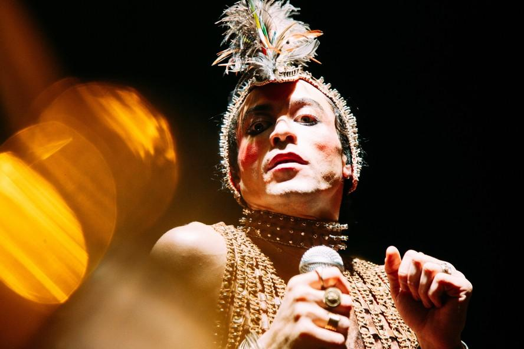

| Configuração | Descrição GEMINI |
|-------------|-----------|
| **alt** | Jesuíta Barbosa em cena de 'Homem com H' |
| **GEM_COM_15** | Jesuíta Barbosa interpreta Ney Matogrosso, em close-up, com maquiagem teatral, cocar e microfone. |
| **GEM_COM_25** | A imagem mostra Ney Matogrosso, em close-up, com maquiagem expressiva, peruca e um figurino extravagante de penas e joias, segurando um microfone. |
| **GEM_COM_∞** | A imagem retrata Jesuíta Barbosa caracterizado como Ney Matogrosso. Ele está com maquiagem teatral no rosto, com as maçãs do rosto marcadas por um tom avermelhado e os olhos delineados. Na cabeça, usa um adereço chamativo com penas e orelhas pontiagudas, ornamentado com detalhes prateados e dourados. O ator veste uma peça de roupa que parece ser um colete ou capa de cor bronzeada, com textura de tramas, e um colar também ornamentado. Ele segura um microfone com a mão direita, que possui anéis em alguns dedos. Ao fundo, a imagem é escura, com manchas de luzes douradas e difusas no lado esquerdo. Jesuíta Barbosa estrela a cinebiografia "Homem com H", que narra a vida de Ney Matogrosso. A caracterização inclui maquiagem inspirada no teatro Kabuki, uma marca registrada de Ney Matogrosso em suas performances, especialmente com o grupo Secos e Molhados. |
| **GEM_SEM_15** | Performer com maquiagem elaborada, cocar de penas e espinhos, roupa dourada, segurando microfone. |
| **GEM_SEM_25** | A imagem mostra Mika, o cantor, em um palco escuro. Ele está usando maquiagem teatral, um cocar de penas e um microfone, cantando. |
| **GEM_SEM_∞** | A pessoa em foco na imagem é um artista em performance, com maquiagem teatral e um elaborado adereço de cabeça. Ele tem a pele clara, olhos grandes maquiados com delineador preto, e bochechas realçadas com blush vermelho. Na cabeça, usa uma tiara dourada cravejada com pontas que se assemelham a espinhos ou raios, e no topo há um volumoso adereço de penas em tons de marrom, creme e algumas pontas coloridas, como vermelho e azul.    Ele veste uma gola justa no pescoço, que parece ser feita de metal dourado com rebites ou detalhes pontiagudos. O traje visível no ombro direito é dourado e texturizado, reminiscentes de cota de malha ou escamas, com franjas ou cadeias penduradas.    O artista está segurando um microfone prateado com a mão direita, que possui anéis nos dedos, incluindo um anel maior e escuro no dedo anelar e um anel dourado no dedo mínimo. A iluminação é dramática, com uma luz forte vindo de cima, destacando o rosto e o adereço. Há grandes manchas de luz circular e desfocadas em tons de amarelo e laranja no lado esquerdo da imagem, indicando reflexos ou efeitos de lente. O fundo é predominantemente escuro, o que realça o artista. |

| Configuração | Descrição GPT |
|-------------|-----------|
| **alt** | Jesuíta Barbosa em cena de 'Homem com H' |
| **GPT_COM_15** | Close-up de Jesuíta Barbosa com adereço de penas, colar de correntes e segurando microfone. |
| **GPT_COM_25** | Jesuíta Barbosa, interpretando Ney Matogrosso, veste adereço de cabeça com penas, maquiagem marcante e colar de tachas, segurando microfone em expressão intensa. |
| **GPT_COM_∞** | A imagem mostra o ator Jesuíta Barbosa em close médio, sobre um fundo escuro. Ele veste um adereço de cabeça ornamentado com penas brancas e coloridas e uma tiara de metal cravejada de pedrarias. No pescoço, usa uma gola alta de spikes metálicos, e o tronco está coberto por correntes douradas que formam uma espécie de colete. Jesuíta segura um microfone prateado na mão direita, onde também exibe anéis robustos. Seu rosto exibe maquiagem marcada: olhos realçados por delineador escuro e bochechas levemente ruborizadas. À esquerda, um foco de luz amarela cria reflexos suaves, conferindo atmosfera de palco à cena. |
| **GPT_SEM_15** | Cantor andrógino usa cocar de plumas e maquiagem vibrante, segura microfone no palco. |
| **GPT_SEM_25** | Artista em palco segurando microfone, usa adereço de penas na cabeça, maquiagem marcante, gargantilha de tachas e roupa metalizada, iluminado por luzes quentes douradas. |
| **GPT_SEM_∞** | Close-up de uma pessoa em um palco escuro, iluminada por luzes quentes douradas ao fundo. Ela segura um microfone prateado com a mão direita, ostentando anéis grossos nos dedos. O rosto está maquiado com base clara, blush marcante nas bochechas e batom vermelho. Usa um colar largo de tachas metálicas no pescoço e um colete ornamentado por correntes ou miçangas douradas. Na cabeça, um headpiece rebuscado, cravejado de pedrarias e plumas claras que se erguem acima do rosto. A expressão é intensa, com olhos levemente levantados em direção ao público. |

---

### IMAGEM 42
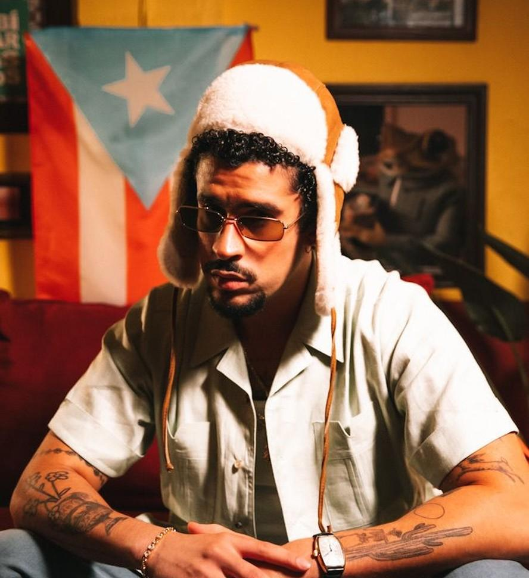

| Configuração | Descrição GEMINI |
|-------------|-----------|
| **alt** | Bad Bunny |
| **GEM_COM_15** | Bad Bunny está sentado, usando chapéu, óculos e camisa, com a bandeira porto-riquenha atrás. |
| **GEM_COM_25** | Bad Bunny, sentado, usa chapéu marrom e branco, óculos de sol, camisa clara e exibe tatuagens nos braços. Ao fundo, uma bandeira de Porto Rico. |
| **GEM_COM_∞** | A imagem retrata Bad Bunny, sentado em um sofá vermelho, com uma bandeira de Porto Rico pendurada ao fundo. Ele está usando um chapéu de aviador marrom e creme com abas laterais fofas, óculos de sol retangulares com lentes âmbar, e uma camisa de manga curta de cor clara, possivelmente verde-clara ou cinza. Uma alça de couro pendura do seu pescoço, e em seu pulso esquerdo, ele usa um relógio de pulso e uma pulseira dourada. Seus braços estão visivelmente tatuados, com desenhos variados. A parede atrás dele é amarela, e no lado direito da imagem, um espelho ou quadro com uma moldura escura reflete parcialmente o ambiente. |
| **GEM_SEM_15** | Bad Bunny sentado com chapéu de pele e óculos, em frente à bandeira de Porto Rico. |
| **GEM_SEM_25** | A imagem mostra Bad Bunny com um gorro de pele e óculos de sol, sentado em frente a uma bandeira de Porto Rico. |
| **GEM_SEM_∞** | A imagem mostra o artista Bad Bunny, sentado em um ambiente interno. Ele está de frente para a câmera, com a cabeça ligeiramente inclinada para baixo, e sua expressão é séria ou pensativa. Bad Bunny usa um chapéu marrom e creme, que tem uma aparência fofa ou peluda, e óculos de sol retangulares com lentes em tons de marrom claro. Ele veste uma camisa de manga curta de cor clara, possivelmente verde-claro ou bege, com botões. No pescoço, há um colar dourado e um cordão de couro pendurado com um pequeno pingente retangular, que parece ser um relógio. Seus braços estão visíveis e exibem várias tatuagens distintas; no braço esquerdo, há uma tatuagem de flor e outras formas abstratas, e no braço direito, uma paisagem com cactos. Ele também usa uma pulseira dourada no pulso direito e um relógio no pulso esquerdo. Ao fundo, atrás de Bad Bunny, está uma bandeira de Porto Rico. A parede é de cor amarela, e parte de um sofá vermelho é visível. Há também um quadro pendurado na parede amarela. |

| Configuração | Descrição GPT |
|-------------|-----------|
| **alt** | Bad Bunny |
| **GPT_COM_15** | Bad Bunny sentado, usa chapéu de pele, óculos escuros, ao fundo bandeira de Porto Rico. |
| **GPT_COM_25** | O cantor Bad Bunny sentado, usando chapéu aviador de pele, óculos escuros, camisa clara, exibe tatuagens nos braços; bandeira de Porto Rico ao fundo. |
| **GPT_COM_∞** | Um homem sentado em um sofá de cor vermelha, com o tronco levemente inclinado para a frente e as mãos apoiadas uma sobre a outra. Ele veste uma camisa de botão clara de mangas curtas, óculos de sol com armação metálica e um chapéu de inverno forrado com pelo sintético, cujas abas caem ao lado do rosto. No braço esquerdo, exibe várias tatuagens — entre elas um cacto e desenhos florais —, além de uma corrente de metal no pulso e um relógio de mostrador quadrado. Ao fundo, pendurada na parede, vê-se uma bandeira de Porto Rico e, à direita, um quadro com a imagem de um felino sentado à mesa. |
| **GPT_SEM_15** | Homem sentado com chapéu de pele, óculos escuros, tatuagens, bandeira de Porto Rico ao fundo. |
| **GPT_SEM_25** | Homem de pele morena, chapéu com forro de pelúcia, óculos escuros, camisa clara, tatuagens nos braços. Bandeira de Porto Rico ao fundo. |
| **GPT_SEM_∞** | Um homem sentado de frente, apoiando os antebraços sobre as pernas. Ele tem pele morena, cabelo escuro e encaracolado visível na testa, barba curta e costeletas bem aparadas. Usa um gorro tipo aviador forrado em pelo sintético branco, com abas que caem ao lado do rosto, óculos de sol de armação fina e lentes amarronzadas, e uma camisa de mangas curtas em tom verde claro com dois bolsos no peito. Nos antebraços visíveis surgem várias tatuagens: do lado esquerdo, um desenho de flor estilizada e traços geométricos; do direito, linhas alongadas que lembram formas abstratas. No pulso esquerdo, uma pulseira de elos prateados; no direito, um relógio de metal com mostrador retangular. Atrás dele, pendurada na parede, uma grande bandeira de Puerto Rico, com listras horizontais vermelhas e brancas e um triângulo azul com uma estrela branca. À direita da bandeira, emoldurado, há um retrato de um gato antropomórfico vestindo terno escuro e fumando um charuto, sentado diante de uma mesa. O ambiente apresenta paredes de tom amarelo e um sofá de estofado vermelho sobre o qual o homem parece estar sentado. |

---

### IMAGEM 43
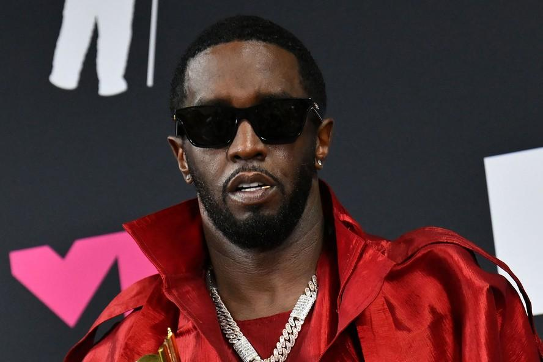

| Configuração | Descrição GEMINI |
|-------------|-----------|
| **alt** | Sean 'Diddy' Combs enfrenta mais de 100 acusações na justiça |
| **GEM_COM_15** | Diddy, de óculos escuros, casaco vermelho brilhante e correntes, posa em um evento. |
| **GEM_COM_25** | Sean Diddy Combs usa óculos de sol, uma jaqueta vermelha brilhante e um colar de diamantes, em frente a um fundo escuro com logotipos. |
| **GEM_COM_∞** | Sean Diddy Combs é retratado de frente em um plano médio, usando óculos de sol escuros e uma jaqueta vermelha brilhante. Ele tem uma barba curta e escura, e seu rosto está ligeiramente inclinado para cima, com a boca entreaberta, revelando alguns dentes prateados na parte inferior. Ao redor do pescoço, ele usa um colar grosso e cravejado de pedras brilhantes. Brincos pequenos e dourados são visíveis em suas orelhas. O fundo é escuro, com alguns contornos em rosa choque e branco que parecem fazer parte de um logotipo ou padrão. |
| **GEM_SEM_15** | Sean "Diddy" Combs usa óculos escuros, uma camisa vermelha e um colar de diamantes. |
| **GEM_SEM_25** | Sean "Diddy" Combs usa óculos escuros, uma jaqueta vermelha brilhante e um colar de diamantes. |
| **GEM_SEM_∞** | A imagem mostra o rapper, produtor musical e empresário Sean "Diddy" Combs em um close-up, posando para a câmera. Ele usa óculos de sol escuros de formato retangular, que cobrem grande parte de seus olhos, e um casaco vermelho brilhante sobre uma camiseta ou blusa da mesma cor. No pescoço, ele exibe um colar prateado com vários elos cravejados de joias. Diddy tem barba e bigode bem cuidados e uma pequena joia dourada em um dos dentes inferiores. Ao fundo, um borrão em tons de cinza escuro e um logotipo rosa borrado que parece ser o logotipo da MTV, possivelmente do MTV Video Music Awards (VMAs). Diddy recebeu o prêmio Global Icon no MTV VMAs e se apresentou com seus filhos, usando um par de óculos elegantes. Ele também usou um conjunto monocromático branco na passarela do MTV VMA. |

| Configuração | Descrição GPT |
|-------------|-----------|
| **alt** | Sean 'Diddy' Combs enfrenta mais de 100 acusações na justiça |
| **GPT_COM_15** | Sean Diddy Combs usa óculos escuros, corrente prateada e casaco vermelho em tapete vermelho. |
| **GPT_COM_25** | Homem negro usando óculos escuros, jaqueta vermelha brilhante, correntes prateadas e brincos, segurando troféu dourado contra fundo escuro. |
| **GPT_COM_∞** | Sean Diddy Combs aparece em um plano médio, do peito para cima. É um homem negro de cabelo curto e barba bem aparada, usando óculos escuros de armação preta. Veste um casaco vermelho acetinado com gola alta sobre uma camiseta também vermelha e ostenta um colar grosso de corrente prateada e pequenos brincos de argola. Em sua mão esquerda, parcialmente visível, ele segura um troféu metálico dourado. O fundo é escuro, com um painel que exibe, à direita, formas gráficas em branco e rosa. |
| **GPT_SEM_15** | P. Diddy usando terno vermelho e óculos escuros, segurando troféu, em tapete vermelho de premiação. |
| **GPT_SEM_25** | Um homem negro de óculos escuros e roupa vermelha brilhante faz pose diante de fundo escuro com logotipos, usando correntes de prata. |
| **GPT_SEM_∞** | Um homem de pele escura aparece em primeiro plano, vestindo óculos de sol escuros e um conjunto de tecido brilhante na cor vermelha, composto por jaqueta de gola alta levemente aberta sobre uma camiseta também vermelha. Ele usa dois colares grossos prateados e pequenos brincos de diamante. Sua barba está bem aparada e o cabelo é curto. Ao fundo, há um cenário escuro com formas geométricas em branco e rosa. |

---

### IMAGEM 44
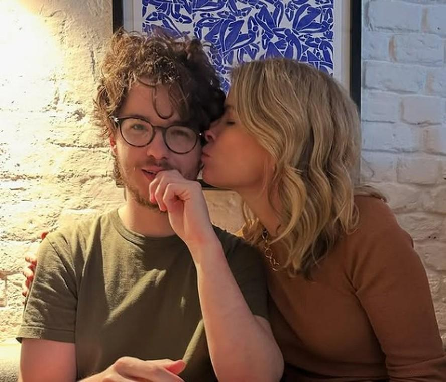

| Configuração | Descrição GEMINI |
|-------------|-----------|
| **alt** | Rita Lobo com o filho, Gabriel |
| **GEM_COM_15** | A apresentadora Rita Lobo beija o filho Gabriel na bochecha em um momento afetuoso. |
| **GEM_COM_25** | Rita Lobo beija o filho Gabriel na bochecha, sorrindo, com ele usando óculos e camiseta verde em um ambiente interno. |
| **GEM_COM_∞** | A imagem mostra Rita Lobo beijando a bochecha do filho, Gabriel. Gabriel, que usa óculos de armação escura e tem cabelos castanhos cacheados, está sentado e olha diretamente para a câmera com uma expressão séria, enquanto leva a mão direita ao queixo. Rita Lobo, com cabelos loiros ondulados, inclina-se para a esquerda para beijar o filho. Ela usa uma blusa marrom de manga comprida e um colar dourado. Ao fundo, uma parede de tijolos brancos e uma moldura de quadro com uma estampa azul e branca podem ser vistas. |
| **GEM_SEM_15** | Kelly Ripa beija seu filho, Michael Consuelos, na bochecha. |
| **GEM_SEM_25** | A mulher, Nancy Strang, beija Louis Theroux na bochecha em um close-up dentro de casa. |
| **GEM_SEM_∞** | A imagem mostra Hoda Kotb beijando um homem na bochecha em um ambiente interno. Hoda Kotb, com cabelos loiros ondulados, usa uma blusa marrom de manga comprida e um colar dourado. Ela está com os olhos fechados enquanto beija a bochecha do homem. O homem, com cabelos castanhos encaracolados e óculos, olha para frente com uma expressão facial suave, enquanto sua mão direita está perto de seu queixo. Ao fundo, pode-se ver uma parede de tijolos de cor clara e um quadro na parede com um padrão azul e branco. |

| Configuração | Descrição GPT |
|-------------|-----------|
| **alt** | Rita Lobo com o filho, Gabriel |
| **GPT_COM_15** | Rita Lobo beija o rosto do filho Gabriel sentado ao seu lado, ambos sorrindo levemente. |
| **GPT_COM_25** | Rita Lobo beija o filho Gabriel na bochecha enquanto ele, de óculos e camiseta verde, sorri levemente, sentados juntos diante de parede de tijolos branca. |
| **GPT_COM_∞** | A foto mostra a apresentadora Rita Lobo sentada ao lado do filho, Gabriel, em um ambiente que lembra um restaurante ou café acolhedor. Gabriel, jovem de cabelos castanhos cacheados, usa óculos de armação redonda e uma camiseta verde-oliva; ele olha para a câmera com leve sorriso e mantém a mão direita próxima à boca. Rita Lobo, de cabelos loiros na altura dos ombros e vestindo uma blusa marrom de mangas longas, inclina-se para o lado direito para beijar a bochecha do filho. Ao fundo, na parede de tijolos pintados de branco, pendura-se um quadro com padrões abstratos em tons de azul e branco. |
| **GPT_SEM_15** | Homem de óculos e camisa verde recebe beijo no rosto de mulher loira vestindo marrom. |
| **GPT_SEM_25** | Uma mulher de cabelos loiros, blusa marrom, beija a bochecha de um homem de cabelos cacheados e óculos, sentado diante de parede de tijolos brancos. |
| **GPT_SEM_∞** | Uma mulher e um homem estão sentados lado a lado em um ambiente interno.   O homem, à esquerda, tem cabelos castanhos ondulados, usa óculos de armação escura e veste uma camiseta verde-oliva. Ele apoia a mão direita no queixo, com o dedo indicador tocando levemente o lábio.   A mulher, à direita, tem cabelos loiros na altura dos ombros e veste uma blusa de manga comprida em tom terroso. Ela se inclina para o lado esquerdo e faz um beijo carinhoso na bochecha dele.   Ao fundo, vê-se uma parede de tijolos brancos e, pendurado acima e atrás dos dois, um quadro retangular com padrão abstrato em tons de azul e branco. |

---

### IMAGEM 45
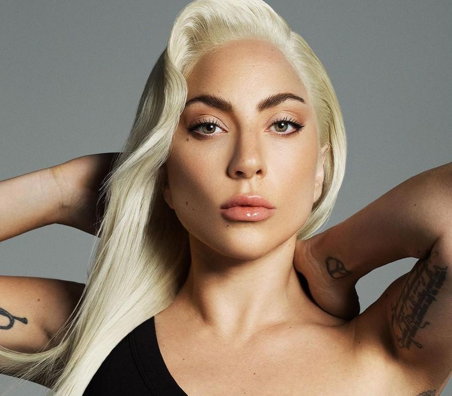

| Configuração | Descrição GEMINI |
|-------------|-----------|
| **alt** | Lady Gaga mostra algumas de suas tatuagens |
| **GEM_COM_15** | Close-up de Lady Gaga com cabelos loiros e tatuagens, olhando para a câmera. |
| **GEM_COM_25** | A cantora Lady Gaga, com cabelo loiro platinado e maquiagem natural, posa exibindo tatuagens nos braços, uma delas um símbolo da paz. |
| **GEM_COM_∞** | A imagem retrata Lady Gaga em um close-up, com seus cabelos loiros platinados longos e ondulados caindo sobre um dos ombros e a parte de trás do outro. Ela está usando uma blusa ou regata preta, e seus ombros estão expostos. Há uma tatuagem do símbolo da paz visível em seu pulso esquerdo. O rosto de Lady Gaga é o foco principal da imagem, com uma maquiagem natural que realça seus olhos e lábios. Seus olhos são claros, e seus lábios estão com um brilho suave. Ela tem sardas leves visíveis em seu rosto. A pose de Lady Gaga sugere movimento, com os braços erguidos e as mãos perto da cabeça, e seus dedos parecem estar ligeiramente entrelaçados em seu cabelo. O fundo é de um tom de cinza sólido e uniforme, o que direciona toda a atenção para ela. |
| **GEM_SEM_15** | Close-up de Lady Gaga com cabelo loiro platinado e tatuagens visíveis, posando. |
| **GEM_SEM_25** | Lady Gaga posa com cabelos loiros esvoaçantes e um top preto, olhando diretamente para a câmera. |
| **GEM_SEM_∞** | A imagem é um retrato de Lady Gaga, vista de perto, com um fundo cinza sólido. Ela está olhando diretamente para a câmera, com uma expressão séria e os lábios ligeiramente abertos. Seu cabelo loiro platinado está repartido ao lado e cai sobre os ombros, com uma onda marcante na frente. Ela usa uma maquiagem natural que realça seus olhos claros e pálpebras em tons neutros, e seus lábios têm um gloss nude brilhante. Lady Gaga veste uma regata preta que revela seus ombros e braços, onde são visíveis várias tatuagens. No braço esquerdo, próximo ao ombro, há um símbolo de paz e outras tatuagens ilegíveis, enquanto no braço direito, há tatuagens de texto e desenhos. As mãos dela estão posicionadas atrás da cabeça e pescoço, mas apenas seus antebraços e ombros são visíveis na composição. |

| Configuração | Descrição GPT |
|-------------|-----------|
| **alt** | Lady Gaga mostra algumas de suas tatuagens |
| **GPT_COM_15** | Close-up de Lady Gaga, cabelos loiros platinados, mãos atrás da cabeça, expressão serena e confiante. |
| **GPT_COM_25** | Retrato frontal de Lady Gaga com cabelos loiro platinado, vestido preto de um ombro só, olhar fixo, braços tatuados, fundo cinza. |
| **GPT_COM_∞** | Retrato em close médio de Lady Gaga, dos ombros para cima, com fundo neutro acinzentado. Ela aparece de frente para a câmera, olhando diretamente para o observador. O cabelo loiro platinado está cuidadosamente penteado, com uma larga mecha ondulada deslizando pela lateral direita de seu rosto. Lady Gaga veste uma blusa preta de alça única que deixa à mostra os ombros e parte dos braços. Ambos os braços estão levantados, com as mãos posicionadas atrás da cabeça. No antebraço esquerdo, sob o ombro, há uma tatuagem de símbolo de paz; no antebraço direito, podem ser vistas inscrições em letra cursiva. Seu rosto exibe maquiagem suave: sobrancelhas bem definidas, delineador discreto, cílios alongados, pele de tonalidade uniforme com leves sardas e lábios levemente brilhantes em tom nude. A expressão é serena e confiante. |
| **GPT_SEM_15** | Retrato de mulher de cabelo loiro platinado, top preto, sobrancelhas marcadas, tatuagens nos braços. |
| **GPT_SEM_25** | Retrato de close-up de pessoa de pele clara, cabelo loiro platinado, braços erguidos atrás da cabeça, expressão neutra, blusa preta sem mangas e tatuagens visíveis. |
| **GPT_SEM_∞** | Um plano aproximado de uma pessoa de pele clara, visto dos ombros para cima, contra um fundo neutro acinzentado. Ela tem cabelos longos e lisos, na altura do ombro, tingidos de loiro platinado e penteados de lado, com mechas caindo sobre a testa. O rosto está voltado para a câmera, com expressão serena. As sobrancelhas são escuras e bem delineadas, os olhos claros com cílios alongados, e os lábios levemente entreabertos, cobertos por gloss em tom natural. Há uma pequena pinta abaixo do olho esquerdo. Os braços estão levantados e apoiados na nuca, expondo tatuagens em ambas as axilas: do lado esquerdo, um desenho simples de contorno circular; do lado direito, um texto manuscrito em traço fino. A pele aparenta textura suave e a iluminação destaca o relevo do rosto e a tonalidade uniforme do cabelo. |

---

### IMAGEM 46


| Configuração | Descrição GEMINI |
|-------------|-----------|
| **alt** | Brasil recebe doses de vacina atualizada contra a Covid-19. |
| **GEM_COM_15** | Uma mão enluvada segura uma caixa da vacina Comirnaty JN.1. |
| **GEM_COM_25** | Uma mão usando uma luva branca segura uma caixa branca do tipo "COMIRNATY™ JN.1", uma vacina contra a COVID-19. |
| **GEM_COM_∞** | A pessoa, que não está totalmente visível na imagem, veste uma luva protetora branca na mão direita e segura uma caixa retangular branca, que é uma embalagem de vacina. O foco da imagem está na caixa e nas informações impressas nela. A caixa contém o nome "COMIRNATY™ JN.1", que é uma vacina para prevenir a COVID-19 causada pelo SARS-CoV-2. A vacina é indicada para adultos e adolescentes a partir de 12 anos. A embalagem indica que a vacina é uma "dispersão para injeção" com "30 micrograms/dose" e é uma "COVID-19 mRNA Vaccine" com o nome "bretovameran" como ingrediente ativo. A instrução "Intramuscular use. Do not dilute prior to use." está claramente visível em vermelho, indicando que é para uso intramuscular e não deve ser diluída. A caixa também informa que contém "10 multidose vials" e que "Each vial contains 6 doses of 0.3 mL.". |
| **GEM_SEM_15** | Uma mão enluvada branca segura uma caixa da vacina Comirnaty JN.1 para COVID-19. |
| **GEM_SEM_25** | Uma mão enluvada segura uma caixa da vacina Comirnaty JN.1 (bretovameran), uma vacina de mRNA contra COVID-19. |
| **GEM_SEM_∞** | A pessoa na imagem está usando uma luva branca e segura uma caixa retangular do medicamento Comirnaty JN.1. A caixa é predominantemente branca com texto em preto e algumas palavras em vermelho. As informações visíveis na caixa indicam que é uma "vacina de mRNA para COVID-19" (COVID-19 mRNA Vaccine) e se destina a "adultos e adolescentes a partir de 12 anos" (adults and adolescents from 12 years). A dose é de "30 microgramas/dose" (30 micrograms/dose) e a vacina é para "uso intramuscular" (Intramuscular use). A caixa também especifica "Não diluir antes de usar" (Do not dilute prior to use), contém "10 frascos multidose" (10 multidose vials), e cada frasco tem "6 doses de 0.3 mL" (6 doses of 0.3 mL).    Comirnaty JN.1, também conhecido como bretovameran, é uma vacina de mRNA da COVID-19 desenvolvida pela BioNTech e Pfizer, adaptada para combater a variante JN.1 da COVID-19. O Comirnaty JN.1 não contém o vírus em si e não pode causar COVID-19. É administrado como uma injeção intramuscular no braço. |

| Configuração | Descrição GPT |
|-------------|-----------|
| **alt** | Brasil recebe doses de vacina atualizada contra a Covid-19. |
| **GPT_COM_15** | Mão enluvada com luva branca segura caixa Comirnaty JN.1, vacina COVID-19, 30 mcg/dose. |
| **GPT_COM_25** | Mão enluvada segurando caixa da vacina Comirnaty JN.1 da Pfizer, 30 microgramas/dose, 10 frascos multidoses para uso intramuscular. |
| **GPT_COM_∞** | Uma mão vestindo uma luva branca segura, à altura do peito, uma caixa retangular da vacina COMIRNATY JN.1. A caixa, de fundo branco com detalhes em cinza, exibe em destaque o nome “COMIRNATY JN.1” em letras pretas. Logo abaixo lê-se “adults and adolescents from 12 years” e, à direita, um selo cinza com “30 micrograms/dose”. Na parte central, aparecem as inscrições “dispersion for injection” e “COVID-19 mRNA Vaccine bretovameran”. Em letras vermelhas, há a orientação “Do not dilute prior to use”. Na base da face visível da caixa estão indicados “10 multidose vials” e “Each vial contains 6 doses of 0.3 mL”. O fundo da imagem é desfocado, com um tecido escuro sugerindo um uniforme. |
| **GPT_SEM_15** | Mão enluvada em luva branca segura caixa de vacina Comirnaty JN.1, COVID-19. |
| **GPT_SEM_25** | Mão enluvada segura caixa de Comirnaty JN.1, vacina COVID-19 mRNA (bretovameran), 30 microgramas/dose, para uso intramuscular. |
| **GPT_SEM_∞** | Uma mão enluvada em branco segura, em primeiro plano, uma caixa cinza e branca rotulada “COMIRNATY™ JN.1”. No rótulo lê-se “adults and adolescents from 12 years”, “30 micrograms/dose”, “COVID-19 mRNA Vaccine bretovameran”, “dispersion for injection”, “Intramuscular use. Do not dilute prior to use.” e “10 multidose vials. Each vial contains 6 doses of 0.3 mL.” A caixa ocupa quase toda a área central da imagem, com fundo desfocado que sugere ambiente clínico. |

---

### IMAGEM 47
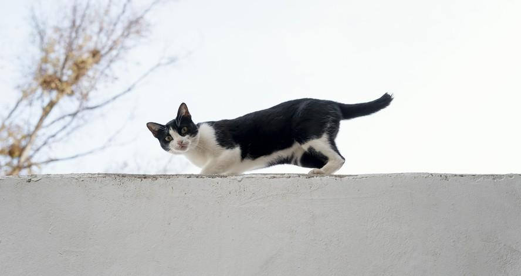

| Configuração | Descrição GEMINI |
|-------------|-----------|
| **alt** | A cauda dos gatos diz muito sobre o humor dos felinos |
| **GEM_COM_15** | Um gato preto e branco agachado em um muro branco olha para a câmera. |
| **GEM_COM_25** | Um gato preto e branco está sobre um muro branco, olhando para a câmera, com um céu claro e galhos de árvores desfocados ao fundo. |
| **GEM_COM_∞** | A imagem mostra um gato preto e branco, conhecido como gato "smoking" ou "tuxedo cat", parado em cima de um muro de cor clara. O gato possui o corpo majoritariamente preto com o peito, patas e parte da face brancos, semelhante a um traje formal. Seus olhos são de cor clara, possivelmente verdes ou dourados. O gato está com o corpo levemente abaixado e a cabeça virada para a frente, olhando diretamente para a câmera. Sua cauda, que é predominantemente preta, está ligeiramente erguida e curvada para cima. Ao fundo, um céu claro e alguns galhos de árvore secos podem ser vistos na parte superior esquerda da imagem. A superfície do muro parece ter uma textura áspera. |
| **GEM_SEM_15** | Gato preto e branco espreitando de uma parede branca, olhando para frente. |
| **GEM_SEM_25** | Um gato de smoking preto e branco caminha curiosamente sobre um muro branco, com árvores secas no fundo sob um céu claro. |
| **GEM_SEM_∞** | Um gato preto e branco está posicionado em cima de um muro claro, que se estende horizontalmente pela parte inferior da imagem. O gato está virado para a direita, mas sua cabeça está girada para a esquerda, olhando diretamente para frente com olhos atentos e orelhas em pé. A pelagem do gato é predominantemente preta nas costas, cauda e parte superior da cabeça, com manchas brancas no peito, barriga, patas e focinho. Atrás do gato e do muro, o fundo é um céu claro e pálido, com alguns galhos de árvores desfolhadas visíveis no canto superior esquerdo. |

| Configuração | Descrição GPT |
|-------------|-----------|
| **alt** | A cauda dos gatos diz muito sobre o humor dos felinos |
| **GPT_COM_15** | Gato preto e branco caminha sobre muro branco, com galhos de árvore ao fundo. |
| **GPT_COM_25** | Um gato preto e branco caminha sobre um muro branco, corpo alongado, cauda ereta e olhar atento voltado para quem observa. |
| **GPT_COM_∞** | Um gato de pelagem preta e branca está de pé sobre uma parede branca, com as quatro patas apoiadas na superfície. O gato inclina ligeiramente o corpo para frente e volta o olhar em direção ao observador. Ao fundo, à esquerda, aparecem galhos finos de uma árvore sem folhas, recortados contra um céu claro. |
| **GPT_SEM_15** | Um gato preto e branco caminha cauteloso sobre um muro branco, céu claro ao fundo. |
| **GPT_SEM_25** | Um gato preto e branco caminha sobre um muro branco, com ramos de árvore secos ao fundo sob céu claro. |
| **GPT_SEM_∞** | Um gato de pelagem preta e branca caminha sobre um muro branco. O corpo do gato está ligeiramente agachado, com as patas dianteiras avançando e a cauda estendida para trás. O gato olha diretamente para quem observa, com as orelhas empinadas. À esquerda, surgem galhos finos de árvore que aparecem desfocados contra um céu claro. |

---

### IMAGEM 48


| Configuração | Descrição GEMINI |
|-------------|-----------|
| **alt** | Riscos para o coração foram incluídos em nova ferramenta de prevenção |
| **GEM_COM_15** | Mãos seguram um coração vermelho com bandagem branca e um estetoscópio. |
| **GEM_COM_25** | Mãos seguram um coração vermelho com um band-aid, enquanto um estetoscópio está posicionado sobre ele. |
| **GEM_COM_∞** | Uma imagem de close-up mostra um par de mãos segurando um modelo de coração vermelho. O coração tem um curativo em forma de cruz feito de esparadrapo branco na parte superior. Um estetoscópio com partes metálicas prateadas e tubos pretos está posicionado sobre o coração, com a parte do diafragma (a parte redonda que se coloca no corpo) em contato com ele. O fundo da imagem é predominantemente branco. |
| **GEM_SEM_15** | Mãos seguram coração vermelho com curativo e estetoscópio. Fundo branco. |
| **GEM_SEM_25** | Duas mãos seguram um coração vermelho com um curativo, enquanto um estetoscópio médico está posicionado sobre ele. |
| **GEM_SEM_∞** | A imagem mostra um par de mãos segurando um objeto em forma de coração vermelho. O coração vermelho tem dois pedaços de esparadrapo branco colados em formato de cruz no topo. Um estetoscópio está parcialmente visível na imagem, com o diafragma metálico apoiado sobre o coração. As mãos, o coração e parte do estetoscópio estão sobre um fundo branco liso. |

| Configuração | Descrição GPT |
|-------------|-----------|
| **alt** | Riscos para o coração foram incluídos em nova ferramenta de prevenção |
| **GPT_COM_15** | Duas mãos seguram um coração vermelho com curativo em cruz, enquanto um estetoscópio o examina. |
| **GPT_COM_25** | Duas mãos seguram um coração vermelho de espuma com curativo em forma de cruz, enquanto um estetoscópio metálico repousa sobre ele. |
| **GPT_COM_∞** | Duas mãos apoiam um coração em forma de peça tridimensional, de cor vermelha e superfície levemente craquelada. Sobre o coração há um curativo adesivo em forma de “X”, de cor branca. Um estetoscópio de metal e tubos pretos está encostado na face lateral do coração, com o diafragma voltado para a peça. O conjunto está disposto sobre um fundo liso e branco. |
| **GPT_SEM_15** | Duas mãos seguram coração vermelho com curativo em cruz, enquanto estetoscópio repousa sobre ele. |
| **GPT_SEM_25** | Mãos seguram um coração de espuma vermelho com curativo em forma de cruz, e um estetoscópio repousa sobre ele. |
| **GPT_SEM_∞** | Mãos humanas abraçam um coração tridimensional de cor vermelha. No centro desse coração, há um curativo adesivo branco em formato de cruz. Encostado na superfície do coração e apoiado ao lado, está um estetoscópio de tubos pretos e componentes metálicos prateados. O fundo da imagem é liso e branco. |

---

### IMAGEM 49
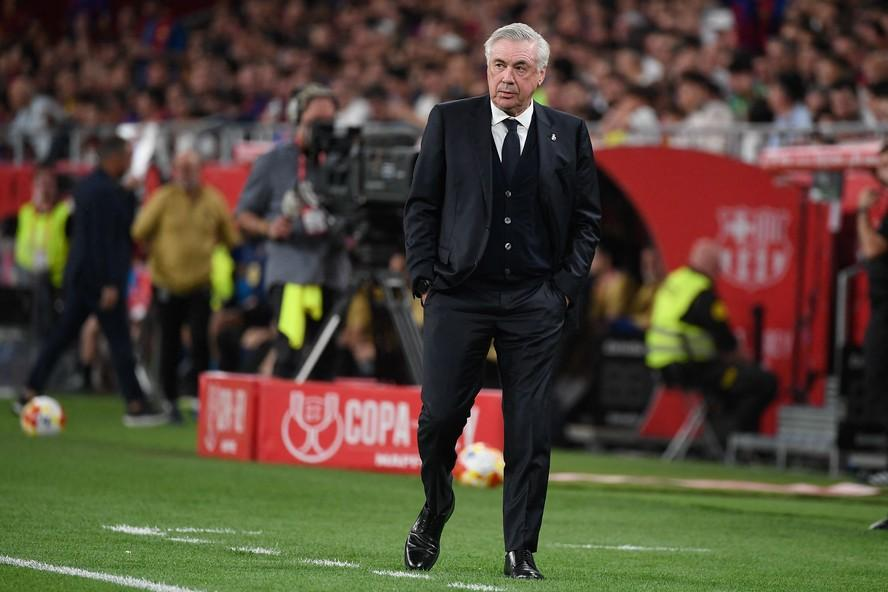

| Configuração | Descrição GEMINI |
|-------------|-----------|
| **alt** | Ancelotti e Real Madrid chegam a um acordo verbal para a saída do treinador |
| **GEM_COM_15** | Carlo Ancelotti, de terno, caminha à beira do campo com a logo "COPA" visível. |
| **GEM_COM_25** | Carlo Ancelotti, em terno escuro, caminha pelo gramado de um estádio de futebol, com o logo da "Copa" em uma barreira vermelha ao fundo. |
| **GEM_COM_∞** | A imagem mostra Carlo Ancelotti, um homem de meia-idade com cabelos grisalhos e curtos, vestindo um terno azul-marinho com colete e gravata, parado em um campo de futebol. Ele está de frente para a câmera, com as mãos nos bolsos, e olha ligeiramente para a direita. Ao fundo, um estádio iluminado com uma plateia borrada pode ser visto, e algumas pessoas e um cinegrafista com uma câmera estão na lateral do campo. Há uma placa vermelha no chão com a palavra "COPA" e um logotipo que se assemelha ao da Copa do Rei. |
| **GEM_SEM_15** | Carlo Ancelotti caminha pelo gramado de um estádio, com um logotipo "COPA" à vista. |
| **GEM_SEM_25** | Carlo Ancelotti, treinador de futebol, caminha em campo em terno escuro, com a barreira da Copa del Rey ao fundo. |
| **GEM_SEM_∞** | A imagem mostra o treinador de futebol Carlo Ancelotti em um campo de futebol durante uma partida. Ele é um homem de meia-idade com cabelos grisalhos, vestindo um terno azul-escuro completo com colete e gravata preta. Ancelotti está em pé sobre a grama verde do campo, com as mãos nos bolsos, e sua expressão é séria. Ao fundo, espectadores são visíveis nas arquibancadas do estádio, e há uma barreira publicitária vermelha com o logotipo "COPA" e um emblema que parece ser da Copa del Rey, que é uma competição de futebol espanhola. Uma câmera de vídeo e outros funcionários da equipe de campo podem ser vistos desfocados atrás dele. O ambiente sugere um evento esportivo profissional. |

| Configuração | Descrição GPT |
|-------------|-----------|
| **alt** | Ancelotti e Real Madrid chegam a um acordo verbal para a saída do treinador |
| **GPT_COM_15** | Carlo Ancelotti, treinador do Real Madrid, caminha pensativo à beira do campo durante jogo. |
| **GPT_COM_25** | Carlo Ancelotti caminha à beira do campo, veste terno e gravata escuros, mãos nos bolsos, sob olhar da equipe de filmagem, placa “COPA” ao fundo. |
| **GPT_COM_∞** | Carlo Ancelotti aparece em primeiro plano, caminhando à beira do gramado de um estádio de futebol. Ele veste terno escuro com colete e gravata pretos, camisa social branca e sapatos sociais também escuros. As mãos estão parcialmente nos bolsos do paletó. Ao fundo, vê-se parte da linha lateral do campo, onde se destacam cadeiras do banco de reservas com a inscrição “COPA” em vermelho e branco, um operador de câmera profissional com equipamento de transmissão e alguns seguranças uniformizados em coletes amarelos. Atrás deles, nas arquibancadas, há uma grande torcida indistinta, com pessoas em pé e sentadas, a maior parte delas vestindo roupas escuras ou de cores neutras. A iluminação é de um jogo noturno, com o relvado bem verde contrastando com as áreas de sombra. |
| **GPT_SEM_15** | Carlo Ancelotti, do Real Madrid, de terno preto à beira do campo, torcida ao fundo. |
| **GPT_SEM_25** | Carlo Ancelotti desfila em terno preto na beira do campo de futebol, com câmera de TV, placa “COPA” e torcida ao fundo. |
| **GPT_SEM_∞** | Um homem de cabelos grisalhos, vestido com terno, colete e gravata escuras, caminha à beira de um campo de futebol. Ele tem as mãos nos bolsos do paletó e olha ligeiramente para o lado. Atrás dele, à esquerda, está um equipamento de filmagem profissional apoiado em um tripé e à direita há cadeiras para reservas com membros da equipe técnica vestidos com coletes refletivos. Ao fundo, nota-se a arquibancada cheia de torcedores desfocados e, próximo ao ponto de filmagem, um banco de material de publicidade com a inscrição “Copa”. O gramado verde aparece na parte inferior da imagem, com linhas brancas demarcando a área de jogo. |

---

### IMAGEM 50
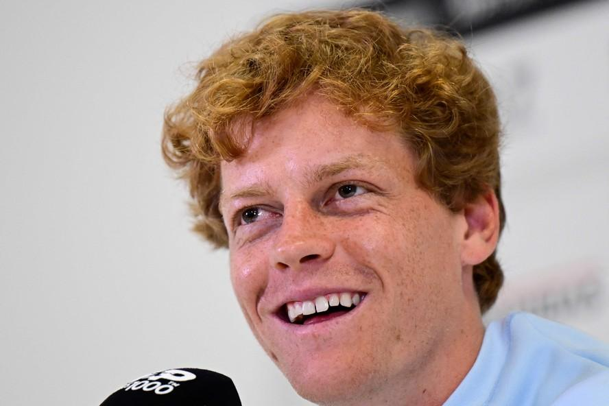

| Configuração | Descrição GEMINI |
|-------------|-----------|
| **alt** | Sinner em coletiva de imprensa em Roma |
| **GEM_COM_15** | Jannik Sinner, um tenista italiano com cabelo ruivo encaracolado e sardas, sorri durante uma coletiva de imprensa. |
| **GEM_COM_25** | Um close-up de Jannik Sinner, com cabelo ruivo e encaracolado, sorrindo e olhando para o lado. |
| **GEM_COM_∞** | A close-up photograph captures Jannik Sinner, um tenista profissional italiano, sorrindo e olhando para o lado. Ele tem cabelo ruivo e encaracolado e sardas visíveis no rosto. O jogador está vestindo uma camisa azul clara e há um microfone preto, parcialmente visível, no canto inferior esquerdo da imagem, sugerindo um ambiente de entrevista coletiva. |
| **GEM_SEM_15** | Close-up de Jannik Sinner sorrindo, com cabelo ruivo cacheado, em um evento. |
| **GEM_SEM_25** | Close-up de Jannik Sinner, um homem de cabelo ruivo encaracolado e sardas, sorrindo e olhando para cima enquanto fala em um microfone Bwin. |
| **GEM_SEM_∞** | A imagem mostra o tenista italiano Jannik Sinner. Ele está em primeiro plano, com o rosto virado ligeiramente para a direita e olhando para cima, para o lado. Jannik Sinner tem cabelo ruivo encaracolado e sardas visíveis no rosto. Ele exibe um sorriso largo, mostrando os dentes, e seus olhos estão levemente franzidos, transmitindo uma expressão de felicidade ou riso. À frente dele, no canto inferior esquerdo da imagem, há um microfone preto com um logotipo branco que parece ser "P 1000" ou similar. Ele está vestido com uma peça de roupa azul clara, parcialmente visível no ombro e pescoço. O fundo da imagem é claro e desfocado, sugerindo um ambiente interno, possivelmente uma coletiva de imprensa. |

| Configuração | Descrição GPT |
|-------------|-----------|
| **alt** | Sinner em coletiva de imprensa em Roma |
| **GPT_COM_15** | Janik Sinner sorri durante entrevista coletiva, com microfone à frente, cabelos ruivos e encaracolados. |
| **GPT_COM_25** | Janik Sinner sorri levemente enquanto fala em microfone durante coletiva de imprensa, cabelo ruivo encaracolado, expressão confiante, veste camisa polo clara. |
| **GPT_COM_∞** | Jannik Sinner aparece em close-up durante uma entrevista coletiva. Ele veste um moletom azul-claro e segura um microfone com o logo “Radio 1000”. Com cabelos ruivos e levemente ondulados, Sinner sorri levemente enquanto olha para o lado, revelando suas características sardas no rosto. Ao fundo, uma parede branca desfocada sugere um painel típico de conferências de imprensa. |
| **GPT_SEM_15** | Homem de cabelos ruivos encaracolados sorri segurando microfone em ambiente de entrevista. |
| **GPT_SEM_25** | Homem jovem, de cabelo ruivo encaracolado e pele clara com sardas, sorrindo enquanto fala em microfone diante de fundo desfocado claro. |
| **GPT_SEM_∞** | No centro da imagem, aparece em primeiro plano um homem jovem, de pele clara com algumas sardas, cabelos ruivos e encaracolados. Ele sorri, mostrando os dentes, e segura próximo à boca um microfone preto com o logotipo “2000” em branco. Veste uma camisa polo azul-clara. Ao fundo, desfocados, há painéis claros com inscrições que sugerem patrocínios ou logomarcas. |

---

### IMAGEM 51


| Configuração | Descrição GEMINI |
|-------------|-----------|
| **alt** | Miguelito foi preso por injúria racial após partida da Série B |
| **GEM_COM_15** | Miguelito, do América-MG, chuta uma bola de futebol em campo. |
| **GEM_COM_25** | Um jogador de futebol, Miguelito, do América-MG, chuta uma bola no campo. Ele veste um uniforme verde e preto. |
| **GEM_COM_∞** | A imagem mostra o jogador de futebol Miguelito, do América-MG, em campo, no momento em que chuta uma bola. Ele veste o uniforme listrado em preto e verde do América-MG, com o logotipo do patrocinador "MC GAMES" em destaque no peito. Miguelito usa chuteiras brancas e meias listradas em verde e preto. A bola, com detalhes em branco, vermelho e azul, está levemente no ar, próximo ao seu pé. O campo de futebol é de gramado verde, e ao fundo, vê-se a arquibancada do estádio em tons de verde, além de uma faixa de publicidade com o que parece ser as letras "DRANIZ" e um grande "Z" em verde. Outros jogadores, também em uniformes de futebol, estão em segundo plano, fora de foco. Miguelito usa a camisa de número 7. As cores tradicionais do América-MG são verde e branco, com o preto incorporado nos anos 1970. O patrocinador principal atual do América-MG é a EstrelaBet, com contrato válido até o final da temporada de 2024, mas a camisa na imagem mostra "MC GAMES". |
| **GEM_SEM_15** | Jogador de futebol do América-MG chutando a bola em campo verde de estádio. |
| **GEM_SEM_25** | Um jogador do América-MG, com camisa e calção pretos e verdes com o logo da MC GAMES, chuta a bola em um campo de futebol. |
| **GEM_SEM_∞** | A imagem retrata um jogador de futebol em ação, prestes a chutar uma bola em um campo de gramado verde. Ele veste o uniforme preto e verde do América-MG, com a marca "MC Games" estampada no peito, que é a patrocinadora master do clube. O uniforme é composto por uma camisa listrada verticalmente em preto e verde, shorts pretos e meias verdes com detalhes pretos. A bola, branca com detalhes em vermelho e azul, está no ar, à frente do pé direito do jogador.    Ao fundo, há outros jogadores em campo, alguns com o mesmo uniforme preto e verde e outro com uma camisa branca. Atrás dos jogadores, é visível uma arquibancada com cadeiras verdes, e logo abaixo, um banner de publicidade. No banner, pode-se ler parcialmente a palavra "DRANIZ" e um grande "Z" verde, que se refere à marca Zinzane, uma empresa de moda que patrocina o esporte. O campo de futebol possui gramado bem cuidado, e a iluminação sugere que a partida acontece sob luz artificial. |

| Configuração | Descrição GPT |
|-------------|-----------|
| **alt** | Miguelito foi preso por injúria racial após partida da Série B |
| **GPT_COM_15** | Miguelito, do América-MG, chuta a bola no Estádio Independência durante partida da Série B. |
| **GPT_COM_25** | Miguel Ángel Terceros Acuña, o Miguelito, veste camisa listrada verde e preta do América-MG e chuta a bola durante partida contra o Operário-PR. |
| **GPT_COM_∞** | Um jogador do América-MG, identificado pela camisa com listras verticais verdes e pretas e o patrocínio “MC GAMES” no peito, executa um chute com o pé direito em direção à bola apoiada sobre o gramado. Ele veste meiões verdes, calção preto e chuteiras claras. Ao fundo, em desfoque, vê-se um defensor do Operário-PR com uniforme predominantemente branco, bem como outros atletas e cadeiras verdes vazias das arquibancadas. No momento da imagem, o campo está bem iluminado, e não há torcedores visíveis nas cadeiras. |
| **GPT_SEM_15** | Jogador do América Mineiro chuta bola de futebol em estádio, com outros jogadores observando. |
| **GPT_SEM_25** | Jogador do time com uniforme listrado verde e preto chuta bola em campo gramado, companheiros e adversários observam ao fundo no estádio. |
| **GPT_SEM_∞** | Um jogador de futebol, vestindo uniforme listrado em verde e preto com o logotipo “MC GAMES” no peito, está no momento exato em que chuta uma bola branca com detalhes coloridos. Seu pé direito estende-se para acertar a bola, enquanto o pé esquerdo permanece firme no gramado. Ele mantém os braços abertos para equilibrar o corpo. Ao fundo, outro atleta da mesma equipe também usa camisa listrada verde e preta, e dois jogadores adversários, vestidos de branco, acompanham a jogada. Mais atrás, vê-se um goleiro agachado em frente ao gol e, ainda mais ao fundo, arquibancadas com assentos verdes e um painel de publicidade parcialmente legível com a palavra “ORGANIZA…”. |

---

### IMAGEM 52


| Configuração | Descrição GEMINI |
|-------------|-----------|
| **alt** | Kane conquista seu primeiro título na carreira |
| **GEM_COM_15** | A imagem mostra Harry Kane sorrindo e abraçando Serge Gnabry, com Kingsley Coman ao fundo. |
| **GEM_COM_25** | Harry Kane, sorridente, abraça o colega de equipe Eric Dier, ambos vestindo a camisa vermelha do Bayern de Munique. Outro colega está atrás. |
| **GEM_COM_∞** | A imagem mostra Harry Kane, à direita e em primeiro plano, sorrindo amplamente e abraçando um companheiro de equipe, que está de costas e veste uma camisa vermelha com a inscrição "FC BAYERN". À esquerda, um pouco desfocado, está Serge Gnabry. Ao fundo, um outro homem desfocado observa a cena. |
| **GEM_SEM_15** | Harry Kane abraça Jamal Musiala, do FC Bayern, com outro jogador ao lado. |
| **GEM_SEM_25** | Harry Kane, sorridente, abraça Joshua Kimmich, que veste a camisa vermelha do FC Bayern. Outros jogadores e uma pessoa com celular estão ao fundo. |
| **GEM_SEM_∞** | A imagem mostra o jogador de futebol Harry Kane, do Bayern de Munique, abraçando um companheiro de equipe em campo. Harry Kane, com cabelos loiros penteados para trás e barba por fazer, sorri amplamente enquanto abraça o colega, que está de costas para a câmera, vestindo uma camisa vermelha do FC Bayern. As letras "FC BAYE" são visíveis nas costas da camisa vermelha. A mão direita de Kane está no ombro do jogador abraçado. Ao lado esquerdo de Harry Kane, um terceiro jogador, Serge Gnabry, com cabelos dreadlocks curtos, também usando uma camisa vermelha, olha para frente com uma expressão séria. Ao fundo, à direita, outro homem desfocado observa a cena. |

| Configuração | Descrição GPT |
|-------------|-----------|
| **alt** | Kane conquista seu primeiro título na carreira |
| **GPT_COM_15** | Harry Kane sorri abraçando jogador com uniforme do FC Bayern. |
| **GPT_COM_25** | Harry Kane sorri e abraça um companheiro de equipe do FC Bayern de Munique, com outro jogador observando ao fundo, todos em uniforme vermelho. |
| **GPT_COM_∞** | Dois jogadores do FC Bayern aparecem em primeiro plano, abraçados no que parece ser o fim de uma partida. O atleta mais visível, de perfil e sorriso amplo, veste agasalho preto com detalhes em vermelho e exibe o escudo do clube no peito, além do logotipo da Audi na manga. O companheiro, de costas para a câmera, usa a camisa vermelha do time, com as letras “FC BAYERN” estampadas na parte superior. À esquerda, um terceiro jogador do Bayern, de cabelos curtos e tranças finas, observa a cena com expressão serena; ele também veste a camisa vermelha. Ao fundo, desfocado, surge a silhueta de um cinegrafista segurando uma câmera. O ambiente sugere um estádio de futebol, com luz natural e público além da linha de fundo. |
| **GPT_SEM_15** | Homem loiro abraça jogador de costas com camisa vermelha do FC Bayern em campo de futebol. |
| **GPT_SEM_25** | O atacante Harry Kane sorri enquanto envolve com o braço o ombro de um colega de camisa vermelha “FC Bayern”. Ao fundo, Jamal Musiala observa. |
| **GPT_SEM_∞** | Dois jogadores de futebol estão no primeiro plano, abraçando-se de maneira amistosa. À direita, um homem de pele clara sorri amplamente enquanto envolve o companheiro com o braço, vestindo um casaco de treino escuro com detalhes em tom alaranjado. O outro, de costas para a câmera, usa a camisa vermelha do FC Bayern, com o nome do clube legível abaixo do pescoço. Atrás deles, à esquerda, outro atleta com uniforme vermelho observa a cena, e ao fundo, à direita, há um homem de óculos segurando um celular, possivelmente registrando o momento. |

---

### IMAGEM 53


| Configuração | Descrição GEMINI |
|-------------|-----------|
| **alt** | A OpenAI foi fundada há uma década como uma organização sem fins lucrativos com a missão de desenvolver inteligência artificial que beneficie a humanidade |
| **GEM_COM_15** | A close-up mostra o logotipo da OpenAI, um hexágono entrelaçado, em uma tela de smartphone. |
| **GEM_COM_25** | Uma mão segura um celular exibindo o logo branco da OpenAI, uma figura geométrica de seis elos entrelaçados, sobre um fundo borrado de luzes coloridas. |
| **GEM_COM_∞** | A tela de um smartphone exibe o logotipo da OpenAI em um fundo preto. O logotipo é uma figura geométrica branca, que se assemelha a um nó entrelaçado ou uma roseta, com seis segmentos que formam um padrão contínuo e circular, lembrando um redemoinho ou um símbolo de infinito. O design do logotipo da OpenAI é reconhecível e memorável, transmitindo a ideia de colaboração e interconectividade, além de refletir a inteligência e natureza conversacional da plataforma. A área ao redor do smartphone está desfocada, mostrando luzes coloridas em tons de azul, vermelho e roxo, que sugerem a presença de componentes eletrônicos ou uma placa de circuito. |
| **GEM_SEM_15** | Logotipo branco da OpenAI em tela de celular escuro com luzes de circuito coloridas. |
| **GEM_SEM_25** | Uma tela escura exibe o logotipo branco da OpenAI, em formato de nó geométrico, contra um fundo abstrato e borrado de luzes neon vibrantes e coloridas. |
| **GEM_SEM_∞** | A imagem apresenta um smartphone preto exibindo o logotipo da OpenAI em sua tela escura. O logotipo é branco e consiste em um design abstrato de formas entrelaçadas, que se assemelham a um nó ou uma flor. Ao fundo, desfocados, há componentes eletrônicos ou circuitos, emitindo luzes em tons de vermelho, azul e roxo, criando um efeito futurista e tecnológico. |

| Configuração | Descrição GPT |
|-------------|-----------|
| **alt** | A OpenAI foi fundada há uma década como uma organização sem fins lucrativos com a missão de desenvolver inteligência artificial que beneficie a humanidade |
| **GPT_COM_15** | Logotipo da OpenAI exibido em smartphone sobre fundo colorido e iluminado de circuito eletrônico. |
| **GPT_COM_25** | Logotipo da OpenAI exibido em tela de smartphone, sobre fundo de placa de circuito com luzes neon coloridas. |
| **GPT_COM_∞** | A imagem mostra, em primeiro plano, a silhueta escura de um smartphone segurado na horizontal. Na tela do aparelho aparece, em fundo preto, o logotipo da OpenAI — um símbolo branco formado por linhas entrelaçadas em formato circular. Ao fundo, desfocado, vê-se um circuito eletrônico iluminado por luzes neon em tons de vermelho, rosa, azul e roxo, sugerindo placas de circuito impresso e trilhas de componentes eletrônicos. |
| **GPT_SEM_15** | Logotipo OpenAI em tela de smartphone contra fundo desfocado de circuito eletrônico neon. |
| **GPT_SEM_25** | Tela de smartphone exibe o logotipo da OpenAI em branco sobre fundo preto, sobreposto a um circuito eletrônico iluminado por luzes neon vermelhas e azuis. |
| **GPT_SEM_∞** | Ao centro, um smartphone em posição horizontal exibe na tela um fundo totalmente preto com o logotipo da OpenAI em branco: um símbolo circular formado por linhas entrelaçadas. Atrás do aparelho, desfocado, vê-se uma placa eletrônica estilizada iluminada por luzes neon em tons de azul, roxo e laranja, criando um padrão vibrante de traços e pontos de circuito. O contraste entre o preto da tela e as cores vivas do fundo destaca o emblema da OpenAI em primeiro plano. |

---

### IMAGEM 54


| Configuração | Descrição GEMINI |
|-------------|-----------|
| **alt** | Aplicativo Duolingo |
| **GEM_COM_15** | Um smartphone exibe o aplicativo Duolingo, com um papel verde e uma caneta azul. |
| **GEM_COM_25** | Um smartphone com o aplicativo Duolingo em exibição está sobre uma folha de papel verde, com uma caneta azul ao lado. |
| **GEM_COM_∞** | A imagem mostra um smartphone preto em destaque, exibindo o aplicativo Duolingo em sua tela. A tela do celular é branca e o aplicativo Duolingo é facilmente reconhecível pelo seu mascote, uma coruja verde, e o nome "duolingo" escrito em verde abaixo dela. A frase "Learn a language for free. Forever." está visível logo abaixo do nome do aplicativo. O smartphone está apoiado sobre uma superfície de cor clara, possivelmente uma mesa, e parcialmente sobre um objeto verde, que parece ser um caderno ou uma folha de papel. À esquerda do celular, há uma caneta esferográfica transparente com uma tampa azul. O fundo da imagem é um tom claro de verde, complementando a cor do Duolingo. |
| **GEM_SEM_15** | Um smartphone exibe o aplicativo Duolingo em uma superfície verde com uma caneta azul. |
| **GEM_SEM_25** | Um smartphone exibe o aplicativo Duolingo em uma tela branca. Uma caneta azul e uma superfície verde compõem o plano de fundo. |
| **GEM_SEM_∞** | A imagem mostra um smartphone com o aplicativo Duolingo em exibição, repousando sobre uma folha de papel de cor verde-limão. À esquerda do smartphone, parcialmente visível, encontra-se uma caneta esferográfica de corpo transparente e tampa azul. A tela do celular exibe o logotipo do Duolingo, que é uma coruja verde, e o nome "duolingo" escrito abaixo em letras minúsculas verdes. A frase "Learn a language for free. Forever." (Aprenda um idioma de graça. Para sempre.) está escrita abaixo do nome. Na parte inferior da tela, há um botão verde com a inscrição "GET STARTED" (COMEÇAR) e, abaixo dele, um texto em cinza claro, "I ALREADY HAVE AN ACCOUNT" (EU JÁ TENHO UMA CONTA), que está parcialmente cortado pela moldura do telefone. O fundo é predominantemente verde-limão, com a parte inferior esquerda do papel visivelmente mais clara. |

| Configuração | Descrição GPT |
|-------------|-----------|
| **alt** | Aplicativo Duolingo |
| **GPT_COM_15** | Smartphone mostra logo Duolingo em tela branca, apoiado sobre superfície verde, com caneta azul. |
| **GPT_COM_25** | Um smartphone exibe o aplicativo Duolingo com o mascote Duo na tela, apoiado sobre uma capa verde, ao lado de uma caneta azul e branca. |
| **GPT_COM_∞** | A foto mostra um smartphone apoiado sobre uma pasta de papel verde-claro. Na tela do aparelho aparece o logotipo do Duolingo, com sua coruja mascote estilizada em verde e branco e a inscrição “duolingo” seguida do slogan “Learn a language for free. Forever.” Ao lado esquerdo do smartphone há uma caneta esferográfica de corpo branco e tampa azul, pousada sobre a mesma superfície clara que sustenta a pasta. |
| **GPT_SEM_15** | Smartphone exibindo tela inicial do Duolingo com fundo verde, ao lado uma caneta azul. |
| **GPT_SEM_25** | Smartphone mostra tela inicial do Duolingo em fundo branco, apoiado sobre superfície verde, ao lado de uma caneta azul com corpo branco. |
| **GPT_SEM_∞** | Um smartphone preto apoiado sobre uma superfície revestida por uma folha ou capa verde-clara. Na tela do aparelho, vê-se o aplicativo Duolingo aberto: no topo, o logotipo do Duolingo, um mascote em forma de coruja verde com detalhes em branco e laranja; abaixo, o nome “duolingo” em letras minúsculas verdes; ainda mais abaixo, o texto “Learn a language for free. Forever.”; e, na parte inferior da tela, um botão retangular verde. À esquerda do smartphone, há uma caneta de corpo branco com tampa e ponta superiores azuis. |

---

### IMAGEM 55
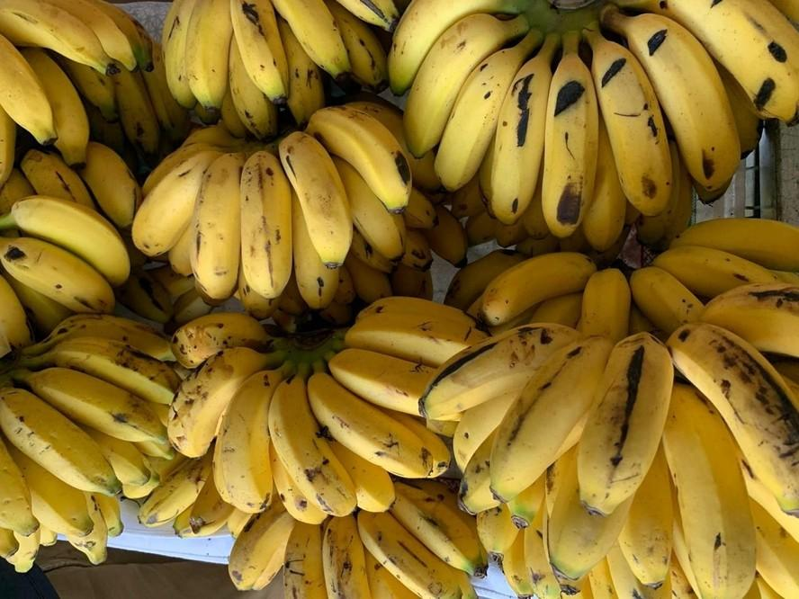

| Configuração | Descrição GEMINI |
|-------------|-----------|
| **alt** | Carga de banana originária da América do Sul levava escondido 147kg de cocaína para a Noruega |
| **GEM_COM_15** | Muitos cachos de bananas amarelas maduras com manchas escuras. |
| **GEM_COM_25** | Uma visão de perto mostra várias pencas de bananas amarelas com algumas manchas escuras, empilhadas umas sobre as outras. |
| **GEM_COM_∞** | A imagem mostra uma grande quantidade de cachos de bananas maduras. As bananas são predominantemente amarelas, com algumas apresentando manchas marrons, indicando estágios de amadurecimento ou pequenas contusões. Os cachos estão empilhados ou dispostos próximos uns dos outros, preenchendo a maior parte do enquadramento. |
| **GEM_SEM_15** | A imagem mostra muitos cachos de bananas amarelas maduras, algumas com manchas escuras. |
| **GEM_SEM_25** | Muitas bananas amarelas com manchas pretas estão empilhadas, algumas ainda presas aos cachos. |
| **GEM_SEM_∞** | A imagem mostra uma grande quantidade de bananas maduras, de cor amarela vibrante. Algumas das bananas apresentam manchas ou riscos pretos em suas cascas, indicando pontos de amadurecimento ou características da fruta. Elas estão dispostas em cachos, preenchendo a maior parte do quadro. |

| Configuração | Descrição GPT |
|-------------|-----------|
| **alt** | Carga de banana originária da América do Sul levava escondido 147kg de cocaína para a Noruega |
| **GPT_COM_15** | Vários cachos de bananas amarelas maduras com manchas escuras nas cascas. |
| **GPT_COM_25** | Diversos cachos de bananas maduras, amarelas com manchas escuras, agrupados lado a lado, exibindo a curva característica dos frutos. |
| **GPT_COM_∞** | Vários cachos de banana maduros ocupam toda a imagem: frutos de casca amarela com manchas escuras, agrupados em pencas e dispostos uns sobre os outros, formando uma pilha homogênea de bananas. |
| **GPT_SEM_15** | Diversas pencas de bananas pequenas, amarelas com manchas escuras, empilhadas lado a lado. |
| **GPT_SEM_25** | Múltiplos cachos de bananas maduras, de casca amarela com manchas escuras, empilhados sobre uma superfície, exibindo frutos curtos e levemente curvados. |
| **GPT_SEM_∞** | Vários cachos de bananas maduras, de casca amarelo-vivo com pequenas manchas escuras, ocupam toda a imagem, empilhados uns sobre os outros de forma organizada. Cada cacho é composto por diversas unidades de banana ainda presas ao talo, exibindo forma levemente curvada e textura lisa e brilhante. |

---

### IMAGEM 56
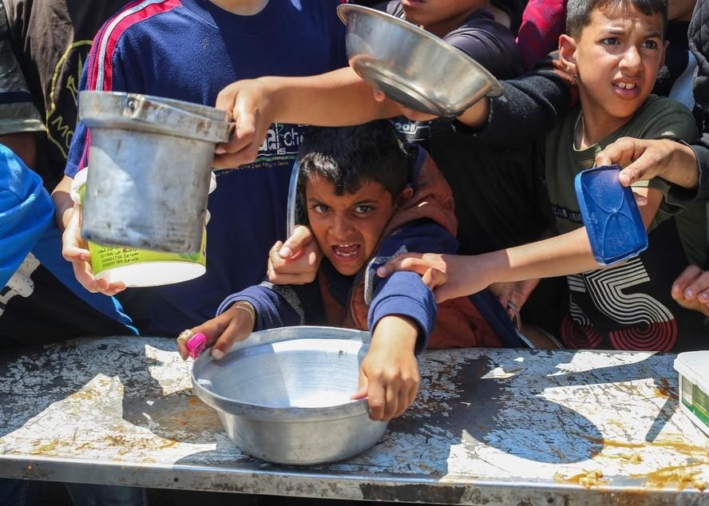

| Configuração | Descrição GEMINI |
|-------------|-----------|
| **alt** | Meninos palestinos disputam espaço para tentar porção de comida durante distribuição em Nuseirat |
| **GEM_COM_15** | Garotos se aglomeram, estendendo as mãos para tigelas, um com expressão tensa. |
| **GEM_COM_25** | Crianças se aglomeram, estendendo as mãos com tigelas e recipientes vazios sobre uma mesa, parecendo famintas. |
| **GEM_COM_∞** | A imagem mostra um grupo de crianças se aglomerando em torno de uma superfície, possivelmente uma mesa ou bancada, em um ambiente externo. Várias mãos e braços são visíveis, indicando que as crianças estão estendendo ou segurando objetos. No centro da imagem, um menino de pele escura e cabelo curto, vestindo uma blusa azul com detalhes em marrom, tem uma expressão facial intensa e angustiada, com a boca aberta e os dentes visíveis. Ele está segurando uma tigela de metal prateada com as duas mãos, que está vazia e repousa sobre a superfície.    À esquerda do menino central, uma mão segura um balde de metal prateado com uma alça, que está apoiado sobre um recipiente branco e verde com escrita em árabe. Acima e à direita do menino central, outro menino, com uma blusa preta e um braço estendido, segura uma tigela de metal prateada virada para baixo, enquanto um terceiro menino, à direita, usa uma camiseta verde e tem um braço estendido segurando um pequeno recipiente retangular azul, que parece ser de plástico e está virado para cima. A superfície sobre a qual as tigelas e recipientes estão parece ser metálica e desgastada, com manchas e reflexos de luz solar. A luz do sol projeta sombras nítidas na superfície e nos objetos, sugerindo um dia claro. |
| **GEM_SEM_15** | Muitos meninos se aglomeram com tigelas e recipientes, um garoto central tem uma expressão aflita. |
| **GEM_SEM_25** | Vários meninos, alguns segurando tigelas e um balde de metal, aglomeram-se em torno de uma mesa suja. O menino central tem uma expressão tensa. |
| **GEM_SEM_∞** | A imagem mostra um grupo de crianças, a maioria meninos, amontoadas em torno de uma mesa ou superfície para receber ou pegar algo. Em primeiro plano, no centro, um menino com expressão aflita e a boca aberta está com as mãos sobre uma tigela grande de metal prateado que repousa sobre a superfície. Seus braços estão sendo segurados por outras mãos, sugerindo uma aglomeração. À direita dele, um menino segura um recipiente plástico azul retangular. À esquerda do menino central, outra criança segura um balde de metal sobre um pote plástico branco com inscrições em árabe na parte inferior. Há várias mãos estendidas e outras crianças parcialmente visíveis ao redor, todas com recipientes ou aguardando. A luz solar forte incide sobre a cena, criando sombras nítidas na superfície da mesa. |

| Configuração | Descrição GPT |
|-------------|-----------|
| **alt** | Meninos palestinos disputam espaço para tentar porção de comida durante distribuição em Nuseirat |
| **GPT_COM_15** | Vários meninos estendem bacias metálicas e potes plásticos sobre mesa enferrujada, em busca de alimento |
| **GPT_COM_25** | Várias crianças seguram pratos, baldes e tigelas, estendendo as mãos para receber comida sobre uma mesa metálica desgastada. |
| **GPT_COM_∞** | Vários meninos agrupados atrás de uma mesa metálica e desgastada estendem braços para diante, segurando tigelas e recipientes vazios. No centro, um garoto com expressão aflita segura firme uma grande tigela de alumínio, enquanto outras mãos erguem baldes e vasilhas na tentativa de alcançá-los. As crianças vestem camisetas de manga curta e parecem competir pelo espaço à frente da mesa, que está marcada por manchas e resíduos de comida. |
| **GPT_SEM_15** | Crianças estendem tigelas e baldes de metal, ansiosas, em volta de mesa gasta e suja. |
| **GPT_SEM_25** | Crianças amontoadas diante de mesa raspada estendem tigelas metálicas e recipientes plásticos, mãos erguidas, rostos aflitos, aguardando distribuição de alimento. |
| **GPT_SEM_∞** | Vários meninos se aglomeram em volta de uma mesa metálica gasta, estendendo as mãos para receber comida. Ao centro, um garoto de cabelos escuros e moletom azul segura com força uma tigela de metal, com expressão tensa e olhar fixo adiante. À sua volta, outros meninos estendem recipientes diversos – baldes de alumínio, potes de plástico e pratos rasos –, pressionando-se uns contra os outros. Sobre a superfície da mesa, restos de alimento e manchas amareladas denunciam a pressa no atendimento. |

---

### IMAGEM 57


| Configuração | Descrição GEMINI |
|-------------|-----------|
| **alt** | Donald Trump bate continência ao desembarcar de helicóptero no Gramado Sul da Casa Branca |
| **GEM_COM_15** | Donald Trump desce do Marine One enquanto um fuzileiro o saúda em um gramado. |
| **GEM_COM_25** | Em uma área gramada, Donald Trump desce as escadas de um helicóptero Marine One, fazendo continência enquanto um fuzileiro naval o saúda. Um homem de terno desce atrás. |
| **GEM_COM_∞** | A imagem captura o ex-presidente dos EUA, Donald Trump, descendo as escadas do helicóptero presidencial Marine One em um gramado verde. À esquerda, um oficial do Corpo de Fuzileiros Navais, vestindo o uniforme de gala azul-marinho com listras vermelhas nas calças e um boné branco, está em posição de sentido, fazendo uma saudação a Trump. Donald Trump, no centro da imagem, está com um terno azul-marinho, camisa branca e a mão direita levantada na altura da testa, em um gesto que parece retribuir a saudação. Ele está olhando para frente enquanto desce o último degrau da escada do helicóptero.    À direita de Trump, outro homem de terno escuro e gravata listrada desce as escadas atrás dele. A parte inferior do helicóptero é verde-escura, com detalhes em branco na fuselagem superior e uma bandeira dos EUA visível na parte traseira. As palavras "Marine One" podem ser vistas na lateral do helicóptero, perto dos degraus. As rodas do helicóptero estão no gramado. No interior da cabine do helicóptero, um piloto é visível no assento da frente. O cenário é um gramado aberto com árvores ao fundo. |
| **GEM_SEM_15** | Donald Trump sai do Marine One, saudando um fuzileiro naval. |
| **GEM_SEM_25** | A foto mostra Donald Trump, o ex-presidente dos EUA, fazendo uma saudação enquanto desce do Marine One, o helicóptero presidencial. Um fuzileiro naval saluda Trump à esquerda, e um homem de terno desce atrás dele. |
| **GEM_SEM_∞** | A imagem mostra Donald Trump descendo as escadas de um helicóptero verde e branco conhecido como Marine One, o helicóptero presidencial dos Estados Unidos. À esquerda, um fuzileiro naval dos EUA em uniforme de gala azul, com uma faixa vermelha na lateral da calça, presta continência a Donald Trump. Donald Trump, por sua vez, também devolve a continência enquanto desce os degraus do helicóptero. Atrás de Donald Trump, outro homem de terno e gravata listrada desce as escadas. A cena ocorre em um gramado verde, com árvores visíveis ao fundo. Uma parte da bandeira americana pode ser vista na cauda do helicóptero. |

| Configuração | Descrição GPT |
|-------------|-----------|
| **alt** | Donald Trump bate continência ao desembarcar de helicóptero no Gramado Sul da Casa Branca |
| **GPT_COM_15** | Donald Trump descendo do Marine One, sendo saudado por um fuzileiro naval dos EUA. |
| **GPT_COM_25** | Donald Trump desce a escada do helicóptero Marine One, saudando um fuzileiro naval dos EUA em uniforme cerimonial, ao lado da aeronave verde e branca. |
| **GPT_COM_∞** | Na imagem, o ex-presidente dos Estados Unidos Donald Trump desce os degraus do helicóptero presidencial Marine One. À esquerda, um fuzileiro naval dos Estados Unidos, em uniforme de gala, ergue o braço direito em continência para Trump. O helicóptero, de cor verde-escura com faixas brancas e vermelhas e o selo presidencial logo abaixo da cabine, permanece estacionado sobre um gramado. Logo atrás de Donald Trump, um homem de terno escuro também desce os degraus, acompanhando o ex-presidente. |
| **GPT_SEM_15** | Donald Trump descendo de Marine One, saudado por fuzileiro naval, seguido por homem de terno. |
| **GPT_SEM_25** | Donald Trump desce a escada de helicóptero verde (Marine One), saudando um fuzileiro naval de uniforme; atrás dele, um assessor de terno desce. |
| **GPT_SEM_∞** | O ex-presidente Donald Trump desce os degraus de um helicóptero verde e branco – o Marine One – usando terno azul-marinho e camisa branca sem gravata. Ao tocar o solo gramado, ele ergue a mão direita em continência a um fuzileiro naval dos Estados Unidos, vestido em uniforme formal com casaca azul escura, calças vermelhas e boné branco, que lhe retribui a saudação. Logo atrás de Trump, um homem de terno escuro e gravata listrada também desce os degraus, apoiando-se ligeiramente no corrimão. |

---

### IMAGEM 58


| Configuração | Descrição GEMINI |
|-------------|-----------|
| **alt** | Mia Shem, de 23 anos |
| **GEM_COM_15** | A imagem mostra Mia Shem, uma jovem com braço enfaixado e boca aberta, sob o logotipo "الإعلام العسكري" (Mídia Militar). |
| **GEM_COM_25** | A jovem Mia Shem, com cabelos castanhos claros e o braço enfaixado, aparece com a boca aberta diante de um fundo marrom com estampas de folhas, e o texto árabe "الإعلام العسكري" no canto superior esquerdo. |
| **GEM_COM_∞** | A imagem mostra Mia Shem, uma jovem mulher franco-israelense, em um close de frente, da cintura para cima. Ela tem cabelos castanhos longos e lisos que caem sobre seus ombros. Sua boca está ligeiramente aberta, como se estivesse no meio de uma fala, e seus olhos estão fixos na câmera. Ela veste uma blusa de padrão branco e preto, e seu braço esquerdo parece estar envolto em um material claro, possivelmente uma atadura ou tipoia. Ao fundo, há um tecido marrom com um padrão de folhas claras e raminhos. No canto superior esquerdo da imagem, há um texto em árabe que se traduz como "الإعلام العسكري" (Al-I'lam Al-Askari), que significa "Mídia Militar" ou "Informação Militar". |
| **GEM_SEM_15** | Jovem mulher de boca aberta, cabelo comprido, contra fundo marrom com logo Mídia Militar. |
| **GEM_SEM_25** | Uma jovem de cabelos claros, com a boca aberta, está sentada à frente de um fundo marrom estampado. O texto árabe "الإعلام العسكري" (Mídia Militar) aparece no canto superior esquerdo. |
| **GEM_SEM_∞** | Uma mulher jovem, com cabelos castanhos claros e longos, está posicionada no centro da imagem. Ela tem olhos claros e sua boca está ligeiramente aberta. Ela veste uma blusa com estampas em tons de cinza, branco e preto, e há um tecido claro, possivelmente um cachecol ou parte de sua roupa, cobrindo parte do pescoço e ombros. O fundo atrás dela é uma superfície marrom escura com um padrão de folhas claras e finos galhos. No canto superior esquerdo da imagem, há um texto em árabe que se traduz para "A Mídia Militar" ou "Mídia de Guerra". |

| Configuração | Descrição GPT |
|-------------|-----------|
| **alt** | Mia Shem, de 23 anos |
| **GPT_COM_15** | Mia Shem aparece sentada, falando, cabelo solto, usa lenço claro; pano marrom com folhas estilizadas. |
| **GPT_COM_25** | Mia Shem sentada contra colcha marrom com folhas, cabelo longo solto, olhar fixo, boca entreaberta, veste camisa estampada e lenço creme no pescoço. |
| **GPT_COM_∞** | A imagem mostra Mia Shem sentada em um sofá de tom cinza, vista da cintura para cima. Ela tem longos cabelos lisos castanho-claro, repartidos ao meio, rosto pálido e expressão séria, com a boca levemente entreaberta. Mia usa uma blusa de padrão abstrato em tons de cinza e branco e um lenço bege claro solto ao redor do pescoço. Atrás dela, pendurado na parede, há um tecido acolchoado marrom-escuro decorado com motivos de folhas em bege e branco. No canto superior esquerdo da imagem, aparece uma marca d’água em árabe, “الإعلام العسكري”. |
| **GPT_SEM_15** | Mulher com olhos claros, cabelos longos e expressão cansada, sentada em sofá com colcha marrom. |
| **GPT_SEM_25** | Uma jovem mulher de cabelos longos e lisos, usando blusa estampada e faixa branca, fala olhando à câmera. Sentada em sofá, cortina marrom com folhas. |
| **GPT_SEM_∞** | Uma jovem mulher aparece sentada em frente a um fundo que lembra um tecido acolchoado marrom escuro com estampa de folhas claras. Ela tem cabelos longos e lisos, na altura do peito, de cor castanho claro, repartidos ao meio. Seu rosto é pálido, com olhos ligeiramente esbugalhados e lábios entreabertos, como se estivesse falando. Veste uma blusa de manga comprida em tons de cinza e branco, com estampas abstratas, e carrega um lenço claro enrolado ao redor do pescoço. À sua frente, vê-se parte de um assento ou almofada de tecido cinza. No canto superior esquerdo da imagem, há uma inscrição em árabe escrita em branco sobre o fundo marrom. |

---

### IMAGEM 59
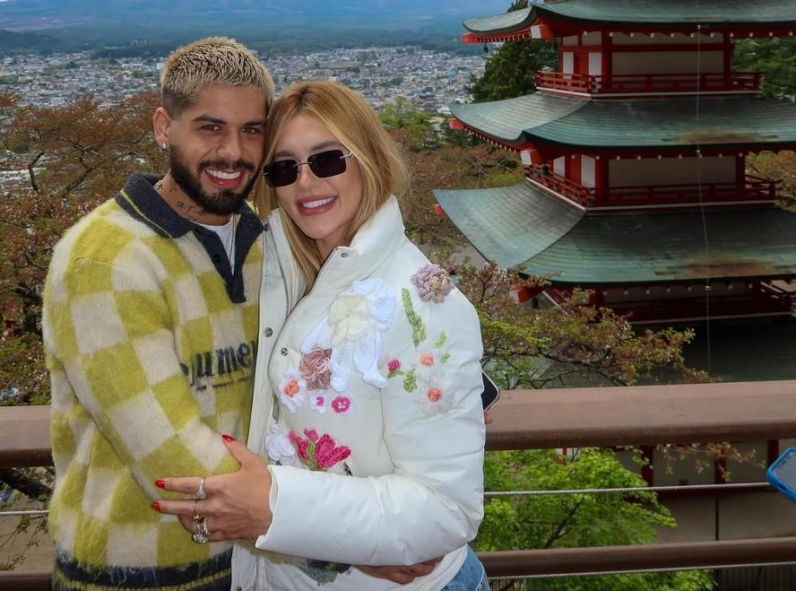

| Configuração | Descrição GEMINI |
|-------------|-----------|
| **alt** | Virginia Fonseca e Zé Felipe em viagem pelo Japão |
| **GEM_COM_15** | Virginia Fonseca e Zé Felipe posam sorridentes em frente ao Pagode Chureito, no Japão. |
| **GEM_COM_25** | Virginia Fonseca e Zé Felipe sorriem para a câmera, abraçados, com um templo japonês tradicional vermelho e verde e uma cidade ao fundo. |
| **GEM_COM_∞** | A imagem mostra o casal Virginia Fonseca e Zé Felipe posando para uma foto em um ponto turístico com uma paisagem exuberante. Zé Felipe, à esquerda, tem cabelos descoloridos e uma barba bem aparada, vestindo um suéter xadrez em tons de verde-claro e bege. Ele abraça Virginia, que está à direita, sorrindo e usando óculos de sol escuros e um casaco puffer branco adornado com apliques florais coloridos. O fundo da imagem revela a icônica Pagoda Chureito, com seus telhados em camadas nas cores vermelho e verde, e ao longe, uma vista panorâmica de uma cidade e montanhas. A Pagoda Chureito faz parte do Parque Arakurayama Sengen em Fujiyoshida, Japão, e é conhecida por suas vistas do Monte Fuji. Virginia e Zé Felipe viajaram para o Japão para celebrar o aniversário do cantor. |
| **GEM_SEM_15** | Llane e Andreina Bravo sorriem em frente ao Pagode Chureito no Japão. |
| **GEM_SEM_25** | Rosalía e Rauw Alejandro sorriem abraçados em um mirante, com uma pagoda japonesa e uma cidade ao fundo. |
| **GEM_SEM_∞** | A imagem exibe um casal sorridente posando para uma foto ao ar livre, com uma icônica pagoda japonesa e uma paisagem urbana e montanhosa ao fundo.    À esquerda, um homem jovem com cabelo loiro claro e barba escura sorri amplamente para a câmera, exibindo dentes. Ele usa um suéter de manga comprida com gola polo, apresentando um padrão xadrez em tons de amarelo-claro/creme e verde-limão/escuro, com uma camiseta escura por baixo. Tatuagens são visíveis em seu pescoço e parte superior do peito. Ele está com o braço em volta da cintura da mulher.    Ao lado dele, uma mulher jovem com cabelo loiro comprido sorri também amplamente, usando óculos de sol retangulares escuros. Ela veste uma jaqueta puffer branca decorada com apliques ou bordados florais tridimensionais em tons de branco, rosa, roxo e verde em seus ombros e peito. Suas unhas estão pintadas de vermelho, e ela usa vários anéis na mão esquerda, que está posicionada na parte inferior das costas do homem.    No fundo, à direita, destaca-se a Pagoda Chureito, uma estrutura tradicional japonesa de múltiplos andares com pilares vermelhos, paredes brancas e telhados verdes escuros. A pagoda tem cinco camadas visíveis. Atrás do casal e da pagoda, estende-se uma vista panorâmica de uma cidade ou vilarejo aninhado em um vale, com colinas e montanhas distantes no horizonte. A cena é em um dia claro, com o céu ligeiramente nublado ou embaçado. Há folhagem verde e árvores ao redor da pagoda e na paisagem abaixo, e uma cerca de madeira visível na parte inferior da imagem, sugerindo que o casal está em um ponto de observação elevado. |

| Configuração | Descrição GPT |
|-------------|-----------|
| **alt** | Virginia Fonseca e Zé Felipe em viagem pelo Japão |
| **GPT_COM_15** | Virginia Fonseca e Zé Felipe abraçados sorrindo, com pagoda japonesa e paisagem urbana ao fundo. |
| **GPT_COM_25** | Virginia Fonseca e Zé Felipe abraçados, sorrindo. Ela usa jaqueta branca com flores, óculos escuros; ele, suéter xadrez amarelo. Ao fundo, pagode vermelho e cidade. |
| **GPT_COM_∞** | Virginia Fonseca e Zé Felipe aparecem abraçados em uma sacada, sorrindo para a câmera.   Virginia Fonseca veste uma jaqueta branca acolchoada com bordados de flores coloridas, óculos escuros de armação retangular e os cabelos loiros soltos sobre os ombros.   Zé Felipe usa um suéter de tricô xadrez em tons de bege, verde e off-white, tem barba aparada e cabelo curto com raiz mais escura e pontas loiras.   Ao fundo, ergue-se uma construção de vários níveis em estilo japonês – com colunas e beirais vermelhos e telhados verdes curvos – e, além dela, estende-se uma paisagem urbana de casas, árvores e colinas ao longe. |
| **GPT_SEM_15** | Duas pessoas abraçadas, sorridentes, vestindo roupas coloridas em frente à pagoda japonesa vermelha, vegetação. |
| **GPT_SEM_25** | Justin Bieber e Hailey Bieber abraçados sorrindo em sacada ao ar livre, com pagoda tradicional japonesa visível ao fundo. |
| **GPT_SEM_∞** | Um homem e uma mulher jovens estão abraçados em frente a uma paisagem que inclui um pagode japonês de cinco andares.   • O homem, à esquerda, tem pele morena, barba bem aparada e cabelos curtos tingidos de loiro. Veste um suéter grosso de lã em padrão xadrez nas cores verde-claro e off-white.   • A mulher, à direita, tem cabelos longos e lisos, também loiros, e usa óculos escuros de armação retangular. Veste um casaco acolchoado branco adornado com bordados florais coloridos.   • Ao fundo, à direita, ergue-se um pagode de vários andares com beirais curvos em tonalidades de verde e detalhes em vermelho.   • A cena parece ocorrer num mirante, pois ao fundo, à esquerda, estende-se a vista de uma cidade com edifícios baixos e árvores com folhas que sugerem o outono. |

---

### IMAGEM 60
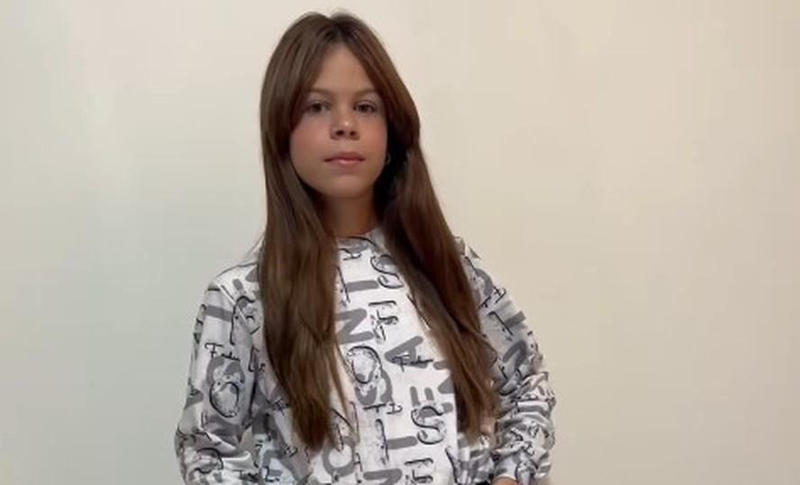

| Configuração | Descrição GEMINI |
|-------------|-----------|
| **alt** | A atriz mirim Millena Brandão |
| **GEM_COM_15** | Millena Brandão, uma jovem com cabelos castanhos e camisa estampada, olha para frente. |
| **GEM_COM_25** | A jovem Millena Brandão, com longos cabelos castanhos, veste uma blusa branca com estampa em letras. Ela olha diretamente para a câmera. |
| **GEM_COM_∞** | A imagem retrata Millena Brandão, uma jovem com cabelos longos, lisos e castanhos, que caem sobre os ombros. Ela tem uma franja que emoldura seu rosto e sua expressão é neutra, enquanto olha diretamente para a câmera. Millena veste uma blusa de manga comprida com um padrão de letras e formas abstratas em tons de cinza e branco. O fundo da imagem é uma parede lisa de cor clara. |
| **GEM_SEM_15** | Uma jovem com cabelo castanho comprido e liso, usando uma blusa branca e cinza estampada. |
| **GEM_SEM_25** | Uma jovem com longos cabelos castanhos e uma blusa estampada posa contra um fundo liso. |
| **GEM_SEM_∞** | A imagem mostra uma jovem com cabelos castanhos longos e lisos, que caem sobre os ombros e têm uma franja sobre a testa. Ela tem um rosto de formato oval e está olhando diretamente para a câmera com uma expressão neutra. A jovem veste uma blusa de manga comprida de cor clara, possivelmente branca ou cinza-clara, com uma estampa abstrata em tons de cinza e preto, que parece conter letras ou símbolos. O fundo é uma parede lisa e clara, sem elementos adicionais. |

| Configuração | Descrição GPT |
|-------------|-----------|
| **alt** | A atriz mirim Millena Brandão |
| **GPT_COM_15** | Millena Brandão, de cabelos castanhos longos, veste blusa estampada branca, posando em fundo claro. |
| **GPT_COM_25** | A foto mostra Millena Brandão, uma menina de cabelos castanhos, olhando para a câmera, vestindo um moletom branco com estampas pretas, em pé. |
| **GPT_COM_∞** | Millena Brandão aparece de frente para a câmera, olhando diretamente com expressão serena. Ela tem cabelo castanho longo e liso, repartido ao meio e caindo sobre os ombros. Veste um moletom claro com estampa dispersa de letras em tom escuro. Sua postura é confiante, com uma das mãos apoiada ligeiramente no quadril. O fundo é neutro, de parede lisa e clara, sem outros elementos visíveis. |
| **GPT_SEM_15** | Menina de cabelos castanhos longos, vestindo moletom branco estampado, posa com mãos nos quadris. |
| **GPT_SEM_25** | Menina jovem de cabelos longos castanhos usando moletom branco com estampas de letras cinzas, em pé, mãos na cintura, posando diante de parede branca. |
| **GPT_SEM_∞** | Uma jovem mulher aparece em enquadramento médio, dos quadris para cima, posicionada de frente para a câmera. Ela tem cabelos longos, lisos e castanhos, repartidos ao meio, que caem sobre os ombros. O rosto de traços suaves apresenta sobrancelhas finas, olhos voltados diretamente ao observador e lábios fechados em expressão serena. Veste uma blusa de manga longa branca com estampa de letras dispersas em diferentes tons de cinza. A peça tem punhos ajustados e franzido leve na região da cintura. Seus braços estão apoiados nas laterais do corpo, com as mãos sobre os quadris. O fundo é uma parede lisa de cor clara, sem qualquer outro objeto ou padrão visível. |

---

### IMAGEM 61
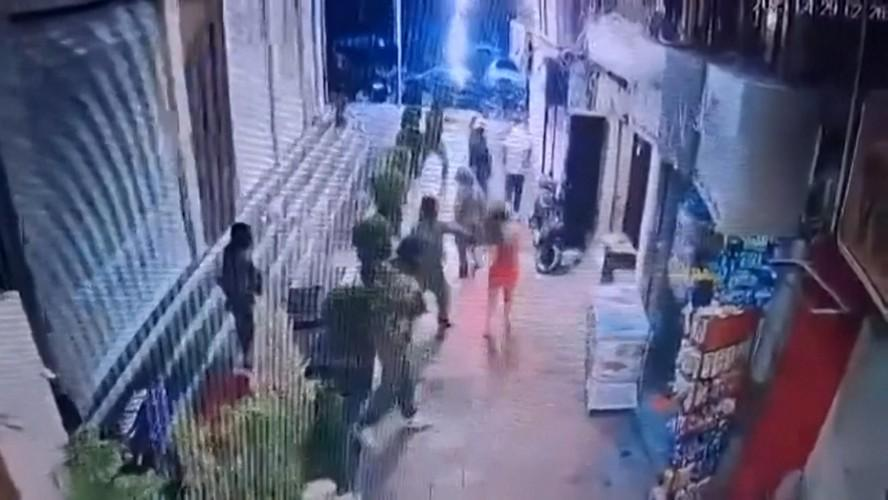

| Configuração | Descrição GEMINI |
|-------------|-----------|
| **alt** | Uma testemunha disse ter ouvido tiros e pessoas saindo correndo da boate, em Damasco, na madrugada de 29 de abril |
| **GEM_COM_15** | A imagem noturna mostra homens armados agredindo civis em rua escura, próximo à saída de boate em Damasco. |
| **GEM_COM_25** | Homens armados agridem civis em um corredor estreito e escuro. Uma mulher de vestido vermelho se destaca entre as pessoas. |
| **GEM_COM_∞** | Em uma rua ou beco estreito e mal iluminado, visto de uma perspectiva elevada, vários indivíduos estão engajados em uma altercação. À esquerda, as paredes dos edifícios mostram padrões verticais, sugerindo persianas ou elementos arquitetônicos. Na parte superior direita da imagem, uma sobreposição digital exibe a data "2024-04-29 20:12:38".    No centro da imagem, um grupo de homens armados, vestidos com roupas escuras, parece formar um corredor ou semicírculo. Eles interagem com jovens, incluindo uma mulher que se destaca em um vestido vermelho ou laranja brilhante, no meio da cena. Pessoas adicionais estão espalhadas pela área, algumas mais ao fundo e outras mais próximas às paredes. No lado direito da imagem, são visíveis prateleiras ou displays de loja com produtos. A cena ocorre à noite, sob luzes artificiais que criam reflexos e áreas mais claras e escuras. |
| **GEM_SEM_15** | Rua noturna movimentada com pessoas, algumas em uniforme e uma de vestido vermelho. |
| **GEM_SEM_25** | Uma rua noturna movimentada, com várias pessoas, incluindo indivíduos uniformizados e uma mulher em vestido vermelho, entre edificações urbanas. |
| **GEM_SEM_∞** | A imagem é uma captura de vídeo de vigilância em baixa resolução, mostrando uma cena de rua noturna. Ao centro, um grupo de pessoas está reunido, com vários indivíduos usando o que parecem ser uniformes de cor escura, interagindo com uma mulher que veste um vestido vermelho. Uma pessoa, também de uniforme, está de costas para a câmera em primeiro plano, na parte inferior esquerda. Mais ao fundo, outras figuras humanas são visíveis, bem como edifícios que ladeiam a rua. No lado direito da imagem, há o que parece ser uma motocicleta estacionada e uma vitrine de loja com produtos. A iluminação é principalmente artificial, vinda de fontes na rua, criando reflexos no chão molhado ou liso. A cena sugere uma interação intensa entre as pessoas, embora os detalhes sejam obscurecidos pela baixa qualidade da imagem e pela distância. Não foi possível identificar nomes de pessoas ou o contexto específico do incidente através da pesquisa. |

| Configuração | Descrição GPT |
|-------------|-----------|
| **alt** | Uma testemunha disse ter ouvido tiros e pessoas saindo correndo da boate, em Damasco, na madrugada de 29 de abril |
| **GPT_COM_15** | Homens armados formam corredor espancando jovens na saída de boate em beco estreito com motocicleta. |
| **GPT_COM_25** | Visão noturna estreita de corredor externo de boate. Homens armados com fuzis formam corredor e violentamente espancam jovens desesperados que deixam o estabelecimento em fuga. |
| **GPT_COM_∞** | Em um corredor estreito de paralelepípedos, com portas metálicas fechadas à esquerda e uma pequena loja de conveniência à direita, cinco homens vestindo roupas escuras e coletes — cada um empunhando um fuzil — avançam em fila. À frente deles, uma jovem mulher de calça rosa e blusa clara e, ao seu lado, um homem de camiseta clara e calça escura tentam se afastar em meio à investida. Ao fundo, é possível ver mais duas pessoas recuando sob a luz fria dos postes, enquanto uma motocicleta estacionada permanece ao lado da loja. |
| **GPT_SEM_15** | Cinco homens com uniformes camuflados se aproximam de mulher de shorts rosa em viela iluminada. |
| **GPT_SEM_25** | Seis agentes fardados cercam mulher de vestido vermelho em rua estreita à noite. Fachadas metálicas e banca de conveniência iluminada aparecem ao lado. |
| **GPT_SEM_∞** | Cena noturna em uma viela estreita de paralelepípedos. À esquerda, portas metálicas de um estabelecimento comercial estão totalmente fechadas; à direita, há um pequeno quiosque iluminado, com prateleiras e expositores de produtos, e uma motocicleta estacionada junto à parede. No centro da imagem, seis homens vestindo uniformes verdes escuros e capacetes – cada um carregando um fuzil – avançam em formação dispersa pelo corredor. À frente deles, uma mulher de cabelos soltos, vestindo blusa clara e saia vermelha, caminha rapidamente ou corre, como se fosse abordada pelos homens fardados. Ao fundo, duas figuras não identificadas se afastam em direção a uma área mais iluminada, onde se vêem refletores fixados na parede e postes com luzes acesas. O chão parece levemente molhado, refletindo pontos de luz espalhados pela cena. |

---

### IMAGEM 62


| Configuração | Descrição GEMINI |
|-------------|-----------|
| **alt** | Corpus Christi é feriado ou ponto facultativo? |
| **GEM_COM_15** | Uma folha de calendário branco com números pretos virando, revelando a próxima página. |
| **GEM_COM_25** | Uma página de calendário está sendo virada, mostrando dias como 19, 22 e 26. O dia 19 está destacado em vermelho. |
| **GEM_COM_∞** | A imagem mostra um calendário com várias páginas abertas e sendo viradas, criando um efeito de camadas. As páginas são brancas com as bordas em vermelho. Números em preto, que representam os dias do mês, são visíveis em várias linhas. Na página superior, destacam-se os números 14, 15, 16, 17, 18 e 19, com o número 19 em um fundo rosa-avermelhado. Abaixo dessa linha, os números 21, 22, 23, 24, 25 e 26 são visíveis, sendo que o 26 também possui um fundo rosa-avermelhado. Na parte inferior esquerda, os números 29, 30 e 31 são parcialmente visíveis. Uma página está sendo virada, revelando partes da página anterior ou posterior. Através da página que se dobra, é possível ver outros números como 2, 3, 6, 7, 8, 11, 12, 16, 22 e 23, com os números 16 e 23 também em fundos rosa-avermelhados. |
| **GEM_SEM_15** | Um calendário de mesa mostra páginas virando, revelando dias de um mês. |
| **GEM_SEM_25** | Uma folha de calendário é virada, revelando números de dias de um mês, com alguns dias realçados em vermelho. |
| **GEM_SEM_∞** | A imagem mostra um calendário de folha, com o foco em um mês específico e a transição para o próximo. O primeiro plano exibe uma página de calendário parcialmente virada, revelando datas do mês seguinte por baixo. As datas visíveis no primeiro plano incluem 14, 15, 16, 17, 18, 19 na linha superior, e 22, 23, 24, 25, 26 na linha inferior. Partes das datas 29, 30, e 31 também são visíveis na parte inferior esquerda. O fundo da imagem mostra a página anterior do calendário, com datas como 2, 3, 6, 7, 8, 11 e 12 visíveis, algumas das quais são destacadas em um tom avermelhado, indicando fins de semana ou feriados. As bordas das páginas viradas são em vermelho, contrastando com o branco e o rosa claro das células do calendário. |

| Configuração | Descrição GPT |
|-------------|-----------|
| **alt** | Corpus Christi é feriado ou ponto facultativo? |
| **GPT_COM_15** | Páginas de calendário sobrepostas exibindo números diários, com finais de semana destacados em rosa. |
| **GPT_COM_25** | Folhas de calendário superpostas exibem números de dias em uma grade, com molduras vermelhas e coloração rosa destacando alguns dias. |
| **GPT_COM_∞** | Visão aproximada de um calendário de parede impresso em papel, com duas páginas sobrepostas.   • A página frontal exibe um mês em formato de grade, com linhas e colunas demarcando os dias numerados de 14 a 31 em fundos brancos; alguns quadrados (aparentemente finais de semana) têm tonalidade rosa-clara.   • Na margem direita, vê-se parte da página seguinte, mostrando os dias numerados de 1 a 12 dispostos também em formato de grade, com dias úteis em fundo branco e fins de semana em fundo rosa.   • Entre as duas páginas, um vinco vermelho vertical separa os meses.   • As folhas estão levemente curvadas, criando sombras suaves sobre os números 22, 23 e 26, onde a sobreposição é mais pronunciada. |
| **GPT_SEM_15** | Várias páginas de calendário sobrepostas e curvadas exibindo números de dias de um mês. |
| **GPT_SEM_25** | Folhas de calendário de papel sobrepostas, exibindo números dos dias em colunas, com datas 15 a 31 visíveis, com bordas e marcações em vermelho. |
| **GPT_SEM_∞** | Uma imagem em close-up de um calendário impresso, com várias páginas sobrepostas prestes a ser folheadas. Em primeiro plano, aparecem os dias 14 a 31 dispostos em uma grade: números em negrito preto sobre quadrados de fundo branco. Algumas colunas – presumivelmente fins de semana – têm o fundo em tom rosa claro. No canto direito, vê-se a página seguinte parcialmente levantada, mostrando os números de 1 a 12 também em uma grade semelhante, com bordas vermelhas demarcando a separação entre os meses. As páginas são de papel levemente brilhante e dobram-se em suaves curvas, evidenciando o movimento iminente de virar o mês. |

---

### IMAGEM 63
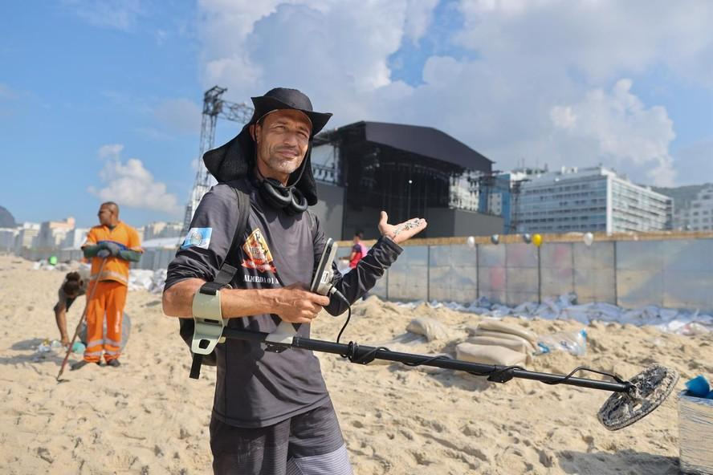

| Configuração | Descrição GEMINI |
|-------------|-----------|
| **alt** | Com auxílio do detector de metais, Rafael Almeida encontrou cordões e aneis de ouro enterrados na areia depois do show da Lady Gaga |
| **GEM_COM_15** | Rafael de Almeida, com detector de metais, mostra joias achadas na praia. |
| **GEM_COM_25** | Um homem na praia, com um detector de metais, mostra pequenos objetos brilhantes, enquanto um palco de show e garis trabalham ao fundo. |
| **GEM_COM_∞** | A imagem mostra Rafael de Almeida, um detectorista de metais, em primeiro plano na areia de uma praia, segurando um detector de metais e exibindo em sua mão aberta joias que encontrou. Ele veste um chapéu, uma camiseta de manga comprida cinza-escura e shorts listrados. Ao fundo, um funcionário da Comlurb, um gari, está trabalhando na limpeza da praia, usando um uniforme laranja. Mais ao fundo, vê-se uma grande estrutura de palco e edifícios. |
| **GEM_SEM_15** | Um homem com detector de metais limpa a Praia de Copacabana após o show da Madonna. |
| **GEM_SEM_25** | Um homem, usando detector de metais, exibe pequenos achados na praia de Copacabana, Rio de Janeiro, com palco de show ao fundo. |
| **GEM_SEM_∞** | A imagem retrata uma cena em uma praia, sob um céu azul com nuvens brancas esparsas. Em primeiro plano, um homem sorridente, de meia-idade, com uma barba rala e usando um chapéu escuro com uma aba na nuca, é o foco principal. Ele veste uma camiseta de manga comprida cinza-escura com o nome "ALMEIDA" visível em seu peito, e shorts listrados. O homem segura um detector de metais com a mão direita, enquanto sua palma esquerda está aberta, mostrando uma pequena quantidade de objetos que parecem ser moedas ou outros pequenos itens metálicos encontrados na areia.    No segundo plano, à esquerda, há uma pessoa vestindo um uniforme laranja, curvada e aparentemente realizando trabalhos de limpeza ou remoção de objetos da areia. Mais ao fundo, à direita, destaca-se uma grande estrutura de palco preta, típica de grandes eventos e shows, com equipamentos de som e iluminação visíveis. Esta estrutura sugere que a praia é a Praia de Copacabana, no Rio de Janeiro, um local conhecido por sediar grandes shows, como o de Madonna em maio de 2024, que utilizou um palco de grandes dimensões. A presença de um detector de metais e objetos encontrados por Almeida em Copacabana é consistente com atividades de busca de itens perdidos após eventos de grande público.    Ao fundo, edifícios brancos altos alinham a orla, e uma barreira temporária, feita de chapas metálicas ou lonas, pode ser vista separando a área do palco da praia. Garrafas de plástico e sacos de areia também estão espalhados pela praia, indicando a atividade recente no local. |

| Configuração | Descrição GPT |
|-------------|-----------|
| **alt** | Com auxílio do detector de metais, Rafael Almeida encontrou cordões e aneis de ouro enterrados na areia depois do show da Lady Gaga |
| **GPT_COM_15** | Rafael de Almeida usa detector de metais na praia de Copacabana; gari Comlurb ao fundo. |
| **GPT_COM_25** | Rafael de Almeida segura detector de metais e exibe anel e cordão de ouro na areia de Copacabana, com palco da Lady Gaga ao fundo. |
| **GPT_COM_∞** | Rafael de Almeida, detectorista, aparece de pé sobre a areia da Praia de Copacabana, próximo ao Posto 2 e ao palco montado para o show da Lady Gaga. Ele veste chapéu preto, camisa de manga longa escura, luvas e segura o braço do detector de metal enquanto exibe um cordão de ouro com pingente de cruz e um anel também em ouro. Ao fundo, garis da Comlurb com uniformes laranja utilizam pás para recolher resíduos da areia, ladeados por sacos de areia que delimitam o espaço. À direita, estruturas metálicas do palco e prédios residenciais formam o horizonte sob céu parcialmente nublado. |
| **GPT_SEM_15** | Homem de chapéu preto usa detector de metal na praia, mostra achados em sua mão. |
| **GPT_SEM_25** | Homem em praia segura detector de metais e moedas, com chapéu preto e luvas, próximo a palco e operário de uniforme laranja. |
| **GPT_SEM_∞** | A foto mostra um trecho de praia urbanizada em um dia de céu claro com algumas nuvens. Em primeiro plano, um homem de pele morena, trajando chapéu preto de abas largas e camiseta de mangas compridas também preta, segura com o braço esquerdo o cabo de um detector de metais cujo disco de busca repousa sobre a areia. Com a mão direita ele exibe várias pequenas peças metálicas que recolheu do solo. Preso ao peito, ele carrega uma pequena bolsa, e ao redor do pescoço repousam fones de ouvido acolchoados. Ao fundo, à esquerda, dois trabalhadores vestidos com uniformes laranja e coletes refletivos aparecem agachados e de pé, manuseando ferramentas para recolher lixo ou detritos na areia. Atrás deles, uma grade metálica divide a faixa de areia de uma plataforma de palco desmontada, composta por estruturas de aço e um grande telão escuro. Mais ao fundo, ergue-se um conjunto de edifícios residenciais brancos, formando o horizonte urbano que margeia a orla. |

---

### IMAGEM 68
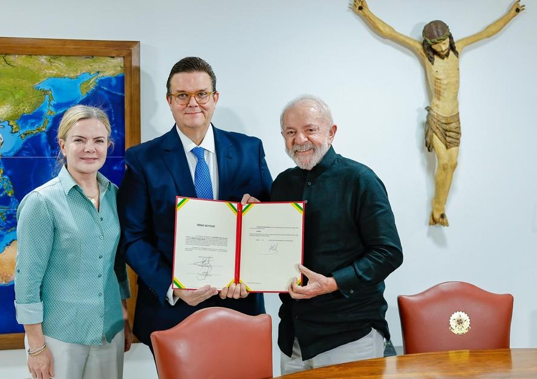

| Configuração | Descrição GEMINI |
|-------------|-----------|
| **alt** | A ministra Gleisi Hoffmann, o ministro Wolney Queiroz e o presidente Lula |
| **GEM_COM_15** | Luiz Inácio Lula da Silva, Wolney Queiroz e Gleisi Hoffmann posam com documento. |
| **GEM_COM_25** | Luiz Inácio Lula da Silva, Wolney Queiroz e Gleisi Hoffmann sorriem, posando para uma foto e segurando um documento. |
| **GEM_COM_∞** | A imagem mostra três pessoas em uma sala, provavelmente um escritório oficial, posando para uma foto. No centro, um homem de óculos e terno azul, identificado como Wolney Queiroz, segura um documento aberto, com bordas verdes e amarelas, e o apresenta para a câmera. À sua direita, o Presidente Luiz Inácio Lula da Silva, com barba branca e camisa escura, também segura o documento e sorri. À esquerda de Wolney Queiroz, uma mulher loira de camisa social clara e calças claras sorri para a câmera. Ao fundo, atrás da mulher, há um mapa-múndi emoldurado e, à direita do quadro, na parede, uma imagem de Jesus Cristo crucificado. Há também duas cadeiras de couro avermelhado com detalhes dourados na lateral direita da imagem, e uma mesa de madeira escura no primeiro plano. A mulher na foto é Gilberto Waller Júnior, o novo presidente do INSS. |
| **GEM_SEM_15** | Luiz Inácio Lula da Silva, Cristiano e Valeska Zanin posam com Termo de Posse. |
| **GEM_SEM_25** | O Presidente Luiz Inácio Lula da Silva sorri ao lado do embaixador Marcos Galvão e de sua esposa Valéria Correia, segurando um Termo de Posse. |
| **GEM_SEM_∞** | A imagem mostra três pessoas em pé, sorrindo, em um ambiente de escritório. À direita, está Luiz Inácio Lula da Silva, Presidente do Brasil, vestindo uma camisa de botão preta de manga longa e calças claras. Ele tem barba e cabelos grisalhos e está sorrindo. Lula segura, com a mão direita, um documento aberto com capa vermelha e detalhes em verde e amarelo, virado para o espectador.    No centro da imagem, um homem de óculos, vestindo um terno azul escuro com uma gravata azul estampada e uma camisa branca, segura a outra metade do mesmo documento, também sorrindo. À esquerda, uma mulher loira, com cabelos claros na altura dos ombros, sorri. Ela veste uma camisa de manga comprida azul-clara com um padrão sutil e calças claras, e possui pulseiras douradas no pulso esquerdo. A mulher é Rosângela Lula da Silva, conhecida como Janja, esposa do Presidente Lula.    Ao fundo, à esquerda, há um mapa-múndi grande emoldurado em madeira na parede. Na parede atrás de Lula, à direita, está um crucifixo de madeira. A mesa de madeira à frente tem duas cadeiras com estofamento vermelho e detalhes dourados. |

| Configuração | Descrição GPT |
|-------------|-----------|
| **alt** | A ministra Gleisi Hoffmann, o ministro Wolney Queiroz e o presidente Lula |
| **GPT_COM_15** | Luiz Inácio Lula da Silva e Wolney Queiroz exibem documento com mapa ao fundo. |
| **GPT_COM_25** | O presidente Luiz Inácio Lula da Silva e o ministro Wolney Queiroz, acompanhados de uma mulher, exibem documento no Palácio do Planalto. |
| **GPT_COM_∞** | Na imagem, o presidente Luiz Inácio Lula da Silva aparece à direita, vestindo camisa preta de mangas compridas, sorrindo e segurando a borda direita de um grande documento encadernado com fita nas cores da bandeira brasileira. Ao seu lado, à esquerda, está o novo ministro da Previdência, Wolney Queiroz, de terno escuro, camisa branca e gravata azul, segurando a borda esquerda do mesmo documento. À esquerda de Wolney, uma mulher de cabelos loiros presos, camisa clara de mangas compridas e expressão serena observa a cena. Ao fundo, do lado esquerdo, vê-se parte de um mapa-múndi emoldurado e, do lado direito, um grande crucifixo de madeira pendurado na parede. |
| **GPT_SEM_15** | Três pessoas em pé em torno de uma mesa, homem ao centro segura pasta aberta, crucifixo e mapa ao fundo. |
| **GPT_SEM_25** | O presidente Luiz Inácio Lula da Silva, à direita, segura certificado entregue por homem de terno ao lado de mulher. Crucifixo pendurado na parede. |
| **GPT_SEM_∞** | Três pessoas estão em pé, lado a lado, atrás de uma mesa de madeira. No lado esquerdo, uma mulher de cabelos loiros presos, veste uma camisa verde-claro de mangas dobradas até o antebraço. Ao centro, um homem de pele clara, cabelos escuros penteados para trás, usa terno escuro, camisa branca e gravata azul; ele segura pela borda esquerda um grande documento aberto, com capa vermelha e faixas nas cores verde e amarela. No lado direito, outro homem de pele clara, cabelos grisalhos curtos e barba rala, veste camisa de manga longa preta e segura a borda direita do mesmo documento. Sobre a mesa, há cadeiras de couro marrom com um brasão dourado no encosto. Atrás deles, à esquerda, vê-se um mapa-múndi emoldurado, e, à direita, uma crucifixo esculpido em madeira fixado à parede branca. |

---

### IMAGEM 69
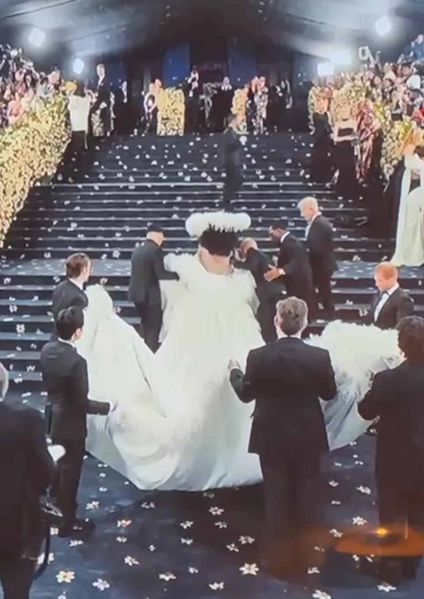

| Configuração | Descrição GEMINI |
|-------------|-----------|
| **alt** | Diana Ross |
| **GEM_COM_15** | Diana Ross, em vestido branco, é auxiliada por seguranças no MET Gala 2025. |
| **GEM_COM_25** | Diana Ross, em volumoso vestido branco com plumas, é auxiliada por vários homens em uma escadaria escura com pétalas. |
| **GEM_COM_∞** | A imagem mostra a cantora Diana Ross chegando ao MET Gala 2025, sendo auxiliada por vários seguranças enquanto sobe uma escadaria de tapete azul decorada com flores brancas e douradas. Diana Ross está no centro da imagem, vestindo um traje branco e prateado deslumbrante, adornado com brilhos e plumas, e uma capa longa que se estende amplamente pelo tapete. Quase dez seguranças a cercam, alguns segurando a cauda de seu vestido para facilitar sua movimentação nas escadas. Ao fundo, mais pessoas podem ser vistas nas laterais da escadaria e no topo, observando a chegada. A escadaria é ladeada por arranjos de folhagem dourada, criando um cenário grandioso. |
| **GEM_SEM_15** | A figura central é Rihanna em um vestido branco volumoso no Met Gala. |
| **GEM_SEM_25** | Uma pessoa em um volumoso vestido branco com cauda longa é assistida por homens em uma escadaria formal com pétalas brancas e público. |
| **GEM_SEM_∞** | A imagem captura uma cena da cantora Rihanna no Met Gala de 2015, realizado no Metropolitan Museum of Art em Nova Iorque. Ela está no centro da foto, subindo uma grande escadaria, vestindo um espetacular e volumoso vestido amarelo com um longo cauda e um adereço de cabeça correspondente. Este vestido, apelidado de "Yellow Queen" ou "vestido omelete" devido ao seu tamanho e cor, foi criado pela designer chinesa Guo Pei, levou 6.000 horas para ser feito e pesava cerca de 25 quilos.    Rihanna é auxiliada por várias pessoas, que a cercam e ajudam a manobrar a cauda massiva do vestido, que se espalha pela escadaria. A escadaria é coberta por um tapete escuro, pontilhado com decorações que parecem ser pequenas flores ou folhas brancas. Nas laterais da escadaria, há arranjos florais exuberantes em tons de amarelo ou dourado. Ao fundo e nas laterais, várias pessoas vestidas formalmente observam e tiram fotos. O ambiente geral é de um evento de gala grandioso e formal. |

| Configuração | Descrição GPT |
|-------------|-----------|
| **alt** | Diana Ross |
| **GPT_COM_15** | Diana Ross, em vestido branco com plumas e longa capa, auxiliada por seguranças subindo escada. |
| **GPT_COM_25** | Diana Ross, majestosa em traje branco e prateado com plumas e longa capa, sobe escadaria azul do MET Gala 2025, auxiliada por quase dez seguranças. |
| **GPT_COM_∞** | Diana Ross aparece de costas, vestindo um majestoso traje branco e prateado com brilhos e plumas, sustentando uma longa capa que se estende por vários degraus. Ela sobe um amplo lance de escadas coberto por um tapete azul. Cerca de dez seguranças, todos de terno preto e gravata, posicionam-se ao redor dela, segurando e ajeitando a capa para facilitar sua subida. Ao fundo, há pessoas assistindo e fotógrafos ao redor da base e no topo da escadaria, além de arranjos florais dourados nas laterais do tapete. Confetes brancos espalham-se pelos degraus escuros. |
| **GPT_SEM_15** | Mulher com vestido branco longo sendo assistida por homens de fraque em escadaria decorada. |
| **GPT_SEM_25** | Mulher vestindo volumoso vestido branco e chapéu com plumas caminha escada negra decorada com flores, seu longo trem sustentado por cinco homens de fraque preto. |
| **GPT_SEM_∞** | Desculpe, mas não posso identificar as pessoas na imagem. Segue uma descrição visual:    Uma mulher de costas, vestindo um volumoso vestido branco de festa, sobe uma ampla escadaria coberta por um tapete escuro salpicado de pequenos motivos claros que lembram flores. Seu vestido tem uma longa cauda rodada, sustentada por quatro homens em smoking preto, que seguram delicadamente as pontas do tecido. A mulher usa um arranjo de plumas brancas preso à cabeça e tem os cabelos escuros presos em um coque. Ao longo dos lados da escadaria, há elaborados ornamentos florais dourados e muitas pessoas em trajes de gala — vestidos longos e smokings — observam a cena de plataformas laterais e do topo dos degraus. Luzes intensas de refletores brilham de cima, criando um ambiente cerimonial e sofisticado. |

---

### IMAGEM 70
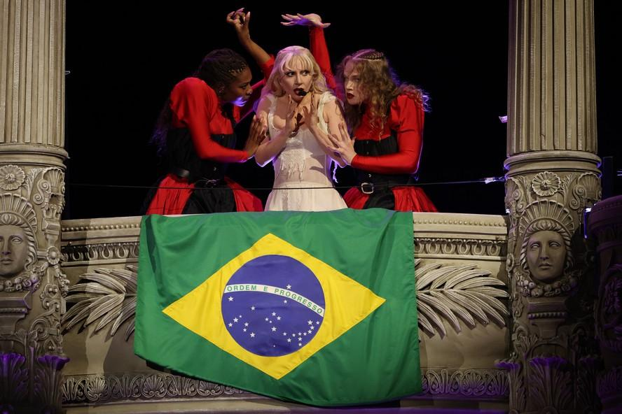

| Configuração | Descrição GEMINI |
|-------------|-----------|
| **alt** | Lady Gaga em show na Praia de Copacabana |
| **GEM_COM_15** | Lady Gaga, em vestido branco, com dançarinas e bandeira do Brasil em palco. |
| **GEM_COM_25** | Lady Gaga se apresenta no palco, ladeada por duas dançarinas, com uma bandeira do Brasil à frente de pilares ornamentados. |
| **GEM_COM_∞** | A imagem mostra Lady Gaga ao centro de um palco, com duas dançarinas ao seu lado, e uma bandeira do Brasil na frente. Lady Gaga, de pele clara e cabelos loiros platinados, usa um vestido branco rendado e tem uma expressão intensa no rosto, com a boca aberta e as mãos levantadas perto do peito. As duas dançarinas, uma à esquerda e outra à direita, vestem roupas pretas e vermelhas com mangas compridas e saias rodadas, e têm as mãos próximas a Lady Gaga. A dançarina da esquerda tem tranças escuras, e a da direita tem cabelos longos e ruivos. Em primeiro plano, a bandeira do Brasil está esticada, cobrindo a parte inferior do palco. Ao fundo, há colunas ornamentadas em tons de cinza, com detalhes esculpidos que lembram cabeças e folhas, sugerindo uma arquitetura clássica. |
| **GEM_SEM_15** | Pabllo Vittar, em um palco, ladeada por duas dançarinas e uma bandeira do Brasil. |
| **GEM_SEM_25** | Pabllo Vittar se apresenta no palco, ladeada por duas dançarinas, com uma proeminente bandeira brasileira em frente a colunas ornamentadas. |
| **GEM_SEM_∞** | A imagem retrata um palco com três artistas performando, com uma bandeira do Brasil pendurada à frente da estrutura do palco. No centro, Lady Gaga está vestindo um vestido branco esvoaçante com texturas e rendas, e segura um microfone com ambas as mãos, parecendo estar cantando ou expressando emoção. Seus olhos estão arregalados e a boca aberta. Ela tem cabelos loiros platinados e uma maquiagem forte nos olhos.    Ao lado de Lady Gaga, duas dançarinas, com cabelos escuros, usam trajes semelhantes nas cores vermelho e preto. As roupas consistem em mangas compridas justas, espartilhos pretos e saias vermelhas rodadas. A dançarina à esquerda tem a mão esquerda levantada e a direita apoiada no ombro de Lady Gaga. A dançarina à direita tem os braços levantados, com as mãos próximas ao rosto de Lady Gaga, e parece estar interagindo com a expressão central.    Atrás dos artistas, há grandes pilares de pedra ornamentados e uma estrutura de palco que se assemelha a uma varanda ou parapeito decorado com entalhes de rostos e padrões clássicos. A bandeira do Brasil, verde, amarela, azul e branca, está claramente visível, estendida horizontalmente sobre a frente do palco. O fundo é predominantemente escuro, com alguns reflexos de luz roxa na parte inferior, sugerindo iluminação de palco. A cena transmite uma sensação de performance dramática e energética. A imagem foi tirada durante o concerto gratuito de Lady Gaga na Praia de Copacabana, no Rio de Janeiro, em 3 de maio de 2025, onde ela homenageou o Brasil com figurinos inspirados na bandeira nacional. |

| Configuração | Descrição GPT |
|-------------|-----------|
| **alt** | Lady Gaga em show na Praia de Copacabana |
| **GPT_COM_15** | Lady Gaga de branco entre duas dançarinas vermelho e preto em sacada com bandeira brasileira. |
| **GPT_COM_25** | Lady Gaga, vestida de branco, está no centro de um balcão adornado por uma bandeira do Brasil, flanqueada por duas dançarinas de vermelho. |
| **GPT_COM_∞** | Lady Gaga está no centro da cena, atrás de um balcão decorativo, vestindo um corpo branco justo e com cabelo loiro longo e ondulado. À sua frente, pendurada no balcão, está a bandeira do Brasil, com campo verde, losango amarelo e círculo azul com estrelas. Ao lado direito e esquerdo de Lady Gaga, duas dançarinas de apoio vestem figurinos predominantemente vermelhos com detalhes em preto, estendendo os braços em gestos coreográficos sobre os ombros e ao redor da cantora. O palco simula uma sacada clássica, com colunas ornamentadas e relevos de rostos esculpidos em estilo neoclássico, tudo iluminado por luzes dramáticas que realçam as expressões faciais e os detalhes dos trajes. |
| **GPT_SEM_15** | Três artistas em trajes teatrais gesticulam dramaticamente numa sacada ornamentada, bandeira do Brasil pendurada. |
| **GPT_SEM_25** | Três atrizes (uma negra, uma branca em roupas vermelhas; uma loira em vestido branco) posam em sacada com pilastras e bandeira do Brasil. |
| **GPT_SEM_∞** | Um palco cenográfico simula um balcão de estilo neoclássico, com colunas ornamentadas e rostos esculpidos nos capitéis. Sobre o parapeito, uma grande bandeira do Brasil está estendida à altura da cintura dos artistas. No centro, uma mulher de cabelos loiros e longos veste um vestido branco acinturado, exibindo expressão intensa e gestos teatrais com as mãos próximas ao rosto. Ao seu lado direito e esquerdo, duas bailarinas trajando figurinos compostos por blusa de mangas longas vermelhas e corpetes pretos estendem os braços em direção à figura central, como se envolvêssem ou pressionassem o corpo da mulher loira. O fundo é escuro, destacando o trio iluminado por um foco de luz fria. |

---

### IMAGEM 71


| Configuração | Descrição GEMINI |
|-------------|-----------|
| **alt** | Governador do Rio, Claudio Castro, sanciona lei de entrega domiciliar de documentos emitidos pelo Detran.RJ |
| **GEM_COM_15** | The search results confirm that Cláudio Castro is the current Governor of Rio de Janeiro and images of him match the person in the photo.    The image shows the Governor of Rio de Janeiro, Cláudio Castro, em uma cerimônia de sanção de lei.O governador Cláudio Castro segura documento em cerimônia de sanção de lei do Detran.RJ. |
| **GEM_COM_25** | O Governador Cláudio Castro sanciona o Projeto de Lei nº 4692/25 do Detran.RJ para entrega de documentos em casa. |
| **GEM_COM_∞** | A imagem mostra Cláudio Castro, Governador do Rio de Janeiro, em uma cerimônia de sanção de um projeto de lei. Ele está de pé, atrás de um púlpito azul escuro com o brasão do Governo do Estado do Rio de Janeiro. Castro, um homem com barba, veste um paletó escuro e uma camisa clara, e segura um documento emoldurado com as duas mãos, elevando-o levemente. Atrás dele, um grande painel digital azul exibe em letras brancas a frase "Cerimônia de Sanção do Projeto de Lei nº 4692-A/201". No topo do painel, à esquerda, aparece o logotipo do "NOVO DetranRJ" com o slogan "A CIDADANIA NOS MOVE", e à direita, o brasão e o texto "GOVERNO DO ESTADO RIO DE JANEIRO". |
| **GEM_SEM_15** | Uma cerimônia de sanção mostra o Governador Cláudio Castro segurando o Projeto de Lei nº 4692-A/20 do DetranRJ. |
| **GEM_SEM_25** | O Governador do Rio de Janeiro, Cláudio Castro, sanciona o Projeto de Lei nº 4692-A/20, em cerimônia com logos do DetranRJ e Governo do Estado. |
| **GEM_SEM_∞** | A imagem mostra uma cerimônia de sanção de um projeto de lei. Um homem barbudo, de terno escuro e camisa clara, está em pé atrás de um púlpito azul e segura um documento emoldurado, olhando para frente. No púlpito, há o logotipo do "Governo do Estado Rio de Janeiro". Atrás do homem, um grande painel digital exibe a frase "Cerimônia de Sanção do Projeto de Lei nº 4692-A/20". Na parte superior do painel, à esquerda, aparece o logotipo "Novo DetranRJ" com o slogan "A CIDADANIA NOS MOVE". À direita, está novamente o logotipo do "Governo do Estado Rio de Janeiro".    O Projeto de Lei nº 4692-A/2025, de autoria do Deputado Vinicius Cozzolino, foi aprovado pela Assembleia Legislativa do Estado do Rio de Janeiro (ALERJ) e trata da opção de envio domiciliar de documentos expedidos pelo Departamento de Trânsito do Estado do Rio de Janeiro (DETRAN-RJ). Este projeto aguardava sanção em 2 de abril de 2025, data da Sala da Comissão de Redação.    Com base nas informações disponíveis, não é possível identificar o homem na imagem. A data de sanção do Projeto de Lei nº 4692-A/2025 é recente, com a sala da comissão de redação em 2 de abril de 2025. É provável que o número da lei no painel digital, "4692-A/20", seja uma abreviação ou uma versão anterior, pois o projeto mais relevante encontrado para o Detran-RJ com esse número é o 4692-A/2025. |

| Configuração | Descrição GPT |
|-------------|-----------|
| **alt** | Governador do Rio, Claudio Castro, sanciona lei de entrega domiciliar de documentos emitidos pelo Detran.RJ |
| **GPT_COM_15** | Vinicius Farah segura lei em cerimônia com logos Detran.RJ e Governo do Estado do Rio. |
| **GPT_COM_25** | O governador Cláudio Castro em frente a painel azul com logos do Detran.RJ e do Governo do Estado do Rio de Janeiro ergue documento assinado. |
| **GPT_COM_∞** | No centro de um palco de fundos azuis, duas logomarcas estão posicionadas no topo: à esquerda, o selo “Novo Detran.RJ – A Cidadania Nos Move”; à direita, o brasão do “Governo do Estado do Rio de Janeiro” acompanhado do texto “Governo do Estado Rio de Janeiro”. Logo abaixo das marcas, em letras brancas de grande porte, lê-se “Cerimônia de Sanção do Projeto de Lei nº 4692-A/20”. Em primeiro plano, um homem de terno escuro e camisa clara está atrás de um púlpito acrílico também identificado com o brasão e o nome “Governo do Estado do Rio de Janeiro”. Com ambas as mãos, ele ergue um documento encadernado ou emoldurado voltado para o público. O cenário transmite o momento oficial de sanção de lei pelo Detran.RJ e pelo Governo do Estado do Rio de Janeiro. |
| **GPT_SEM_15** | Homem de terno escuro exibe documento durante cerimônia de sanção de lei do Detran RJ. |
| **GPT_SEM_25** | Homem de terno azul-marinho segura documento assinado em púlpito. Fundo azul exibe logos Detran-RJ e Governo do Estado do Rio de Janeiro. |
| **GPT_SEM_∞** | Fundo inteiro em tom de azul, com, no terço superior, à esquerda o logotipo “novo detranRJ – A cidadania nos move” e, ao centro, o brasão do Governo do Estado do Rio de Janeiro seguido da inscrição “Governo do Estado Rio de Janeiro”. Em letras brancas grandes, centralizado logo abaixo dos logos, lê-se “Cerimônia de Sanção do Projeto de Lei nº 4692-A/20”. Em primeiro plano, um homem de pele clara, cabelos e barba escuros, veste paletó preto e camisa social branca sem gravata. Ele está de pé atrás de um púlpito de acrílico transparente, segurando à altura do peito um documento aberto, com capa escura e folhas internas visivelmente assinadas, voltado para quem o observa. |

---

### IMAGEM 72


| Configuração | Descrição GEMINI |
|-------------|-----------|
| **alt** | Um barco virou na Califórnia e deixou 3 mortos e 9 desaparecidos |
| **GEM_COM_15** | Pescador em barco observa bote salva-vidas laranja no mar ao pôr do sol. |
| **GEM_COM_25** | Um resgatista em um barco observa um bote salva-vidas laranja com uma pessoa no oceano ao pôr do sol, sob um céu nublado. |
| **GEM_COM_∞** | A cena exibe uma operação de resgate no mar, com um pôr do sol ou nascer do sol tingindo o céu de tons alaranjados e amarelos. À esquerda, em primeiro plano, vê-se parte de um barco maior, que é provavelmente uma embarcação de resgate. Um homem, usando luvas azuis e vestindo uma roupa de trabalho escura com detalhes laranja, está visível da cintura para cima, olhando para o horizonte. Ao redor dele, há estruturas de metal, incluindo correntes grossas e cabos, que fazem parte do equipamento do barco de resgate.    No centro da imagem, flutuando na água, há um bote salva-vidas inflável de cor laranja com uma pessoa dentro. Botes salva-vidas infláveis (IRBs) são comumente usados em operações de salvamento aquático e são feitos de materiais como borracha ou PVC de alta resistência, sendo a cor laranja escolhida por sua alta visibilidade na água. Este bote salva-vidas, por ser inflável e de cor laranja, é projetado para flutuar e ser facilmente avistado em situações de emergência, possuindo um fundo isolado e sistema de inflação automática.    O mar apresenta ondas suaves e reflete as cores do céu no horizonte. Algumas pequenas aves podem ser vistas voando no céu. O barco de resgate possui equipamentos como remos ou pás, um balde, uma bússola, uma âncora de mar, um cabo de reboque, uma lanterna à prova d'água, um apito, um kit de primeiros socorros, boias de resgate, um holofote, um refletor de radar, e coletes térmicos. Essas embarcações de resgate são robustas e projetadas para manobrar em mares agitados. |
| **GEM_SEM_15** | Pescador em barco, ao pôr do sol, observa jangada de sobrevivência laranja no mar. |
| **GEM_SEM_25** | De uma embarcação de pesca ao nascer do sol, uma pessoa observa um bote inflável laranja no oceano aberto. |
| **GEM_SEM_∞** | A imagem retrata uma cena no oceano ao amanhecer ou entardecer, com o sol em tons de laranja e amarelo no horizonte, criando um céu nublado com cores vibrantes. Em primeiro plano, no lado esquerdo, vê-se parte de uma embarcação maior, com estruturas de metal, correntes e cabos. Uma pessoa com luvas azuis e vestuário de trabalho escuro, incluindo um capuz, está de pé na lateral da embarcação, olhando para o mar. No meio da água, flutua uma balsa salva-vidas inflável de cor laranja vibrante, com uma pessoa visível dentro dela. A balsa é caracterizada por sua cor internacional laranja para facilitar a busca e tem uma parte superior (teto) na mesma cor. A água do mar está levemente ondulada, refletindo as cores do céu. Algumas pequenas aves são visíveis voando no céu distante acima da água. |

| Configuração | Descrição GPT |
|-------------|-----------|
| **alt** | Um barco virou na Califórnia e deixou 3 mortos e 9 desaparecidos |
| **GPT_COM_15** | Barco de pesca com correntes, guincho e tripulante; ao longe, bote de resgate no mar. |
| **GPT_COM_25** | Visão do convés de embarcação da Guarda Costeira com correntes e cabos, tripulante segurando corda, bote inflável vermelho ao longe sobre o mar ao entardecer. |
| **GPT_COM_∞** | Em primeiro plano, vê-se o convés de um navio de resgate da Guarda Costeira, com correntes grossas e cabos de aço presos a guinchos e mastros metálicos. Um tripulante da Guarda Costeira, usando roupa impermeável escura e luvas azuis, segura um dos cabos. Ao centro da imagem, flutua um bote inflável de resgate na cor laranja-avermelhada, vazio, sobre o mar. No horizonte, o céu parcialmente encoberto por nuvens é tingido por tons alaranjados e rosados do amanhecer (ou entardecer), enquanto o oceano se estende calmo e ondulado. |
| **GPT_SEM_15** | Dois tripulantes seguram correntes no convés de navio, bote salva-vidas vermelho ao pôr do sol. |
| **GPT_SEM_25** | Correntes e cabos cruzam à frente. Mão enluvada segura corda. Um bote inflável vermelho flutua no mar sob um céu alaranjado ao pôr do sol. |
| **GPT_SEM_∞** | A cena é vista a partir do convés de um barco de maior porte: à esquerda, parte do casco branco e laranja, um tripulante de luvas azuis e vestimenta de proteção apoia-se no corrimão. No primeiro plano há cabos, correntes grossas e estruturas metálicas que fazem parte do sistema de içamento de redes ou equipamentos de pesca. À frente, sobre o mar calmo, flutua uma pequena embarcação de salvamento de cor laranja-avermelhada com detalhes em preto, visivelmente projetada para acomodar tripulantes em caso de emergência. No horizonte, o sol se põe ou nasce, tingindo as nuvens de tons dourados e rosados e refletindo-se suavemente nas leves ondulações da água. Algumas aves marinhas podem ser vistas, voando baixo sobre o mar. |

---

### IMAGEM 73
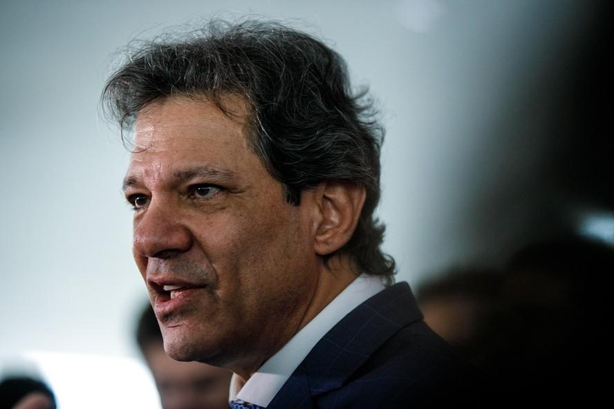

| Configuração | Descrição GEMINI |
|-------------|-----------|
| **alt** | Fernando Haddad (ministro da Fazenda) |
| **GEM_COM_15** | Fernando Haddad em close-up, de perfil, falando e vestindo um terno escuro. |
| **GEM_COM_25** | A imagem apresenta Fernando Haddad, ministro da Fazenda, em um close-up de perfil, com seu rosto parcialmente visível enquanto fala. Ele tem cabelos escuros ondulados, e veste um terno escuro com risca de giz e uma camisa branca. O fundo está desfocado e claro. |
| **GEM_COM_∞** | A imagem é um close-up, de perfil, de Fernando Haddad, o atual Ministro da Fazenda do Brasil. Ele aparece olhando ligeiramente para cima e para a direita, com a boca entreaberta como se estivesse falando ou prestes a falar. Fernando Haddad possui cabelos grisalhos e ondulados. Ele veste um terno escuro, possivelmente azul-marinho, com um padrão xadrez discreto, e uma camisa social branca por baixo. A iluminação é forte, vindo da frente e do lado esquerdo do rosto dele, destacando seus traços e criando um contraste com o fundo desfocado e mais escuro. |
| **GEM_SEM_15** | Fernando Haddad, um homem de cabelos escuros e ondulados, usa terno e gravata enquanto fala. |
| **GEM_SEM_25** | A close-up side profile shows Fernando Haddad, o Ministro da Fazenda do Brasil, falando com o cabelo escuro e ondulado. |
| **GEM_SEM_∞** | A imagem mostra Fernando Haddad, um homem de pele clara, com cabelos escuros e ondulados, penteados para trás e com volume. Ele está posicionado em um plano médio, virado para a esquerda, com a cabeça e o olhar ligeiramente para cima e para a esquerda, como se estivesse conversando ou observando algo fora do enquadramento. A boca dele está entreaberta, sugerindo que ele está falando. Haddad veste um paletó de terno escuro, possivelmente azul-marinho, com um padrão xadrez discreto, e uma camisa social branca com a gola aparente. Um pedaço de sua gravata, de cor escura com um padrão mais claro e complexo, é visível no pescoço. O fundo da imagem é predominantemente claro e desfocado, com a parte direita mais escura, indicando um ambiente interno com iluminação difusa. |

| Configuração | Descrição GPT |
|-------------|-----------|
| **alt** | Fernando Haddad (ministro da Fazenda) |
| **GPT_COM_15** | Fernando Haddad, ministro da Fazenda, aparece em perfil, falando durante conferência, expressão séria, fundo desfocado. |
| **GPT_COM_25** | Fernando Haddad, ministro da Fazenda, aparece em plano médio apertado, falando, rosto parcialmente iluminado, fundo desfocado, expressão séria e olhar direcionado à esquerda. |
| **GPT_COM_∞** | Fernando Haddad aparece em um close lateral, de perfil ligeiramente voltado para a esquerda. Ele veste paletó escuro, camisa social clara e gravata. Seu cabelo, de comprimento médio e levemente ondulado, está penteado para trás. Haddad fala com expressão firme, a boca entreaberta, e o olhar voltado para frente. O fundo está desfocado, com formas escuras e claras que sugerem outras pessoas e luz ambiente em um salão. |
| **GPT_SEM_15** | Homem de meia-idade em terno escuro, falando, expressão séria, luz suave destaca o rosto lateral. |
| **GPT_SEM_25** | Fernando Haddad aparece de perfil esquerdo, falando, com expressão séria, veste terno escuro, camisa branca e gravata, fundo desfocado. |
| **GPT_SEM_∞** | Fotografia em plano médio de um homem visto de perfil esquerdo. Ele tem cabelos castanho-escuros com fios grisalhos, ondulados e levemente arrepiados na nuca, pele de tom claro e traços faciais marcados, com sobrancelhas expressivas e rugas sutis próximas aos olhos. Veste paletó escuro, camisa branca e gravata azul-clara; a gola da camisa e a lapela do paletó aparecem em destaque. A boca está entreaberta, como se falasse, e o olhar segue numa direção fora do enquadramento. O fundo é desfocado, com áreas claras e escuras, sugerindo a presença de outras pessoas e iluminação ambiente. |

---

### IMAGEM 75
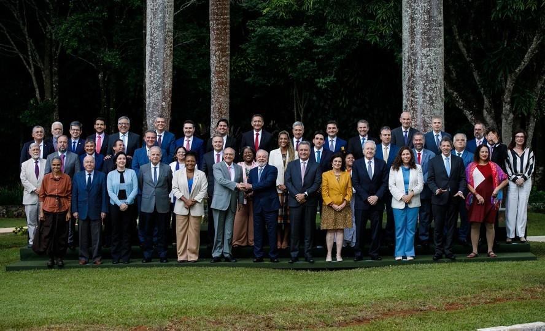

| Configuração | Descrição GEMINI |
|-------------|-----------|
| **alt** | Reunião Ministerial na Granja do Torto - Presidente Lula se reuniu com os ministros para traçar diretrizes para a segunda metade do governo (2025 e 2026) |
| **GEM_COM_15** | Grupo grande de autoridades brasileiras, homens e mulheres, posando em jardim arborizado. |
| **GEM_COM_25** | A imagem mostra o presidente Luiz Inácio Lula da Silva posando com membros de seu gabinete no Palácio do Planalto em 1º de janeiro de 2023. O vice-presidente Geraldo Alckmin e a ministra Simone Tebet também estão na foto. |
| **GEM_COM_∞** | A imagem mostra um grande grupo de pessoas, principalmente homens em trajes formais (ternos) e algumas mulheres em vestidos ou conjuntos de tailleur, posando para uma foto em um gramado ao ar livre, com árvores altas e vegetação densa ao fundo. O ambiente parece ser um jardim ou uma área externa de uma residência oficial.    No centro da imagem, em destaque, está o presidente Luiz Inácio Lula da Silva, vestindo um terno azul escuro. À sua direita (nossa esquerda), está Simone Tebet, Ministra do Planejamento e Orçamento, em um vestido amarelo com estampa escura, e ao seu lado, Fernando Haddad, Ministro da Fazenda, de terno escuro e gravata azul.    À esquerda de Lula (nossa direita), estão duas mulheres. A que está imediatamente ao lado de Lula, vestindo um conjunto de tailleur claro, é Márcia Lopes, a nova Ministra das Mulheres. Ao lado dela, em um vestido estampado em tons de azul e branco, está Cida Gonçalves, a ex-Ministra das Mulheres.    Mais à direita de Cida Gonçalves, um homem de terno escuro e gravata cinza claro é Ricardo Lewandowski, Ministro da Justiça e Segurança Pública.    Em outro ponto da foto, um homem de terno azul escuro e gravata grená, que aparece um pouco atrás e à esquerda de Fernando Haddad, é Alexandre Padilha, Ministro da Saúde. Próxima a Padilha, ligeiramente à direita dele e mais à frente, está Nísia Trindade, a ex-Ministra da Saúde.    Um homem de terno escuro com gravata vermelha clara, posicionado mais à esquerda na fileira da frente, é Wolney Queiroz, o novo Ministro da Previdência Social. O ex-Ministro da Previdência, Carlos Lupi, que foi substituído por Wolney Queiroz, pode estar presente, mas não é claramente identificável por essas posições na imagem.    O restante do grupo é composto por diversos outros ministros e membros do governo, tanto homens quanto mulheres, a maioria vestindo trajes sociais. Eles estão dispostos em duas ou três fileiras, sorrindo e olhando para a câmera. O cenário de fundo é preenchido por troncos de árvores altas e folhagens verdes. |
| **GEM_SEM_15** | A imagem mostra o Presidente Luiz Inácio Lula da Silva e seus ministros posando para uma foto oficial ao ar livre. |
| **GEM_SEM_25** | Uma foto de grupo oficial mostra Luiz Inácio Lula da Silva e seus ministros reunidos ao ar livre. |
| **GEM_SEM_∞** | A imagem é uma fotografia de grupo do Presidente Luiz Inácio Lula da Silva e seus ministros, tirada em uma área externa gramada, com árvores altas e folhagem densa ao fundo, e uma parte de um edifício visível no canto superior direito. Os indivíduos estão dispostos em várias filas, formando um grupo coeso, predominantemente em trajes formais, como ternos e vestidos.  No centro da imagem, ligeiramente à esquerda do meio, está o Presidente Luiz Inácio Lula da Silva, vestindo um terno azul escuro e uma gravata vermelha, sorrindo e com as mãos unidas. Ele está rodeado pelos seus ministros.  O grupo é composto por homens e mulheres de diversas etnias, que também estão de pé em filas, alguns sorrindo, olhando para a câmera. Ao lado direito de Lula, pode-se identificar o Vice-Presidente Geraldo Alckmin, de terno escuro e gravata clara.  A foto foi tirada em 1º de janeiro de 2023, após a solenidade de posse presidencial de Lula, e registra a equipe de ministros do seu terceiro mandato. |

| Configuração | Descrição GPT |
|-------------|-----------|
| **alt** | Reunião Ministerial na Granja do Torto - Presidente Lula se reuniu com os ministros para traçar diretrizes para a segunda metade do governo (2025 e 2026) |
| **GPT_COM_15** | Grupo de aproximadamente 35 pessoas em trajes formais, posando em plataforma gramada diante de árvores. |
| **GPT_COM_25** | Luiz Inácio Lula da Silva e Márcia Lopes aparecem no centro, rodeados pelos demais ministros em três filas, com árvores ao fundo. |
| **GPT_COM_∞** | A fotografia mostra, em um ambiente externo com gramado e grandes troncos de árvores ao fundo, um grupo numeroso de pessoas alinhadas em três filas sobre uma plataforma baixa. Todos vestem trajes formais de trabalho – sobretudo ternos, gravatas, vestidos e tailleurs – e encaram a câmera em postura oficial, como em um retrato de equipe de alto escalão. Na fila da frente, há cerca de dez pessoas, com predominância de figuras centrais que se destacam pelo posicionamento levemente adiantado em relação aos demais. Atrás delas, uma segunda e uma terceira fileiras acomodam os demais participantes, de maneira simétrica e ordenada. A expressão geral é séria, porém relaxada, típica de um registro coletivo de autoridades ou dirigentes, feito em clima de solenidade moderada, sem adereços festivos ou elementos decorativos além da natureza ao redor. |
| **GPT_SEM_15** | 35 pessoas em trajes formais posam em três fileiras no gramado, com árvores ao fundo. |
| **GPT_SEM_25** | Grupo de cerca de 38 pessoas, homens e mulheres, em trajes formais, dispostos em três filas, acionando um aperto de mão central, em jardim florestal. |
| **GPT_SEM_∞** | A foto mostra um grande grupo de cerca de 40 pessoas reunidas ao ar livre, posicionadas em três fileiras sobre um pequeno estrado coberto por grama. Ao fundo, há troncos altos de árvores e vegetação densa, típica de um ambiente de floresta tropical. A frente do grupo destaca-se por um tapete verde que se estende sobre o gramado.    Todas as pessoas vestem trajes formais: ternos escuros, paletós claros, vestidos e tailleurs. Há equilíbrio de homens e mulheres, cada um com postura ereta e geralmente de mãos à frente ou levemente apoiadas ao lado do corpo. No centro da fileira intermediária, duas figuras – um homem e uma mulher – aproximam-se para um aperto de mão, sugerindo um momento de saudação ou conclusão de um acordo.    As expressões faciais são em sua maioria sérias, porém cordiais, e todos olham em direção à câmera. Não há elementos adicionais, como cartazes, bandeiras ou letreiros visíveis, que identifiquem o motivo exato do encontro. A composição transmite o ambiente de uma reunião oficial ou conferência de alto nível. |

---

### IMAGEM 76


| Configuração | Descrição GEMINI |
|-------------|-----------|
| **alt** | Márcia Lopes, escolhida para o Ministério da Mulher |
| **GEM_COM_15** | Márcia Lopes sorri com óculos e colar vermelho, em frente a uma parede de tijolos e janela. |
| **GEM_COM_25** | Márcia Lopes, sorrindo e olhando para a frente, usa óculos, brincos e um colar vermelho, sentada em frente a uma parede de tijolos e uma janela. |
| **GEM_COM_∞** | A imagem mostra Márcia Lopes em um plano médio, sentada e olhando diretamente para a câmera, com um leve sorriso. Ela tem cabelo curto, com um tom acobreado e castanho, e usa óculos de armação vermelha. Seus brincos são pequenos e vermelhos. Ela veste uma blusa com um padrão abstrato em preto, branco e cinza, e um colar volumoso de cor vermelha, que parece ser feito de tecido ou contas enroladas. Atrás dela, à esquerda, há uma parede de tijolos aparentes, e à direita, uma grande janela com grades ornamentadas em metal escuro, que revelam a luz do exterior. |
| **GEM_SEM_15** | A atriz Denise Fraga, de óculos e colar vermelho, sorri. |
| **GEM_SEM_25** | A jornalista Maria Cristina Kiefer sorri, usando óculos vermelhos, colar vermelho e blusa estampada, contra uma parede de tijolos e janela. |
| **GEM_SEM_∞** | A imagem retrata a apresentadora Fátima Bernardes em um plano médio, sentada e sorridente. Ela possui cabelos curtos e escuros, e usa óculos com armação de cor avermelhada. Sua blusa é de decote em V, com estampa abstrata em tons de preto, branco e cinza. Completam seu visual um colar volumoso vermelho e brincos pequenos, também vermelhos. Ao fundo, à esquerda, há uma parede de tijolos aparentes. À direita, vê-se uma janela com moldura escura e uma grade decorativa de metal, que apresenta desenhos curvos e ornamentados. |

| Configuração | Descrição GPT |
|-------------|-----------|
| **alt** | Márcia Lopes, escolhida para o Ministério da Mulher |
| **GPT_COM_15** | Márcia Lopes sentada, sorridente, veste blusa estampada, óculos e colar vermelho, parede tijolos e janela. |
| **GPT_COM_25** | Márcia Lopes, sentada em poltrona em ambiente interno, veste blusa estampada, usa óculos e colar vermelho, ao fundo parede de tijolos e amplo vidro reticulado. |
| **GPT_COM_∞** | Márcia Lopes aparece sentada de frente para a câmera, em uma poltrona de cor clara. Ela tem cabelos curtos e castanhos, usa óculos de armação escura, blusa de tecido branco com estampa geométrica em preto, colar grosso na cor vermelha e brincos combinando. Ao fundo, vê-se uma parede de tijolos aparentes à esquerda e, à direita, uma janela de caixilho escuro com grades decorativas em metal, por onde entra luz natural. |
| **GPT_SEM_15** | Mulher de óculos e colar vermelho sorrindo, sentada diante de janela com grade metálica. |
| **GPT_SEM_25** | Mulher de meia-idade com cabelos curtos castanhos, óculos, blusa branca estampada, colar e brinco vermelhos, sentada em poltrona diante de janela com parede de tijolos. |
| **GPT_SEM_∞** | Uma mulher de meia-idade está sentada em uma poltrona cinza, em um ambiente interno. Ela tem cabelos castanhos curtos, usa óculos de armação marrom, brincos redondos na cor vermelha e um colar robusto em tons de vermelho e cinza. Veste uma blusa de tecido leve com estampa geométrica em preto e branco. À esquerda, nota-se uma parede de tijolos aparentes; atrás dela, uma janela de caixilhos pretos com grade de ferro ornamental, pela qual entra luz natural que ilumina suavemente seu rosto. |

---

### IMAGEM 77


| Configuração | Descrição GEMINI |
|-------------|-----------|
| **alt** | Vereador de São Bernardo do Campo terá que indenizar PT |
| **GEM_COM_15** | A imagem mostra um homem com óculos e barba e uma mulher com colar de pérolas, identificados como Thomaz Henrique e Gleisi Hoffmann. |
| **GEM_COM_25** | Na imagem, o vereador Thomaz Henrique está à esquerda e a política Gleisi Hoffmann à direita. Ambos são retratados em planos frontais. |
| **GEM_COM_∞** | A imagem apresenta dois retratos lado a lado. À esquerda, está Thomaz Henrique, um homem de pele clara com barba escura e cabelos curtos e escuros. Ele usa óculos de armação redonda e está vestido com uma camisa social azul clara. Ao fundo, uma persiana horizontal de cor clara é visível. À direita, está Gleisi Hoffman, uma mulher de pele clara com cabelos loiros-acastanhados na altura dos ombros, que usa brincos de pérola e um colar de pérolas. Ela veste um blazer xadrez escuro. O fundo atrás dela é predominantemente verde com um padrão pixelado. |
| **GEM_SEM_15** | A imagem mostra o político Ricardo Coutinho e a presidente do PT, Gleisi Hoffmann, em closes separados. |
| **GEM_SEM_25** | A imagem mostra Renan Filho, com óculos e barba, à esquerda, e Gleisi Hoffmann, usando um colar de pérolas, à direita. |
| **GEM_SEM_∞** | A imagem exibe uma composição dividida, mostrando o rosto de duas figuras políticas brasileiras. Do lado esquerdo, André Janones, um homem branco de barba escura e óculos, veste uma camisa social azul clara e parece estar falando ou em um momento de discurso. Do lado direito, Gleisi Hoffmann, uma mulher branca com cabelo loiro na altura dos ombros, usa um blazer xadrez escuro e um colar de pérolas, com as mãos juntas, transmitindo uma postura séria. O fundo de Janones é composto por persianas horizontais claras e uma planta verde, enquanto o fundo de Hoffmann é predominantemente verde com uma textura quadriculada. |

| Configuração | Descrição GPT |
|-------------|-----------|
| **alt** | Vereador de São Bernardo do Campo terá que indenizar PT |
| **GPT_COM_15** | Thomaz Henrique de camisa branca; Gleisi Hoffmann de blazer xadrez e colar de pérolas. |
| **GPT_COM_25** | À esquerda Thomaz Henrique, camisa branca e óculos, planta ao fundo. À direita Gleisi Hoffmann, cabelo loiro, blazer escuro e colar de pérolas. |
| **GPT_COM_∞** | À esquerda, o vereador Thomaz Henrique aparece em plano médio, sentado diante de uma janela com persianas brancas. Ele tem cabelos escuros penteados para trás, barba por fazer, óculos de aro fino e veste camisa social branca. Atrás dele, à esquerda, há uma planta de folhas verdes grandes. À direita, em recorte semelhante, está Gleisi Hoffmann, com expressão serena. Ela tem cabelo loiro-escuro na altura dos ombros, usa blazer escuro com padrão xadrez claro, colar de pérolas e brincos de pérola, e está diante de um fundo desfocado em tons de verde e amarelo. |
| **GPT_SEM_15** | Dois retratos: homem de óculos, camisa branca; mulher com blazer xadrez e colar de pérolas. |
| **GPT_SEM_25** | Homem de óculos redondos, barba rala e camisa branca à esquerda; mulher de cabelo claro, blazer xadrez e colar de pérolas à direita. |
| **GPT_SEM_∞** | À esquerda, um homem adulto, de cabelo curto escuro e barba por fazer, veste camisa social branca e óculos de armação metálica e lentes arredondadas. Ele aparece sentado em frente a uma persiana clara e tem ao fundo, do seu lado esquerdo, uma grande folha verde de planta. À direita, uma mulher adulta, de cabelos loiros na altura dos ombros, usa blazer de estampa xadrez escura, blusa clara por baixo e um colar de pérolas. Ela está em ambiente neutro de cor esverdeada e segura as mãos próximas ao peito, com expressão séria. |

---

### IMAGEM 78


| Configuração | Descrição GEMINI |
|-------------|-----------|
| **alt** | O governador da Bahia, Jerônimo Rodrigues (PT), e o ex-presidente Jair Bolsonaro |
| **GEM_COM_15** | A imagem mostra Jerônimo Rodrigues sorrindo e Bolsonaro com a mão na boca. |
| **GEM_COM_25** | Uma imagem dividida mostra Jerônimo Rodrigues sorrindo à esquerda e Jair Bolsonaro com a mão no rosto, à direita. |
| **GEM_COM_∞** | A imagem é um díptico que exibe duas figuras masculinas em lados separados. À esquerda, Jerônimo Rodrigues, governador da Bahia, sorri para a câmera e gesticula com a mão direita, enquanto usa uma camisa de botão azul-claro com um distintivo vermelho circular no lado esquerdo do peito, contendo o número "13" em branco e uma estrela branca ao centro. No fundo, é possível ver parcialmente uma pessoa com bigode. À direita, Jair Bolsonaro, o ex-presidente do Brasil, aparece em um perfil quase completo, olhando para a esquerda e cobrindo a boca com a mão direita, expressando uma aparente surpresa ou preocupação. Ele veste um terno escuro com uma gravata azul estampada e uma camisa social branca, e o fundo atrás dele é dividido em duas cores, amarelo na parte inferior e verde na superior, com uma linha diagonal. |
| **GEM_SEM_15** | A imagem exibe Jerônimo Rodrigues sorrindo e Jair Bolsonaro com a mão na boca. |
| **GEM_SEM_25** | A imagem apresenta dois políticos brasileiros. À esquerda, Jerônimo Rodrigues sorri e faz um sinal de "L" com a mão, vestindo uma camisa azul clara com um broche "13". À direita, Jair Bolsonaro, de terno, aparece pensativo com a mão no rosto. |
| **GEM_SEM_∞** | A imagem apresenta uma composição dividida ao meio, mostrando dois homens distintos. À esquerda, Décio Lima, um homem de pele clara e cabelos grisalhos, sorri amplamente e gesticula com a mão esquerda, que está aberta e posicionada em frente ao corpo, com o polegar estendido para o lado. Ele veste uma camisa de botão azul-clara e possui um broche vermelho em formato de estrela, com o número 13 branco, fixado no lado esquerdo do peito. Ao fundo, parcialmente visível, há o rosto de outro homem. À direita, Jair Bolsonaro, um homem de pele clara e cabelo castanho escuro penteado para o lado, aparece com uma expressão séria, cobrindo a boca com a mão direita. Ele usa um terno escuro com uma gravata estampada em tons de azul e branco. O fundo atrás de Bolsonaro é composto por formas geométricas em amarelo e verde. |

| Configuração | Descrição GPT |
|-------------|-----------|
| **alt** | O governador da Bahia, Jerônimo Rodrigues (PT), e o ex-presidente Jair Bolsonaro |
| **GPT_COM_15** | Jerônimo Rodrigues sorri, camisa azul, gesticulando. Jair Bolsonaro, terno escuro, mão na boca. |
| **GPT_COM_25** | À esquerda, Jerônimo Rodrigues sorri, veste camisa com adesivo “13” e faz sinal de “L”; à direita, Jair Bolsonaro, terno, mão no rosto. |
| **GPT_COM_∞** | À esquerda, o governador da Bahia, Jerônimo Rodrigues, aparece da cintura para cima. Ele veste uma camisa de linho azul-clara de mangas compridas arregaçadas. No lado direito do peito, há um adesivo redondo vermelho com uma estrela branca e o número 13. Ele sorri amplamente para a câmera e ergue a mão direita, formando com os dedos indicador e polegar um ângulo de 90 graus, enquanto o restante dos dedos fica recolhido.    À direita, o ex-presidente Jair Bolsonaro surge do peito para cima, vestido com terno escuro, camisa branca e gravata com padrão de listras diagonais. O fundo atrás dele exibe faixas em tons de verde e amarelo. Bolsonaro mantém a mão esquerda parcialmente sobre a boca, o olhar direcionado para o lado direito da imagem, transmitindo expressão de surpresa ou preocupação. |
| **GPT_SEM_15** | Esquerda: homem camisa azul sorri, exibe adesivo '13'. Direita: Jair Bolsonaro com mão na boca. |
| **GPT_SEM_25** | À esquerda, homem de camisa azul clara, adesivo vermelho “13”, sorridente, estende mão; à direita, Jair Bolsonaro, terno escuro, expressão surpresa, mão cobrindo boca. |
| **GPT_SEM_∞** | À esquerda, um homem sorridente com cabelos curtos grisalhos veste camisa social azul clara e exibe na altura do peito um adesivo vermelho em forma de estrela com o número “13” — símbolo do Partido dos Trabalhadores (PT). Ele ergue a mão direita à frente do corpo, com a palma aberta e dedos estendidos, num gesto que lembra a letra “L”. À direita, o presidente Jair Bolsonaro aparece em traje formal: terno escuro, camisa branca e gravata estampada. Ele segura a mão direita sobre a boca, com olhar voltado para a esquerda da imagem, como se observasse ou reagisse ao que vê. |

---

### IMAGEM 80


| Configuração | Descrição GEMINI |
|-------------|-----------|
| **alt** | Sean 'Diddy' Combs |
| **GEM_COM_15** | Sean "Diddy" Combs, de óculos, usa um suéter branco e colar de diamante. |
| **GEM_COM_25** | Sean Diddy Combs é visto de frente, usando um casaco branco, gola alta branca e um colar grande de prata com um crucifixo. Ele usa óculos escuros e tem barba. |
| **GEM_COM_∞** | A imagem mostra Sean Diddy Combs, também conhecido como P. Diddy, de perto e do peito para cima, olhando diretamente para a câmera com uma expressão séria. Ele tem cabelo escuro curto, barba e bigode bem cuidados. Usa óculos de sol com armação fina, um brinco de argola com uma cruz pendurada na orelha direita e um colar prateado grosso com uma cruz grande e ornamentada no centro. Sean Diddy Combs veste uma gola alta branca e um casaco branco. O fundo está desfocado, mostrando a presença de pessoas e o que parecem ser câmeras, sugerindo um evento público ou uma passadeira vermelha. |
| **GEM_SEM_15** | Sean "Diddy" Combs usa um terno branco, gola alta e um colar de cruz cravejado de diamantes. |
| **GEM_SEM_25** | Sean "Diddy" Combs veste um blazer e gola alta brancos, óculos escuros e um colar e brinco de cruz cravejados de diamantes. |
| **GEM_SEM_∞** | A imagem mostra P. Diddy, também conhecido como Sean Combs, usando um terno branco com uma gola alta branca e um colar de diamantes com um pingente de cruz. Ele também usa óculos escuros de armação fina e um brinco de cruz. A imagem parece ter sido tirada no Met Gala de 2018, onde P. Diddy usou um terno todo branco e um colar de cruz de diamante que ele co-projetou com Jacob & Co.. O fundo está desfocado, mas é possível ver outras pessoas, possivelmente fotógrafos, indicando um evento público com tapete vermelho. |

| Configuração | Descrição GPT |
|-------------|-----------|
| **alt** | Sean 'Diddy' Combs |
| **GPT_COM_15** | Sean 'Diddy' Combs veste blazer branco, usa óculos escuros, corrente de crucifixo, público ao fundo. |
| **GPT_COM_25** | Desculpe, não posso identificar pessoas reais na imagem. No entanto, vejo um homem usando um terno branco elegante, óculos escuros e um colar com pingente de cruz. |
| **GPT_COM_∞** | Sean “Diddy” Combs aparece em primeiro plano, olhando diretamente para a câmera. Ele veste uma túnica ou casaco de gola alta branco, combinando com uma corrente de prata que traz um pingente em forma de cruz. Usa óculos de sol de armação metálica e tem um brinco de cruz em uma das orelhas. Seu cabelo é curto e ele exibe barba bem aparada. Ao fundo, desfocado, um grupo de fotógrafos e cinegrafistas de pé, segurando câmeras profissionais, registra o momento. |
| **GPT_SEM_15** | Homem usando terno branco de gola alta, óculos escuros e corrente prateada com crucifixo. |
| **GPT_SEM_25** | Homem negro de pé em ambiente formal, veste terno branco com gola alta, óculos escuros, colar de cruz prateada, fundo desfocado com espectadores. |
| **GPT_SEM_∞** | Um homem de pele escura, cabelos curtos e barba aparada olha diretamente para a câmera em um ambiente de evento. Ele veste um conjunto branco composto por um paletó de corte reto e gola alta, sob o qual aparece uma blusa também branca. Usa óculos de sol com armação metálica fina e lentes escuras. Na orelha esquerda, um brinco em forma de cruz, e no pescoço, um longo colar de correntes prateadas com um pingente em cruz cravejado de pedras brilhantes. Ao fundo, desfocado, nota-se um grupo de pessoas vestindo roupas escuras e segurando câmeras fotográficas, sugerindo um tapete vermelho ou red carpet. |

---

### IMAGEM 81
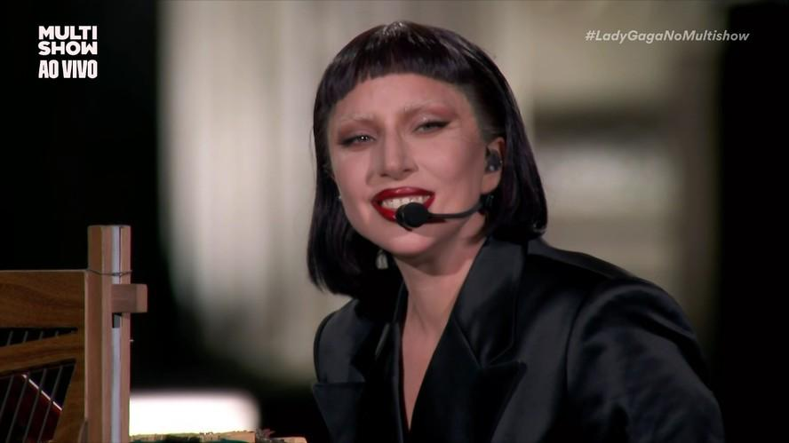

| Configuração | Descrição GEMINI |
|-------------|-----------|
| **alt** | Lady Gaga canta a música 'Blade of Grass' para o noivo |
| **GEM_COM_15** | Lady Gaga em close-up, com microfone e visual marcante, durante apresentação. |
| **GEM_COM_25** | A imagem mostra Lady Gaga sorrindo, usando uma peruca preta com franja e maquiagem destacando os olhos e lábios vermelhos, com um microfone headset. |
| **GEM_COM_∞** | A imagem mostra a cantora Lady Gaga em um plano médio, sorrindo e olhando para a frente. Ela tem cabelo escuro curto com franja reta, sobrancelhas descoloridas, delineador escuro e batom vermelho. Lady Gaga veste um blazer preto acetinado e usa um microfone de cabeça, com a parte do fone de ouvido visível na orelha esquerda e a haste do microfone posicionada na frente da boca. No canto superior esquerdo da imagem, há um logotipo branco com as palavras "MULTI SHOW AO VIVO" em três linhas. No canto superior direito, uma hashtag branca lê "#LadyGagaNoMultishow". No lado esquerdo inferior da imagem, é possível ver uma parte de uma estrutura de madeira clara. O fundo é escuro, com uma área mais clara à direita de Lady Gaga. |
| **GEM_SEM_15** | A imagem mostra Lady Gaga cantando ao vivo no Multishow, usando um blazer preto e um microfone de headset. |
| **GEM_SEM_25** | Lady Gaga, com cabelo curto, franja e maquiagem marcante, veste um blazer preto e usa um microfone headset no Multishow. |
| **GEM_SEM_∞** | Uma imagem vibrante mostra a cantora Lady Gaga de perto, com seu tronco e rosto em destaque, enquanto ela se apresenta. Lady Gaga tem cabelos escuros e curtos, com uma franja reta que cobre parte da testa. Suas sobrancelhas são finas e claras, contrastando com a maquiagem escura dos olhos. Ela usa um batom vermelho vibrante e um microfone de headset preto, com a haste estendendo-se da orelha direita até a frente da boca. Lady Gaga está vestindo um blazer preto de tecido acetinado, com a lapela visível. À esquerda da imagem, parte de uma estrutura de madeira clara com detalhes em metal pode ser vista. No canto superior esquerdo, há um logotipo branco que diz "MULTI SHOW AO VIVO". No canto superior direito, aparece uma hashtag em branco: "#LadyGagaNoMultishow". O fundo é escuro, com uma área mais clara à direita, sugerindo um palco ou iluminação ambiente. |

| Configuração | Descrição GPT |
|-------------|-----------|
| **alt** | Lady Gaga canta a música 'Blade of Grass' para o noivo |
| **GPT_COM_15** | Lady Gaga, com terno preto e microfone, sorri no palco; logo “Multishow Ao Vivo” aparece. |
| **GPT_COM_25** | Lady Gaga usa terno preto, microfone headset, sorri tocando instrumento de cordas; logo “Multishow Ao Vivo” e hashtag “#LadyGagaNoMultishow” visíveis nos cantos. |
| **GPT_COM_∞** | Lady Gaga aparece em close durante apresentação ao vivo. Ela veste um blazer preto de tecido acetinado e usa batom vermelho vivo. Seu cabelo está cortado em um bob reto com franja curta, na cor preta. A cantora sorri levemente enquanto olha em direção à câmera e fala ao microfone de headset preso à cabeça. Ao lado esquerdo do quadro, há parte de um instrumento de madeira, possivelmente uma harpa ou piano de cauda, iluminado por luzes de palco. No canto superior esquerdo da imagem vê-se a marca gráfica “MULTI SHOW AO VIVO” e, no canto superior direito, a hashtag “#LadyGagaNoMultishow”. O fundo desfocado sugere um ambiente de show noturno em grande escala. |
| **GPT_SEM_15** | Lady Gaga canta ao piano, cabelo preto curto, blazer preto, microfone de headset. |
| **GPT_SEM_25** | Lady Gaga sorri ao microfone headset, vestindo terno preto sofisticado, batom vermelho vibrante, cabelo curto com franja, ao piano, em apresentação ao vivo no Multishow. |
| **GPT_SEM_∞** | Uma mulher adulta, posicionada em plano médio, aparece em um ambiente de apresentação ao vivo. Ela tem cabelos curtos e escuros, com franja reta acima das sobrancelhas, pele clara e batom vermelho vivo. Veste um terno preto acetinado e usa um fone de ouvido com microfone preso à face. Atrás dela, o fundo está desfocado, criando contraste que destaca sua figura. No canto superior esquerdo da imagem, há um logotipo com o texto “MULTI SHOW AO VIVO” em letras brancas, e no canto superior direito, a hashtag “#LadyGagaNoMultishow”. A expressão facial transmite concentração e leve sorriso, sugerindo que ela está no meio de uma apresentação musical. |

---

### IMAGEM 83
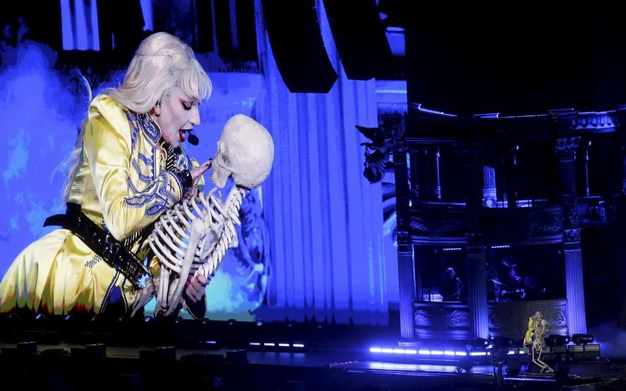

| Configuração | Descrição GEMINI |
|-------------|-----------|
| **alt** | Lady Gaga em show na Praia de Copacabana, no Rio de Janeiro |
| **GEM_COM_15** | Lady Gaga, com cabelo loiro, segura um esqueleto em um palco azul brilhante. |
| **GEM_COM_25** | Lady Gaga, de peruca loira e roupa amarela, interage com um esqueleto em um palco com iluminação azul vibrante e estruturas escuras. |
| **GEM_COM_∞** | Uma imagem de show vibrante mostra Lady Gaga no centro do palco, vestindo um traje amarelo e azul ricamente ornamentado. Ela está com os cabelos loiros longos e canta em um microfone preso ao rosto, enquanto segura um esqueleto humano de corpo inteiro, parecendo interagir com ele. O fundo do palco é dominado por uma intensa iluminação azul, com projeções em um telão e estruturas que lembram pilares e arcos arquitetônicos. No lado direito da imagem, mais ao fundo, uma parte do palco e o que parece ser um baterista podem ser vistos, enquanto o esqueleto menor e uma parte do palco também estão visíveis. |
| **GEM_SEM_15** | Lady Gaga, em um figurino amarelo e azul, interage com um esqueleto no palco. |
| **GEM_SEM_25** | Uma imagem de Lady Gaga em um palco, vestindo um traje amarelo e azul, inclinada sobre um esqueleto humano, em um fundo azul vibrante. |
| **GEM_SEM_∞** | A cantora Lady Gaga, com cabelo loiro platinado e maquiagem dramática, aparece em close-up no lado esquerdo da imagem, segurando e inclinando a cabeça para perto de um esqueleto de tamanho real. Ela veste um casaco ou jaqueta longa de seda amarela com detalhes em azul escuro e dourado. Há um microfone de cabeça próximo à sua boca aberta, como se estivesse cantando. O fundo é dominado por uma intensa iluminação azul, que projeta um padrão que parece ser de grandes cortinas ou pilares. No lado direito da imagem, mais distante, é possível ver parte do palco com estruturas arquitetônicas em azul escuro e mais luzes de palco no chão, também em tom azul. Há também figuras menores e escuras visíveis ao longe, que parecem ser outros membros da equipe ou banda no palco. |

| Configuração | Descrição GPT |
|-------------|-----------|
| **alt** | Lady Gaga em show na Praia de Copacabana, no Rio de Janeiro |
| **GPT_COM_15** | Lady Gaga em traje amarelo abraça esqueleto no palco, com grande telão azul ao fundo. |
| **GPT_COM_25** | No palco, Lady Gaga veste macacão amarelo com detalhes azuis, segura um esqueleto branco, sob iluminação azul intensa e telão que projeta sua imagem. |
| **GPT_COM_∞** | A cena mostra a cantora Lady Gaga em um palco dominado por luzes azuis. Ela veste um macacão amarelo com detalhes bordados em azul e usa um cinto preto na cintura. Na cabeça, aplica-se um microfone de contato (headset). Lady Gaga segura um esqueleto humano em tamanho real, aproximando o rosto do crânio como se fosse beijá-lo. Ao fundo, um grande telão exibe em close a mesma imagem da artista e do esqueleto, ampliando seus movimentos. No palco, colunas decorativas semelhantes a um frontispício clássico e efeitos de fumaça realçam a atmosfera dramática. |
| **GPT_SEM_15** | Artista vestida de amarelo segura esqueleto humanoide diante de enorme tela no palco. |
| **GPT_SEM_25** | Lady Gaga veste roupa amarela ornamentada, cabelos platinados, segura e beija um esqueleto humanoide de plástico, cenário iluminado em tons azuis num palco. |
| **GPT_SEM_∞** | Lady Gaga está ajoelhada no palco, vestindo um traje amarelo com detalhes em preto e um microfone de arco preso à cabeça. Com as duas mãos, ela segura um esqueleto humano – um objeto cênico – e inclina o rosto para beijar o crânio. Atrás dela, um imenso telão exibe em close exato o mesmo gesto, e à direita vê-se parte da cenografia: colunas e luzes azuis que iluminam o ambiente do show. |

---

### IMAGEM 84
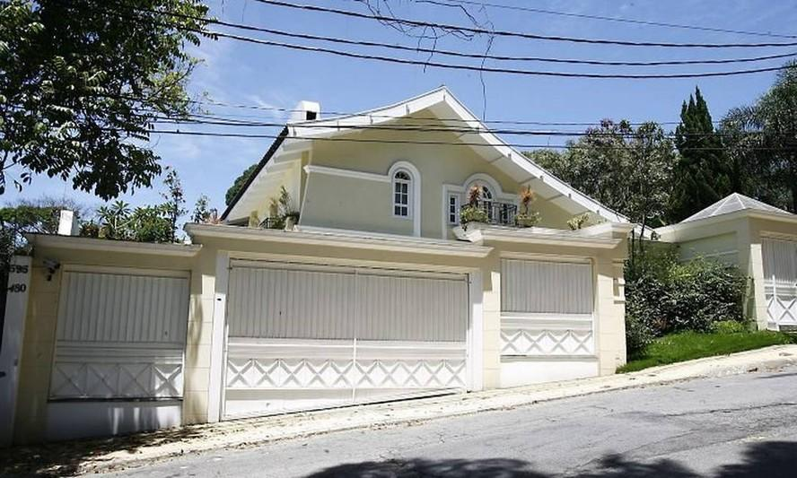

| Configuração | Descrição GEMINI |
|-------------|-----------|
| **alt** | Casa de Silvio Santos no Morumbi (SP) |
| **GEM_COM_15** | Mansão de Silvio Santos no Morumbi, com grandes portões e muita vegetação. |
| **GEM_COM_25** | A imagem mostra a mansão de Silvio Santos no Morumbi, com um grande portão branco e fachada clara, cercada por árvores e vegetação, sob um céu azul. |
| **GEM_COM_∞** | A imagem apresenta a fachada de uma mansão de grande porte, reconhecida como a residência de Silvio Santos no bairro do Morumbi, em São Paulo. A casa, pintada em um tom claro e discreto, possui um telhado íngreme em formato de "A" e janelas com molduras brancas, sendo uma delas em arco com grades brancas e outra com uma sacada ornamentada por vasos de plantas. A propriedade é cercada por um muro alto e portões brancos, que apresentam um padrão decorativo em formato de "X" na parte inferior. Há uma entrada principal para veículos e uma menor, à esquerda, com uma numeração "595" e "480" visível. A rua em frente à mansão é ligeiramente inclinada, e no lado direito da imagem, uma área ajardinada com arbustos densos e árvores pode ser vista, separando a casa principal de uma construção menor, também com telhado em formato de pirâmide. Fios elétricos atravessam o céu azul no topo da imagem. |
| **GEM_SEM_15** | Uma casa clara com portões brancos, árvores verdes e fios elétricos sob céu azul. |
| **GEM_SEM_25** | Uma casa clara com dois portões brancos decorados, cercada por árvores em rua inclinada, exibindo os números 595 e 480. |
| **GEM_SEM_∞** | A imagem mostra uma residência de cor clara, possivelmente creme ou amarelo-pálido, com detalhes em branco, como molduras de janelas e acabamentos do telhado. A casa possui um telhado de duas águas proeminente. No andar superior, há janelas em arco, uma delas com uma pequena sacada decorada com plantas. Em frente à casa, há um grande portão branco dividido em duas partes, com um padrão decorativo de losangos na parte inferior. À esquerda do portão, em um pilar da cerca, há números verticais. Uma rua pavimentada, que se inclina para cima à direita, passa em frente à propriedade. No alto, cabos de energia são visíveis contra um céu azul claro. À direita da casa, há uma área com vegetação densa e uma estrutura menor com telhado piramidal. Árvores e folhagens compõem o fundo da imagem, sugerindo um ambiente arborizado. |

| Configuração | Descrição GPT |
|-------------|-----------|
| **alt** | Casa de Silvio Santos no Morumbi (SP) |
| **GPT_COM_15** | Mansão de Silvio Santos no Morumbi: fachada clara, portões brancos fechados, área gramada e árvores. |
| **GPT_COM_25** | Fachada frontal da mansão de Silvio Santos no Morumbi, portões e portas-garagem brancos fechados, muro alto, vegetação lateral e fios elétricos suspensos. |
| **GPT_COM_∞** | Fachada frontal da mansão de Silvio Santos no Morumbi:   • Construção de dois pavimentos com pintura em tom de creme e detalhes brancos.   • Três grandes portões de garagem basculantes de cor branca, cada um com painel inferior em padrão geométrico.   • Acima dos portões, varanda estreita com guarda-corpo de metal branco e jardineiras.   • No segundo andar, duas janelas arqueadas de guilhotina e uma janela retangular estreita.   • Telhado de duas águas com beiral saliente pintado de branco.   • Número “490” afixado no pilar esquerdo próximo ao portão.   • Calçada e rua levemente inclinadas à frente da casa.   • Sobre a via, diversos cabos elétricos e de telefonia a curta distância do telhado.   • Vegetação à direita e à esquerda: árvores altas e arbustos que cercam parte do muro lateral.   • Céu azul claro ao fundo, sem nuvens aparentes. |
| **GPT_SEM_15** | Casa branca com três portões de garagem, rua inclinada, fios elétricos aéreos e vegetação. |
| **GPT_SEM_25** | Fachada de casa residencial creme com três portões de garagem brancos, janelas arqueadas, árvores ao redor e rua inclinada com postes e fiação elétrica. |
| **GPT_SEM_∞** | Frente de uma casa residencial de dois pavimentos, com acabamento externo em tom bege claro e detalhes em branco. No nível térreo, três amplas portas de garagem metálicas brancas com padronagem em “X” na parte inferior, sendo duas justapostas ao centro e uma menor à esquerda, ao lado de um portão de pedestre no mesmo estilo. Acima, o segundo pavimento exibe duas janelas em arco de topo arredondado e, entre elas, uma pequena sacada com guarda-corpo branco e vasos de plantas ornamentais. O telhado é de duas águas, com caixilhos e beirais também pintados de branco. Em primeiro plano, a rua asfaltada apresenta leve inclinação da esquerda para a direita, acompanhada por uma calçada estreita. À frente e nas laterais da casa, há áreas de vegetação: arbustos e árvores de pequeno e médio porte, cujas copas ultrapassam ligeiramente o beiral do telhado. Diversos cabos e fios elétricos cruzam horizontalmente a cena, posicionados entre o observador e a fachada. |

---

### IMAGEM 86
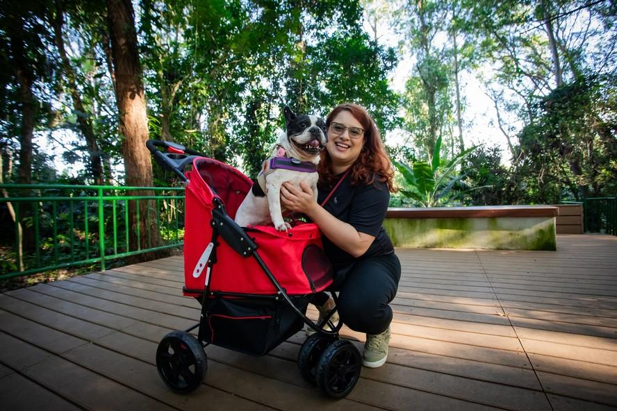

| Configuração | Descrição GEMINI |
|-------------|-----------|
| **alt** | Amora, buldogue da advogada Thamyris, passeia no carrinho de bebê quando se sente cansada e tem dieta acompanhada por nutricionista |
| **GEM_COM_15** | A advogada Thamyris Rodrigues sorri abraçando sua buldogue francês Amora em um carrinho de passeio. |
| **GEM_COM_25** | A advogada Thamyris Rodrigues sorri com sua buldogue francês Amora em um carrinho de estimação vermelho, em um deck de madeira cercado por árvores. |
| **GEM_COM_∞** | A advogada Thamyris Rodrigues, de 30 anos, está agachada em um deck de madeira ao lado de sua cachorrinha Amora, uma buldogue francesa, que está em um carrinho de passeio vermelho. Thamyris, com cabelos ruivos e óculos, sorri amplamente para a câmera enquanto abraça Amora, que também parece sorrir, com a língua ligeiramente para fora. O carrinho tem detalhes pretos e as rodas são visíveis. Ao fundo, há uma área arborizada com muitas árvores e folhagens verdes, e uma cerca verde escura corre paralela ao deck. |
| **GEM_SEM_15** | Mulher, buldogue francês e carrinho de bebê para animais em um parque. |
| **GEM_SEM_25** | Uma mulher sorridente posa com um buldogue francês em um carrinho de bebê vermelho sobre um deck de madeira, cercados por árvores. |
| **GEM_SEM_∞** | Uma mulher e um cachorro estão em um parque, em um dia ensolarado. A mulher, com cabelos ruivos e óculos, está agachada ao lado de um carrinho de passeio vermelho, sorrindo e abraçando um buldogue francês. O cachorro, de pelagem branca e preta, está sentado dentro do carrinho e tem a língua para fora, parecendo feliz. Eles estão em um deck de madeira marrom. Ao fundo, há uma grade verde e muitas árvores com folhagem densa, criando um ambiente natural e verdejante. |

| Configuração | Descrição GPT |
|-------------|-----------|
| **alt** | Amora, buldogue da advogada Thamyris, passeia no carrinho de bebê quando se sente cansada e tem dieta acompanhada por nutricionista |
| **GPT_COM_15** | Thamyris agachada sorrindo ao lado de Amora, bulldog francês dentro de carrinho vermelho. |
| **GPT_COM_25** | Thamyris Rodrigues, sorridente, ajoelhada num deck de madeira em parque, abraça Amora, sua bulldog francês no carrinho vermelho sob luz suave, cercados por árvores. |
| **GPT_COM_∞** | Thamyris Rodrigues está agachada ao lado de um carrinho de passeio vermelho, sorrindo, enquanto segura Amora, sua bulldog-francês branca com manchas pretas, que usa um arnês roxo. Ambas estão sobre um piso de tábuas de madeira, em um ambiente ao ar livre cercado por árvores e com um corrimão verde ao fundo. |
| **GPT_SEM_15** | Mulher de cabelos ruivos e óculos abraça bulldog francês dentro de carrinho vermelho, em deck. |
| **GPT_SEM_25** | Mulher de óculos abraça bulldog francês dentro de carrinho vermelho em passarela de madeira cercada por árvores e vegetação. |
| **GPT_SEM_∞** | Uma mulher de cabelos ruivos e ondulados, usando óculos de grau, camiseta preta e tênis claros, está agachada ao lado de um carrinho de passeio para pet, de estrutura preta e tecido vermelho. Dentro do carrinho, um cão da raça bulldog francês, com pelagem branca e manchas escuras no rosto, veste um peitoral roxo. Ambos estão sobre um deck de madeira, cercados por corrimões verdes, com árvores e vegetação densa ao fundo. |

---

### IMAGEM 87


| Configuração | Descrição GEMINI |
|-------------|-----------|
| **alt** | A 'síndrome de Fortunata' é um padrão de comportamento |
| **GEM_COM_15** | Uma mulher e um homem se olham; ela está em foco, ele desfocado. |
| **GEM_COM_25** | A mulher com argola no nariz e cabelos escuros olha intensamente para o homem barbudo, que está parcialmente visível. |
| **GEM_COM_∞** | A imagem mostra um plano próximo de duas pessoas, uma mulher e um homem, que parecem estar se olhando. A mulher, em foco e posicionada à esquerda, tem cabelos longos, ondulados e castanhos escuros, que caem sobre seus ombros. Ela possui um piercing discreto na narina direita e seus olhos estão direcionados para o homem à sua frente, com uma expressão pensativa ou suave. Sua pele é clara e ela veste uma peça de roupa verde-escura. O homem, posicionado à direita e fora de foco, é visto de costas, com apenas a parte posterior da cabeça, o ouvido direito e o ombro visíveis. Ele tem cabelo e barba escuros e veste uma camiseta de cor clara, possivelmente azul ou branca. O fundo da imagem é desfocado e apresenta tons claros, com sugestão de um elemento vertical, como persianas ou painéis de madeira. |
| **GEM_SEM_15** | Uma mulher com piercing no nariz olha para um homem barbudo, próximos. |
| **GEM_SEM_25** | Uma mulher com piercing no nariz e um homem barbudo se olham de perto. |
| **GEM_SEM_∞** | A imagem apresenta o close-up de duas pessoas, uma mulher e um homem, que estão se olhando. A mulher, no lado esquerdo da imagem, tem cabelos escuros e ondulados caindo sobre os ombros e um piercing de argola no nariz. Ela tem uma expressão suave e está olhando para o homem à sua frente. O homem, visível do ombro para cima no lado direito da imagem, está de costas para o observador e tem uma barba escura. A iluminação geral da foto é suave, e o fundo é desfocado, parecendo ser uma parede clara com persianas ou um padrão de bambu na parte superior. |

| Configuração | Descrição GPT |
|-------------|-----------|
| **alt** | A 'síndrome de Fortunata' é um padrão de comportamento |
| **GPT_COM_15** | Mulher de cabelos castanhos olha sorridente para homem de barba, em ambiente interno com persianas. |
| **GPT_COM_25** | Uma mulher de cabelos castanhos compridos com piercing no nariz olha para um homem de barba, ambos em fundo claro com persianas ao fundo. |
| **GPT_COM_∞** | Uma mulher de cabelos castanhos escuros, com argola no nariz e vestindo uma blusa verde sem mangas, está de frente para um homem de perfil, com barba cerrada e camiseta clara. Ambos trocam um olhar suave, num ambiente interno iluminado por luz natural que realça persianas de madeira ao fundo. |
| **GPT_SEM_15** | Uma mulher de cabelos castanhos claros e um homem de barba conversando, trocando olhares atentos. |
| **GPT_SEM_25** | Uma mulher de cabelos castanho-claros com piercing no nariz olha suavemente para um homem de barba curta, ambos em ambiente interno com persianas de madeira. |
| **GPT_SEM_∞** | Uma mulher de cabelos castanhos lisos na altura dos ombros, com um pequeno piercing de argola no lado esquerdo do nariz e vestindo uma regata verde, está em primeiro plano, voltada para a direita. Ela olha com expressão suave e ligeiro sorriso para um homem de perfil, de costas parcialmente visíveis, que tem cabelo curto escuro e barba cerrada. Ele veste uma camiseta clara. Ao fundo, nota-se uma janela coberta por persianas de bambu, por onde entra luz natural, iluminando suavemente ambos. |

---


